```{r set-options, echo=FALSE, cache=FALSE}
knitr::opts_chunk$set(comment=NA)
options(width = 60)
```

## Today's Agenda

Some reminders and loose ends

- for linear regression models
- for logistic regression models

We'll return to `tidymodels` next time.

## Setup

```{r, message = FALSE}
library(here); library(knitr)
library(magrittr); library(janitor)
library(naniar); library(equatiomatic)
library(GGally); library(broom)
library(rms)

library(tidyverse)

theme_set(theme_bw())
```

# Linear Regression

## The `day12` Data Set

These data are simulated.

```{r, echo = FALSE, eval = FALSE}
## How I created dat12

set.seed(4322022)
q1 <- rnorm(n = 400, mean = 100, sd = 20)
c2_raw <- rbernoulli(n = 400)
q3 <- rnorm(n = 400, mean = 150, sd = 25)
c4_raw <- rbinom(n = 400, size = 3, prob = 0.44) + 1
er <- rnorm(n = 400, mean = 0, sd = 48)

out1 <- 
    0.1*(3000 + 0.05*q1 + 0.005*(q1-100)^3 - 2.05*q3 + 
             104*c2_raw - 29.5*c4_raw + er)


dat12 <- tibble(subj = 1:400, out1, q1, c2 = factor(c2_raw), q3, 
                c4 = factor(c4_raw)) 

dat12 <- dat12 %>%
    mutate(c2 = fct_recode(c2, 
                            "Yes" = "TRUE", "No" = "FALSE")) %>%
    mutate(c4 = fct_recode(c4, 
                            "E" = "1", "VG" = "2",
                            "G" = "3", "F" = "4")) %>%
    mutate(subj = as.character(subj)) %>%
    mutate(q3 = round_half_up(q3, digits = 0)) %>%
    mutate(q1 = round_half_up(q1, digits = 0)) %>%
    mutate(out1 = round_half_up(out1, digits = 0) - 100) %>%
    rename(result = out1, sur_s = q1,
           sbp = q3, typeA = c2, sroh = c4) %>%
    select(subj, result, sur_s, typeA, sbp, sroh)

saveRDS(dat12, here("data/dat12.Rds"))
```

```{r}
dat12 <- readRDS(here("data/dat12.Rds"))

names(dat12)

miss_case_table(dat12)
```

## The `dat12` codebook

Variable | Description | Type
---: | :----: | :----
`result` | Our outcome (0-500 scale) | quant.
`sur_s` | Survey sur_s (0-200 scale) | quant.
`typeA` | Type A (No or Yes) | binary
`sbp` | Systolic Blood Pressure | quant.
`sroh` | Self-Reported Health (E/VG/G/F) | 4 cats.

## Summary of `dat12`

```{r}
summary(dat12 %>% select(-subj))
```

## OLS Model for `result`` without Non-Linear Terms

Variable | Description
-------: | ------------------------------------------------
`result` | Our outcome (0-500 scale)
`sur_s` | Survey sur_s (0-200 scale)
`typeA` | Type A (No or Yes)
`sbp` | Systolic Blood Pressure
`sroh` | Self-Reported Health (E/VG/G/F)

```{r}
d <- datadist(dat12)
options(datadist = "d")

modA <- ols(result ~ sur_s + typeA + sbp + sroh, 
               data = dat12, x = TRUE, y = TRUE)
```

How many degrees of freedom does the model `modA` use?

## Model `modA`

```{r, eval = FALSE}
modA
```

```{r, echo = FALSE, fig.align = "center", out.height = '65%'}
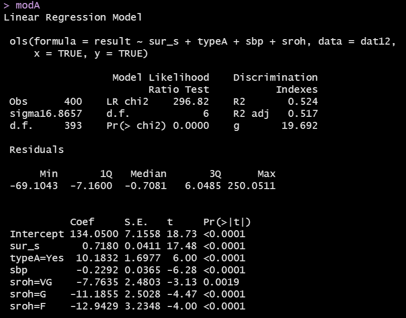
```

## ANOVA results for `modA`

```{r}
anova(modA)
```

## Plot Effect Sizes

```{r, fig.height = 5}
plot(summary(modA))
```


## Consider Potential Non-Linear Terms

```{r, fig.height = 4.5}
plot(spearman2(result ~ sur_s + typeA + sbp + sroh, 
               data = dat12))
```

## Using the Spearman plot as a guide...

Variable | Description | Adj. Spearman $\rho^2$
-------: | ----------------------------------------- | -----
`sur_s` | Survey sur_s (0-200 scale) | Highest
`typeA` | Type A (No or Yes) | 2nd Highest
`sbp` | Systolic Blood Pressure | 3rd Highest
`sroh` | Self-Reported Health (E/VG/G/F) | Lowest

### Using Polynomials or Splines

- Can we build a (polynomial or spline) non-linear term that will add one more degree of freedom to our original main-effects model?
- What if we can afford 2 additional df? Or 3?

### Using Interaction terms

- How many df does the best categorical-categorical interaction use?
- How many df does the best categorical-quantitative interaction use?

## Adding Polynomial Terms in `sur_s`

We'll look at a quadratic, then a cubic polynomial...

```{r}
modP2 <- ols(result ~ pol(sur_s,2) + typeA + sbp + sroh, 
               data = dat12, x = TRUE, y = TRUE)
modP3 <- ols(result ~ pol(sur_s,3) + typeA + sbp + sroh, 
               data = dat12, x = TRUE, y = TRUE)
```

## Quadratic Polynomial adds 1 df to `modA`'s 6

```{r, eval = FALSE}
modP2
```

```{r, echo = FALSE, fig.align = "center", out.height = '65%'}
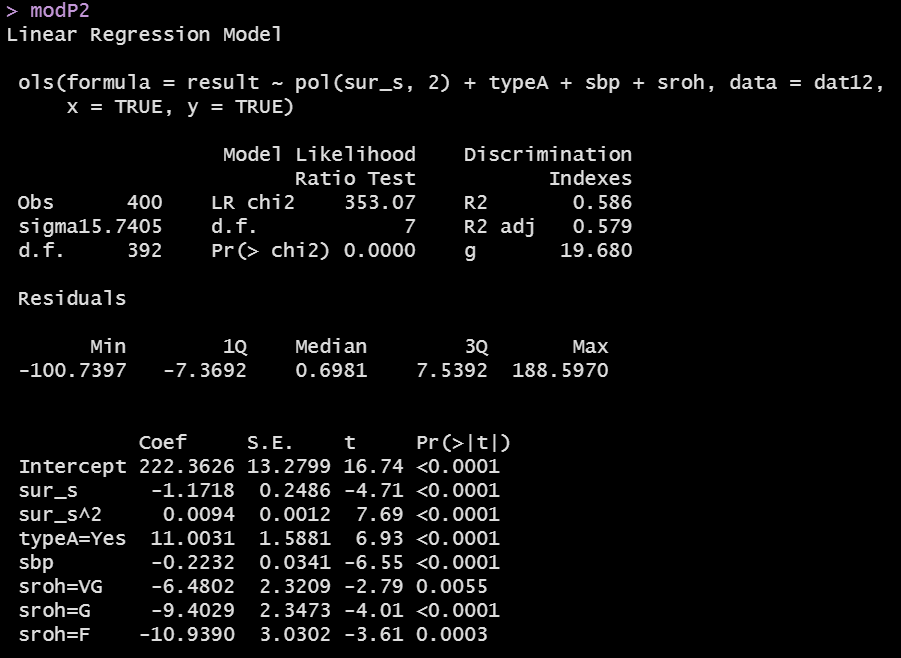
```

## Plot Effect Sizes

```{r, fig.height = 5}
plot(summary(modP2))
```

## What does model `modA` look like?

```{r, fig.height = 5.5}
ggplot(Predict(modA))
```

## What does model `modP2` look like?

```{r, fig.height = 5.5}
ggplot(Predict(modP2))
```

## Nomogram for model `modA`

```{r, fig.height = 5.5}
plot(nomogram(modA))
```

## Nomogram for model `modP2`

```{r, fig.height = 5.5}
plot(nomogram(modP2))
```

## Do the non-linear terms in `modP2` do much?

```{r}
anova(modP2)
```

## Do the non-linear terms in `modP2` help much?

```{r}
AIC(modA); BIC(modA)
AIC(modP2); BIC(modP2)
```

## Cubic (degree 3) polynomial adds 2 df to `modA`'s 6

```{r, eval = FALSE}
modP3
```

```{r, echo = FALSE, fig.align = "center", out.height = '65%'}
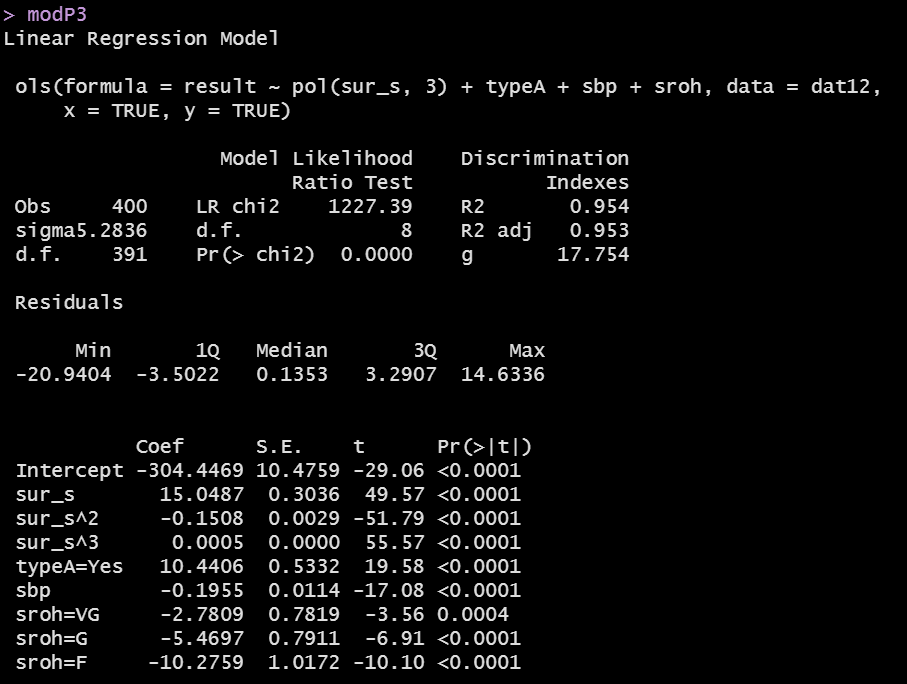
```

## What does model `modP3` look like?

```{r, fig.height = 5.5}
ggplot(Predict(modP3))
```

## Nomogram for model `modP3`

```{r, fig.height = 5.5}
plot(nomogram(modP3))
```

## How about a restricted cubic spline in `cigs`?

```{r}
modC3 <- ols(result ~ rcs(sur_s,3) + typeA + sbp + sroh, 
               data = dat12, x = TRUE, y = TRUE)
modC4 <- ols(result ~ rcs(sur_s,4) + typeA + sbp + sroh, 
               data = dat12, x = TRUE, y = TRUE)
modC5 <- ols(result ~ rcs(sur_s,5) + typeA + sbp + sroh, 
               data = dat12, x = TRUE, y = TRUE)
```


## RCS with 3 knots adds 1 df to `modA`'s 6

```{r, eval = FALSE}
modC3
```

```{r, echo = FALSE, fig.align = "center", out.height = '65%'}
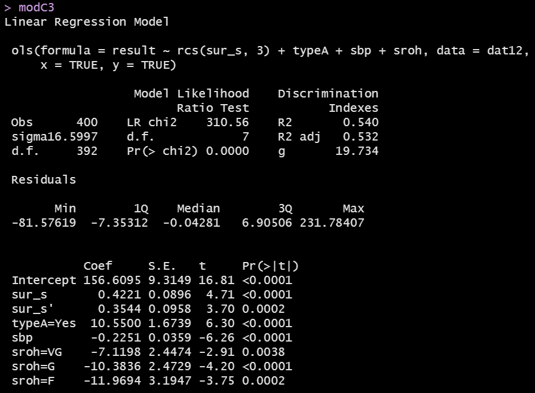
```

## What does model `modC3` look like?

```{r, fig.height = 5.5}
ggplot(Predict(modC3))
```

## What does the nomogram for `modC3` look like?

```{r, fig.height = 5.5}
plot(nomogram(modC3))
```

## Do the non-linear terms help much in `modC3`?

```{r}
AIC(modC3); BIC(modC3)
AIC(modA); BIC(modA)
```

## ANOVA table for `modC3`?

```{r}
anova(modC3)
```

## RCS with 4 knots adds 2 df to `modA`'s 6

```{r, eval = FALSE}
modC4
```

```{r, echo = FALSE, fig.align = "center", out.height = '65%'}
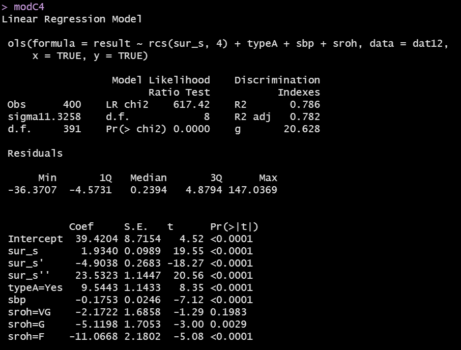
```

## What does model `modC4` look like?

```{r, fig.height = 5.5}
ggplot(Predict(modC4))
```

## What does the nomogram for `modC4` look like?

```{r, fig.height = 5.5}
plot(nomogram(modC4))
```

## RCS with 5 knots adds 3 df to `modA`'s 6

```{r, eval = FALSE}
modC5
```

```{r, echo = FALSE, fig.align = "center", out.height = '65%'}
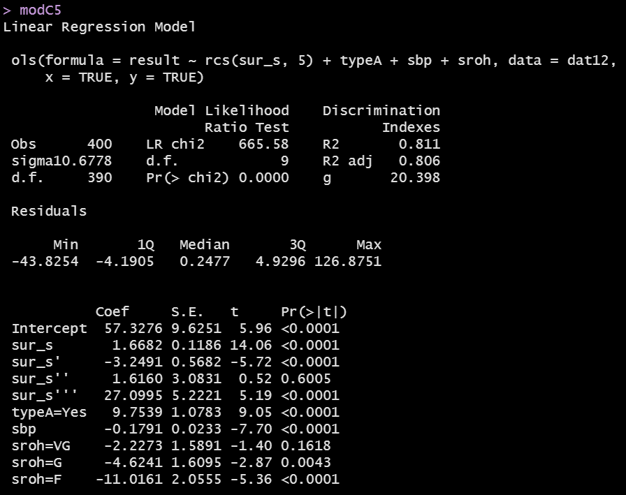
```

## What does model `modC5` look like?

```{r, fig.height = 5.5}
ggplot(Predict(modC5))
```

## What does the nomogram for `modC5` look like?

```{r, fig.height = 5.5}
plot(nomogram(modC5))
```

## Splines and Polynomials with `ols` (or `lrm`)

Model | Coeffs. | "Bends" | DF added
-----: | :-----: | :------: | :-----:
Main Effects (`modA`) | None | None | --
Polynomial, degree 2 (`P2`) | `^2` | 1 | 1
Polynomial, degree 3 (`P3`) | `^2, ^3` | 2 | 2
RCS, 3 knots (`C3`) | `'` | 2 | 1
RCS, 4 knots (`C4`) | `', ''` | 3 | 2
RCS, 5 knots (`C5`) | `', '', '''` | 4 | 3 

- RCS = Restricted Cubic Spline

## What about an interaction term instead?

1. How many df does the best categorical-categorical interaction use?
2. How many df does the best categorical-quantitative interaction use?

```{r, fig.height = 4}
plot(spearman2(result ~ sur_s + typeA + sbp + sroh, 
               data = dat12))
```

## Models with Interaction Terms

```{r}
# already set up datadist for dat12

modI1 <- ols(result ~ sur_s * typeA + sbp + sroh,
             data = dat12, x = TRUE, y = TRUE)
modI2 <- ols(result ~ rcs(sur_s, 4) + typeA + 
                 sur_s %ia% typeA + sbp + sroh, 
             data = dat12, x = TRUE, y = TRUE)
```

## Model `modI1` adds how many df to `modA`?

```{r, eval = FALSE}
modI1
```

```{r, echo = FALSE, fig.align = "center", out.height = '65%'}
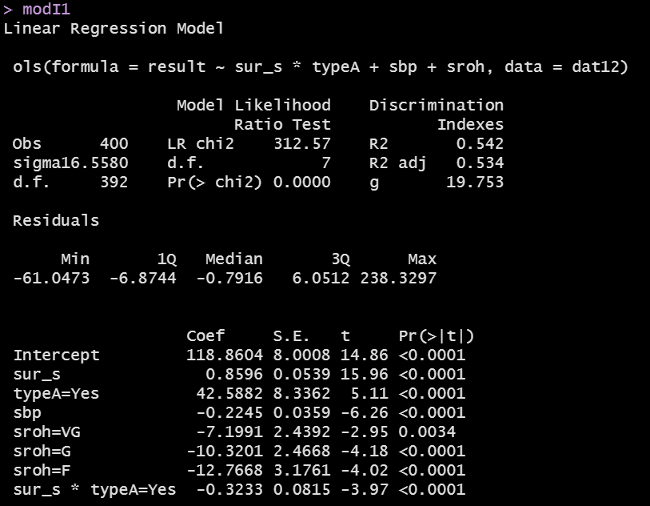
```

## ANOVA for `modI1`

```{r, eval = FALSE}
anova(modI1)
```

```{r, echo = FALSE, fig.align = "center", out.width = '85%'}
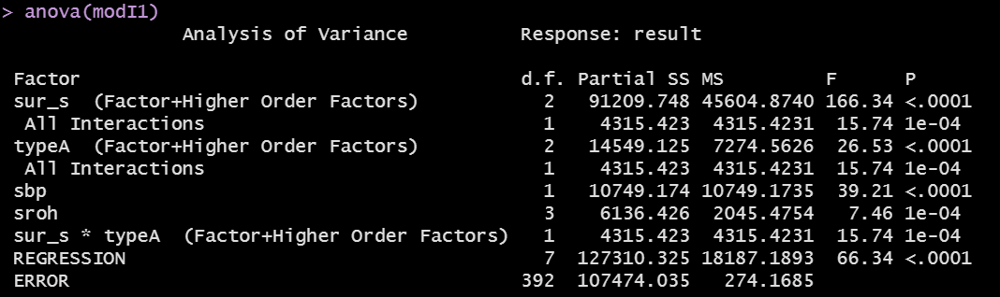
```

## What does `modI1` look like?

```{r, fig.height = 5}
ggplot(Predict(modI1))
```


## Nomogram for `modI1`

```{r, fig.height = 5}
plot(nomogram(modI1))
```

## Model `modI2` adds how many df to `modC4`?

```{r, eval = FALSE}
modI2
```

```{r, echo = FALSE, fig.align = "center", out.height = '65%'}
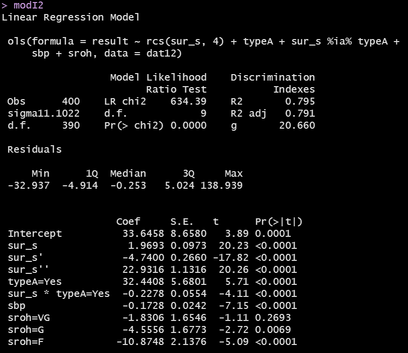
```


## ANOVA for `modI2`

```{r, eval = FALSE}
anova(modI2)
```

```{r, echo = FALSE, fig.align = "center", out.width = '85%'}
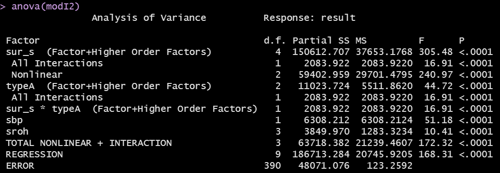
```

## What does `modI2` look like?

```{r, fig.height = 5}
ggplot(Predict(modI2))
```

## Nomogram for `modI2`

```{r, fig.height = 5}
plot(nomogram(modI2))
```

## Comparing Models?

```{r}
set.seed(4321); validate(modA)
```

- Ran validate for other models (see next slide)

```{r, echo = FALSE, eval = FALSE}
set.seed(4322); validate(modP2)
set.seed(4323); validate(modP3)
set.seed(4324); validate(modC3)
set.seed(4325); validate(modC4)
set.seed(4326); validate(modC5)
set.seed(4327); validate(modI1)
set.seed(4328); validate(modI2)
```

## Table of `validate` Results

Model | Raw $R^2$ | Corrected $R^2$ | Corrected MSE
----- | --------: | -------: | -----:
`modA` (Main Effects) | 0.5239 | 0.4788 | 261.8
`modP2` (Quadr. Pol.) | 0.5863 | 0.4756 | 293.8
`modP3` (Cubic Pol.) | 0.9535 | 0.9684 | 28.5
`modC3` (RCS, 3 knots) | 0.5399 | 0.4510 | 313.0
`modC4` (RCS, 4 knots) | 0.7864 | 0.7294 | 162.8
`modC5` (RCS, 5 knots) | 0.8106 | 0.7580 | 137.6
`modI1` (interaction) | 0.5422 | 0.4413 | 339.2
`modI2` (int + RCS4) | 0.7953 | 0.7337 | 161.4

## Making Predictions

Suppose we want to predict the `result` for these new subjects:

```{r}
new_people <- tibble(
    name = c("Dave", "Edna"),
    sur_s = c(100, 115), typeA = c("Yes", "No"),
    sbp = c(140, 125), sroh = c("G", "E"))

new_people %>% kable()
```

## Predicting Dave and Edna with `modA`

- Individual Prediction Intervals

```{r}
predict(modA, newdata = data.frame(new_people), 
        conf.int = 0.95, conf.type = "individual")
```

## Predicting mean of people just like Dave and Edna with `modA`

- Mean Prediction Intervals

```{r}
predict(modA, newdata = data.frame(new_people), 
        conf.int = 0.95, conf.type = "mean")
```

## Predicting Dave and Edna with other models

```{r}
predict(modP3, newdata = data.frame(new_people))
predict(modC4, newdata = data.frame(new_people))
predict(modI2, newdata = data.frame(new_people))
```

## Predicting Dave via the Nomogram for model `modC3`

- Dave has `sur_s` = 100, is typeA, Good `sroh`, `sbp` = 140.

```{r, fig.height = 4}
plot(nomogram(modC3))
```

## Dave's Actual Predicted Value (from `modC3`)

```{r}
predict(modC3, newdata = data.frame(new_people))[1]
```

## Running the `lm` version of `modC5`

```{r}
modC5_lm <- lm(result ~ rcs(sur_s,5) + typeA + sbp + sroh,
               data = dat12)

anova(modC5_lm)
```

## The `modC5_lm` model equation

```{r, asis = TRUE}
extract_eq(modC5_lm, use_coefs = TRUE, wrap = TRUE, 
           terms_per_line = 2)
```

## Residual Plots for `modC5`

```{r, eval = FALSE}
par(mfrow = c(2,2)); plot(modC5_lm); par(mfrow = c(1,1))
```

- Results shown on next slide (not for the faint of heart)

## Residual Plots for `modC5`

```{r, echo = FALSE}
par(mfrow = c(2,2)); plot(modC5_lm); par(mfrow = c(1,1))
```

## Oh dear...

```{r}
dat12 %>% slice(84) %>% kable()
summary(dat12 %>% select(result, sur_s, sbp, sroh, typeA))
```

## Was this foreseeable?

```{r, fig.height = 4}
ggplot(data = dat12, aes(x = result)) +
    geom_histogram(bins = 15, col = "blue", fill = "tan")
```

# Logistic Regression

## Framingham Data (from Class 10)

```{r, message = FALSE}
fram_raw <- read_csv(here("data/framingham.csv")) %>%
    type.convert(as.is = FALSE) %>%
    clean_names() 
```

The variables describe n = `r nrow(fram_raw)` adults examined at baseline, then followed for 10 years to see if they developed incident coronary heart disease. The binary outcome (below) has no missing values.

```{r}
fram_raw %>% tabyl(ten_year_chd)
```


## Data Cleanup

```{r}
fram_new <- fram_raw %>%
    rename(cigs = "cigs_per_day",
           stroke = "prevalent_stroke",
           hrate = "heart_rate",
           sbp = "sys_bp",
           chd10_n = "ten_year_chd") %>%
    mutate(educ = fct_recode(factor(education), 
                     "Some HS" = "1",
                     "HS grad" = "2",
                     "Some Coll" = "3",
                     "Coll grad" = "4")) %>%
    mutate(chd10_f = fct_recode(factor(chd10_n),
                     "chd" = "1", "chd_no" = "0")) %>%
    select(subj_id, chd10_n, chd10_f, age, 
           cigs, educ, hrate, sbp, stroke)
```

## Data Descriptions

Today, we'll only use the `chd` variables, plus `age`.

Variable | Description
-------: | ------------------------------------------------
`subj_id` | identifying code added by Dr. Love
`chd10_n` | (numeric) 1 = coronary heart disease in next 10 years
`chd10_f` | (factor) "chd" or "chd_no" in next ten years
`age`     | in years (range is 32 to 70)
`cigs`    | number of cigarettes smoked per day
`educ`    | 4-level factor: educational attainment
`hrate`   | heart rate in beats per minute
`sbp`     | systolic blood pressure in mm Hg
`stroke`  | 1 = history of stroke, else 0

## Missing Data?

```{r}
miss_var_summary(fram_new)
```


## Prepare our outcome.

We have our binary outcome as both a factor variable and a numeric (0/1) variable

```{r}
fram_new %$% str(chd10_f)
fram_new %$% str(chd10_n)
```

```{r}
fram_new %>% tabyl(chd10_f, chd10_n)
```

## Working with Binary Outcome Models

Does Pr(CHD in next ten years) look higher for *older* or *younger* people?

```{r, echo = FALSE, fig.height = 3}
ggplot(fram_new, aes(x = age, y = chd10_f)) + 
    geom_violin(fill = "wheat") +
    geom_boxplot(fill = "turquoise", width = 0.3, notch = TRUE)
```

```{r, echo = FALSE}
fram_new %>% group_by(chd10_f) %>% 
    summarize(n = n(), mean(age), sd(age), median(age)) %>%
    kable(digits = 2)
```

## So what do we expect in this model?

Pr(CHD in next ten years) looks higher for *older* people?

If we predict log(odds(CHD in next ten years)), we want to ensure that value will be **rising** with increased age.

So, for the `mage_1` model below, what sign do we expect for the slope of `age`?

```{r}
mage_1 <- glm(chd10_f ~ age, family = binomial, 
              data = fram_new)
```

## Results for `mage_1`

```{r}
tidy(mage_1) %>% kable(digits = 3)
tidy(mage_1, exponentiate = TRUE) %>% kable(digits = 3)
```

## Six ways to specify the outcome for this model

```{r}
x1 <- glm(chd10_f ~ age, 
          family = binomial, data = fram_new)
x2 <- glm(chd10_n ~ age, 
          family = binomial, data = fram_new)
x3 <- glm((chd10_n == "1") ~ age, 
          family = binomial, data = fram_new)
x4 <- glm((chd10_n == "0") ~ age, 
          family = binomial, data = fram_new)
x5 <- glm((chd10_f == "chd") ~ age, 
          family = binomial, data = fram_new)
x6 <- glm((chd10_f == "chd_no") ~ age, 
          family = binomial, data = fram_new)
```

What will happen to the `age` coefficient in these models?

## Age Models `x1` and `x2`

```{r, result = 'asis'}
x1 <- glm(chd10_f ~ age, 
          family = binomial, data = fram_new)
extract_eq(x1, use_coefs = TRUE)
```

```{r, result = 'asis'}
x2 <- glm(chd10_n ~ age, 
          family = binomial, data = fram_new)
extract_eq(x2, use_coefs = TRUE)
```

## Age Models `x3` and `x4`

```{r, result = 'asis'}
x3 <- glm((chd10_n == "1") ~ age, 
          family = binomial, data = fram_new)
extract_eq(x3, use_coefs = TRUE)
```

```{r, result = 'asis'}
x4 <- glm((chd10_n == "0") ~ age, 
          family = binomial, data = fram_new)
extract_eq(x4, use_coefs = TRUE)
```

## Age Models `x5` and `x6`

```{r, result = 'asis'}
x5 <- glm((chd10_f == "chd") ~ age, 
          family = binomial, data = fram_new)
extract_eq(x5, use_coefs = TRUE)
```

```{r, result = 'asis'}
x6 <- glm((chd10_f == "chd_no") ~ age, 
          family = binomial, data = fram_new)
extract_eq(x6, use_coefs = TRUE)
```

## Making Predictions with a `glm` model

```{r}
modelL1 <- glm(chd10_f == "chd" ~ age, 
               family = binomial, data = fram_new)

new_folks <- tibble(name = c("Frank", "Grace"),
                    age = c(42, 56))

new_folks %>% kable()
```

## Predictions from a `glm` model (`modelL1`)

### predictions on the logit scale

```{r}
predict(modelL1, newdata = data.frame(new_folks))
```

### or on the probability scale (reminder: `glm` fit)

```{r}
predict(modelL1, newdata = data.frame(new_folks),
        type = "response")
```

## Building a different model with `lrm`

```{r}
dd <- datadist(fram_new)
options(datadist = "dd")

modelL2 <- lrm(chd10_f == "chd" ~ rcs(age, 4), 
               data = fram_new, x = TRUE, y = TRUE)
```

## Plot Effect Sizes from `modelL2`

```{r, fig.height = 5}
plot(summary(modelL2))
```

## Making Predictions with `lrm` (`modelL2`)

```{r}
new_folks %>% kable()
```

- Predictions on the logit scale

```{r}
predict(modelL2, newdata = data.frame(new_folks))
```

## Useful Predictions with `lrm` (`modelL2`)

```{r}
new_folks %>% kable()
```

- Predicted probabilities after an `lrm` fit...

```{r}
predict(modelL2, newdata = data.frame(new_folks),
        type = "fitted")
```

## Using the Nomogram to predict for Age 50

```{r, fig.height = 5}
plot(nomogram(modelL2, fun = plogis))
```

## Compare our results from the nomogram...

- Predicted probabilities after an `lrm` fit...

```{r}
predict(modelL2, newdata = data.frame(age = 50),
        type = "fitted")
```

## Validate C statistic, Nagelkerke $R^2$, Brier score

```{r, eval = FALSE}
set.seed(2022)
validate(modelL2, B = 50)
```

```{r, echo = FALSE, fig.align = "center", out.width = '90%'}
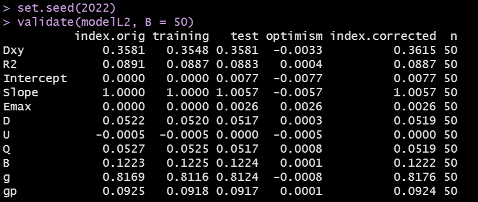
```


## Next Time

- Logistic Regression using `tidymodels`
- Quiz 1 will be made available today at 5 PM. Good luck!
