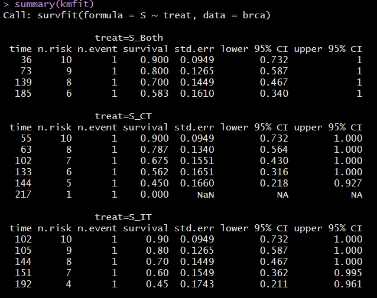
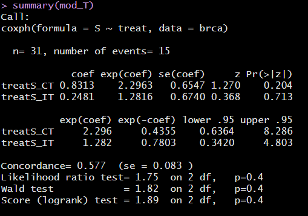

```{r set-options, echo=FALSE, cache=FALSE}
knitr::opts_chunk$set(comment=NA)
options(width = 60)
```

## Preliminaries

```{r packages, message=FALSE, warning=FALSE}
library(here); library(janitor); library(magrittr)
library(knitr); library(rms); library(broom)
library(survival); library(survminer)
library(tidyverse)

theme_set(theme_bw())
```

```{r, message = FALSE}
survex <- read_csv(here("data/survex.csv")) %>%
    type.convert(as.is = FALSE)
```

## Working with Time-to-Event Data

- Last Thursday, we discussed
  - The Survival Function, S(t)
    - Kaplan-Meier Estimation of the Survival Function
    - Creating Survival Objects in R
    - Drawing Survival Curves
  - Testing the difference between Survival Curves
  - The Hazard Function and its Estimation
- Today, we get started with Cox Proportional Hazards Regression

# A Simulated Example

## The `survex` example (from Class 17)

The `survex` data includes 1,000 subjects...

- `sub_id` = patient ID (1-1000)
- `age` = patient's age at study entry, years
- `grp` = patient's group (A or B)
- `study_yrs` = patient's years of observed time in study until death or censoring
- `death` = 1 if patient died, 0 if censored.

To start, we'll model a survival object `Surv(study_yrs, death)` using `grp`.

## Comparing Survival Functions, by group (Class 17)

```{r}
surv_obj2 <- Surv(time = survex$study_yrs, 
                 event = survex$death)

km_grp2 <- survfit(surv_obj2 ~ survex$grp)

survdiff(surv_obj2 ~ survex$grp)
```

## A Cox Proportional Hazards Regression Model

```{r}
mod_grp <- survex %$% 
    coxph(Surv(study_yrs, death) ~ grp)
```

The Cox proportional hazards model fits survival data with a constant (not varying over time) covariate (here, `grp`) to a hazard function of the form:

$$
h(t|grp) = h_0(t) exp(\beta_1grp)
$$

where we estimate the unknown value of $\beta_1$ and where $h_0(t)$ is the baseline hazard which depends on $t$ but not on `grp`.

## Coefficients of our Cox model

```{r}
mod_grp
```

Our hazard ratio estimate is 0.5382 for group B (vs. A)

- Hazard Ratio < 1 indicates a decrease in hazard for subjects in group B as compared to those in group A.
- Does this match our plot?

## The `ggsurvplot` of Cumulative Hazard (`km_grp2`)

```{r, fig.height = 6, echo = FALSE, warning = FALSE}
ggsurvplot(km_grp2, data = survex, fun = "cumhaz",
           xlab = "Time in years",
           pval = TRUE,
           break.time.by = 2,
           risk.table = TRUE,
           risk.table.height = 0.25)
```

## Code for plot on previous slide

```{r, fig.height = 6, eval = FALSE, warning = FALSE}
ggsurvplot(km_grp2, data = survex, fun = "cumhaz",
           xlab = "Time in years",
           pval = TRUE,
           break.time.by = 2,
           risk.table = TRUE,
           risk.table.height = 0.25)
```

## What if we also include Age?

```{r}
mod_age_grp <- coxph(Surv(study_yrs, death) ~ grp + age, 
                     data = survex)
```

## Interpreting the `Age + Group` model

```{r}
mod_age_grp
```

- If Harry is a year older than Steve and both are in group B, then Harry's hazard of death is 1.04 times that of Steve.
- If Harry (group B) and Sally (group A) are the same age, then Harry's hazard of death is 0.55 times that of Sally.

## Tidied coefficients of `coxph` model

```{r}
tidy(mod_age_grp, exponentiate = TRUE, conf.int = T) %>%
    select(term, estimate, std.error, conf.low, conf.high) %>%
    kable(digits = 3)
```

## `glance` for this `coxph` model?

There are actually 18 summary statistics available. Here's a sampling.

```{r}
glance(mod_age_grp) %>%
    select(n, nevent, r2 = r.squared, r2max = r.squared.max, 
           AIC, BIC, nobs, con = concordance) %>%
    kable(digits = c(0, 0, 3, 3, 0, 0, 0, 3))
```

The `concordance` is a goodness-of-fit measure. It describes the probability that the prediction goes in the same direction as the actual data (the fraction of concordant pairs between predictions and the data.) `glance` can also provide a standard error for `concordance`.

## Does adding `age` have an impact on AIC/BIC?

```{r}
AIC(mod_age_grp, mod_grp)
```

```{r}
BIC(mod_age_grp, mod_grp)
```

## Summarizing the Cox Model with `ggforest`

Here is the code. Result on the next slide...

```{r, eval = FALSE}
ggforest(mod_age_grp, data = survex)
```

## Cox Model (Age + Group) Coefficients

```{r, echo = FALSE, fig.height = 6}
ggforest(mod_age_grp, data = survex)
```

## Checking the Proportional Hazards Assumption

- If the proportional hazards assumption is appropriate, we should see a slope of essentially zero in the residuals that are plotted against time on the next slide.
- If we see a slope that seriously different from zero, that will suggest a violation of the proportional hazards assumption.
- A hypothesis test is also performed, where a significant result also indicates a potential problem with the assumption.

If we did see a violation of assumptions, we could either add a non-linear predictor term or use a different kind of survival model.

## PH Check `ggcoxzph(cox.zph(mod_age_grp))`

```{r, echo = FALSE, fig.height = 6, warning = FALSE}
ggcoxzph(cox.zph(mod_age_grp))
```

## What to do if the PH assumption is violated

- If the PH assumption fails on a categorical predictor, fit a Cox model stratified by that predictor (use `strata(var)` rather than `var` in the specification of the `coxph` model.)
- If the PH assumption is violated, this means the hazard isn't constant over time, so we could fit separate Cox models for a series of time intervals.
- Use an extension of the Cox model that permits covariates to vary over time.

Visit https://cran.r-project.org/web/packages/survival/vignettes/timedep.pdf for details on building the relevant data sets and models, with examples.

# A Real Data Example

## The `brca` trial

The `brca` data describes a parallel randomized trial of three treatments, adjuvant to surgery in the treatment of patients with stage-2 carcinoma of the breast. The three treatment groups are:

- `S_CT` = Surgery plus one year of chemotherapy
- `S_IT` = Surgery plus one year of immunotherapy
- `S_Both` = Surgery plus one year of chemotherapy and immunotherapy

The measure of efficacy were "time to death" in weeks. In addition to `treat`, our variables are:

- `trial_weeks`: time in the study, in weeks, to death or censoring
- `last_alive`: 1 if alive at last follow-up (and thus censored), 0 if dead
- `age`: age in years at the start of the trial

## `brca` tibble (note big problem: n = 31!)

Source: Chen and Peace (2011) *Clinical Trial Data Analysis Using R*, CRC Press, section 5.1

```{r, message = FALSE}
brca <- read_csv(here("data", "brca.csv")) %>% 
    type.convert(as.is = FALSE)
```

This is a typical right-censored survival data set with interest in the comparative analysis of the three treatments.

1. Does immunotherapy added to surgery plus chemotherapy improve survival? (Comparing S_Both to S_CT)
2. Does chemotherapy add efficacy to surgery plus immunotherapy? (S_Both vs. S_IT)
3. What is the effect of age on survival?

## The `brca` data

```{r, echo = FALSE}
brca
```


## Create survival object

- `trial_weeks`: time in the study, in weeks, to death or censoring
- `last_alive`: 1 if alive at last follow-up (and thus censored), 0 if dead

So `last_alive` = 0 if the event (death) occurs.

> What's next?

## Create survival object

- `trial_weeks`: time in the study, in weeks, to death or censoring
- `last_alive`: 1 if alive at last follow-up (and thus censored), 0 if dead

So `last_alive` = 0 if the event (death) occurs.

```{r}
brca$S <- with(brca, Surv(trial_weeks, last_alive == 0))

head(brca$S)
```

## Build Kaplan-Meier Estimator

```{r}
kmfit <- survfit(S ~ treat, dat = brca)

print(kmfit, print.rmean = TRUE)
```

---




## K-M Plot via `survminer`

```{r, echo = FALSE, warning = FALSE, fig.height = 6}
ggsurvplot(kmfit, data = brca,
           risk.table = TRUE,
           risk.table.height = 0.25,
           xlab = "Time in weeks")
```

## K-M Plot via `survminer` (code)

```{r, eval = FALSE, warning = FALSE}
ggsurvplot(kmfit, data = brca,
           risk.table = TRUE,
           risk.table.height = 0.25,
           xlab = "Time in weeks")
```

## Testing the difference between curves

```{r}
survdiff(S ~ treat, dat = brca)
```

What do we conclude?

# A Cox Model for Treatment

## Fit Cox Model `mod_T`: Treatment alone

```{r}
mod_T <- coxph(S ~ treat, data = brca)
mod_T
```

---



## Interpreting the Summaries

```{r}
tidy(mod_T, exponentiate = TRUE, conf.int = TRUE) %>%
    select(term, estimate, std.error, conf.low, conf.high) %>%
    kable(digits = 3)
```

- A subject treated with `S_CT` is estimated to have 2.296 times the hazard (95% CI: 0.636, 8.286) of a subject treated with `S_Both` (the baseline).
- A subject treated with `S_IT` is estimated to have 1.282 times the hazard (95% CI 0.342, 4.803) of a subject treated with `S_Both`.

## `ggforest(mod_T, data = brca)`

```{r, echo = FALSE, fig.height = 5}
ggforest(mod_T, data = brca)
```


## Summarizing `mod_T`

All of this comes from `glance(mod_T)`

- `n` = 31 cases, with `nevent` = 15 events (so 16 censored)
- log rank test statistic = 1.752, *p* = 0.416
- Score test statistic = 1.895, *p* = 0.388
- Wald test statistic = 1.820, *p* = 0.403
    - Each tests $H_0$: Treatment adds no value
- (Cox-Snell) R-Squared = 0.055, Maximum Pseudo R-Square = 0.944
    - Cox and Snell's pseudo-$R^2$ reflects the improvement of this model over the model with the intercept alone, with higher values indicating more substantial improvement over an intercept-only model.
    - Not really a percentage of anything: often the maximum value here is less than 1.

## Summarizing `mod_T`

Again, all of this comes from `glance(mod_T)` - see next slide

- Concordance = 0.577 (standard error = 0.083)
    - Really only appropriate when we have at least one quantitative predictor in the Cox model
    - Assesses probability of agreement between survival time and the risk score generated by the predictors
    - 1 indicates perfect agreement, 0.5 indicates no better than chance
- log Likelihood = -43.886, AIC = 91.773, BIC = 93.189
    - Usual summaries, used to compare models, mostly


## `glance(mod_T)` Fit Summaries

```{r, echo = FALSE}
glance(mod_T) %>% select(1:6) %>% kable(digits = 3)
```

```{r, echo = FALSE}
glance(mod_T) %>% select(7:8, 11:12) %>% kable(digits = 3)
```

```{r, echo = FALSE}
glance(mod_T) %>% select(13:18) %>% kable(digits = 3)
```

## Checking the Proportional Hazards Assumption

- If the proportional hazards assumption is appropriate, we should see a slope of essentially zero in the residuals that are plotted against time on the next slide.
- If we see a slope that seriously different from zero, that will suggest a violation of the proportional hazards assumption.
- A hypothesis test is also performed, where a significant result also indicates a potential problem with the assumption.

If we did see a violation of assumptions, we could either add a non-linear predictor term or use a different kind of survival model.

## Graphical PH Check `ggcoxzph(cox.zph(mod_T))`

```{r, echo = FALSE, fig.height = 6}
ggcoxzph(cox.zph(mod_T))
```

## Next Time

- Fitting more complex Cox models with `coxph` and `cph` (from `rms`) for the `brca` data
