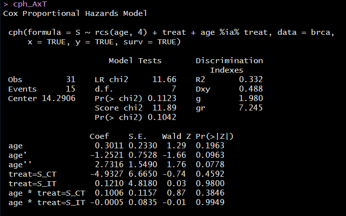
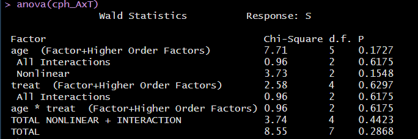

```{r set-options, echo=FALSE, cache=FALSE}
knitr::opts_chunk$set(comment=NA)
options(width = 60)
```

## Today's Agenda

1. Cox models for time-to-event data
    - Returning to the breast cancer trial
    - Using `cph` from `rms` to fit a Cox model
2. Fitting Robust Linear Models
    - Using Huber weights
    - Using bisquare weights
    - Using Quantile Regression

# Cox Models

## Preliminaries for Cox Regression Models

```{r packages, message=FALSE, warning=FALSE}
library(here); library(janitor); library(magrittr)
library(broom); library(knitr); library(rms)

library(survival); library(survminer)

library(tidyverse)

theme_set(theme_bw())
```

```{r, message = FALSE}
brca <- read_csv(here("data", "brca.csv")) %>% 
    type.convert(as.is = FALSE)
```

## Recap of What We Did Tuesday

We're working with data from a trial of three treatments for breast cancer

- Main tibble is `brca` containing `treat` = S_CT, S_IT, S_Both and `age` at baseline
- Time to event data are gathered in `trial_weeks` and `last_alive` which we used to create a survival object we named `S`.
- Created Kaplan-Meier estimate, `kmfit` to compare the `treat` results
- Then built a Cox model for treatment, called `mod_T` using `coxph`.

Now, we'll

- incorporate the covariate (`age`) into the model
- use `cph` from the `rms` package to fit a Cox model that incorporates some non-linearity

## Create survival object

- `trial_weeks`: time in the study, in weeks, to death or censoring
- `last_alive`: 1 if alive at last follow-up (and thus censored), 0 if dead

So `last_alive` = 0 if the event (death) occurs.

```{r}
brca$S <- with(brca, Surv(trial_weeks, last_alive == 0))

head(brca$S)
```

## Fit Cox Model `mod_T`: Treatment alone

```{r}
mod_T <- coxph(S ~ treat, data = brca)
mod_T
```

## Fit Cox Model `mod_AT`: Age + Treatment

```{r}
mod_AT <- coxph(S ~ age + treat, data = brca)
mod_AT
```

## Interpreting the Coefficients of `mod_AT`

```{r}
tidy(mod_AT, exponentiate = TRUE, conf.int = TRUE) %>%
  select(term, estimate, std.error, conf.low, conf.high) %>%
  kable(digits = 2)
```

- If Harry and Sally receive the same `treat` but Harry is one year older, the model estimates Harry will have 1.08 times the hazard of Sally (95% CI 1.01, 1.16).

## Interpreting the Coefficients of `mod_AT`

```{r}
tidy(mod_AT, exponentiate = TRUE, conf.int = TRUE) %>%
  select(term, estimate, std.error, conf.low, conf.high) %>%
  kable(digits = 2)
```

- If Harry receives S_CT and Sally receives S_Both, and they are the same age, the model estimates Harry will have 1.82 times the hazard of Sally (95% CI 0.50, 6.61).
- If Cyrus receives S_IT and Sally receives S_Both, and they are the same age, the model estimates Cyrus will have 1.33 times the hazard of Sally (95% CI 0.33, 5.11).


## `ggforest(mod_AT, data = brca)`

```{r, echo = FALSE, fig.height = 6}
ggforest(mod_AT, data = brca)
```

## Comparing the Two Models

`n` = 31, `nevent` = 15 for each model. 

```{r}
bind_rows(glance(mod_T), glance(mod_AT)) %>%
    mutate(model = c("mod_T", "mod_AT")) %>%
    select(model, p.value.log, concordance, r.squared, 
           max_r2 = r.squared.max, AIC, BIC) %>% 
  kable(digits = c(0,3,3,3,3,1,1))
```

What do the `glance` results indicate?

## Significance Test via Likelihood Ratio ANOVA

```{r}
anova(mod_AT, mod_T)
```

## Graphical PH Check `ggcoxzph(cox.zph(mod_AT))`

```{r, echo = FALSE, fig.height = 6}
ggcoxzph(cox.zph(mod_AT))
```

# Using `cph` from the `rms` package

## Using `rms::cph` to fit a fancier `AxT`

```{r, message = FALSE}
brca <- read_csv(here("data", "brca.csv")) %>% 
    type.convert(as.is = FALSE) # reload without S

d <- datadist(brca)
options(datadist="d")

brca$S <- with(brca, Surv(trial_weeks, last_alive == 0))

cph_AxT <- cph(S ~ rcs(age, 4) + treat + age %ia% treat, 
               data = brca, 
               x = TRUE, y = TRUE, surv = TRUE)
```

## `cph_AxT` results



## `summary(cph_AxT)`

```{r, echo = FALSE}
summary(cph_AxT)
```

## `plot(summary(cph_AxT))`

```{r, echo = FALSE}
plot(summary(cph_AxT))
```

---

```{r, warning = FALSE}
set.seed(432)
validate(cph_AxT)
```

## ANOVA for `cph_AxT` model



## `survplot` in `rms` (code)

For `age` comparison:

```{r, eval = FALSE}
survplot(cph_AxT,
         age = c(35, 45, 55, 65),
         time.inc = 26,
         type = "kaplan-meier",
         xlab = "Study Survival Time in weeks")
```

For `treat` comparison:

```{r, eval = FALSE}
survplot(cph_AxT,
         treat,         
         time.inc = 26,
         type = "kaplan-meier",
         xlab = "Study Survival Time in weeks")
```

## `survplot` in `rms` (Result)

```{r, echo = FALSE, fig.height = 6}
survplot(cph_AxT,
         age = c(35, 45, 55, 65),
         time.inc = 26,
         type = "kaplan-meier",
         xlab = "Study Survival Time in weeks")
```

## `survplot` for `treat` in `rms` (Result)

```{r, echo = FALSE, fig.height = 6}
survplot(cph_AxT,
         treat,
         time.inc = 26,
         type = "kaplan-meier",
         xlab = "Study Survival Time in weeks")
```

## Plotting `age` effect implied by `cph_AxT` model

```{r, fig.height = 5}
ggplot(Predict(cph_AxT, age))
```

## Plotting `treat` effect implied by `cph_AxT` model

```{r, fig.height = 5}
ggplot(Predict(cph_AxT, treat))
```

## `cph_AxT` nomogram (code)

Suppose I want to show 4-year survival rates at the bottom of the nomogram...

```{r, eval = FALSE}
sv <- Survival(cph_AxT)
surv4 <- function(x) sv(208, lp = x)

plot(nomogram(cph_AxT,
              fun = surv4,
              funlabel = c("4 year survival")))
```

## `cph_AxT` nomogram (Results)

```{r, echo = FALSE}
sv <- Survival(cph_AxT)
surv4 <- function(x) sv(208, lp = x)

plot(nomogram(cph_AxT,
              fun = surv4,
              funlabel = c("4-year survival")))
```

## Checking the Proportional Hazards Assumption

```{r, fig.height = 6}
cox.zph(cph_AxT, transform = "km", global = TRUE)
```

---

```{r, fig.height = 6, message = FALSE}
ggcoxzph(cox.zph(cph_AxT))
```

## Additional Diagnostic Plots for your Cox model?

- `survminer` has a function called `ggcoxdiagnostics()` which plots different types of residuals as a function of time, linear predictor or observation id. 
  - See the default graph (which shows martingale residuals) on the next slide.
- Available types of diagnostics that this can plot are specified with the `type` parameter, that takes any of the following options.

```
type = c("martingale", "deviance", "score", "schoenfeld", 
        "dfbeta", "dfbetas", "scaledsch", "partial")
```

---

```{r, fig.height = 6, warning = FALSE, message = FALSE}
ggcoxdiagnostics(cph_AxT)
```


# New Topic: An Introduction to Robust Linear Regression Methods

## Robust Linear Regression Methods

- The `crimestat` data
- Robust Linear Regression Methods 
    - with Huber weights
    - with bisquare weights (biweights)
    - Quantile Regression on the Median

## Additional Packages for this work

```{r, message = FALSE}
library(MASS); library(robustbase); library(boot)
library(quantreg); library(lmtest); library(sandwich)
library(conflicted)

conflict_prefer("select", "dplyr")
conflict_prefer("summarize", "dplyr")

library(tidyverse)
```

```{r, echo = FALSE}
decim <- function(x, k) format(round(x, k), nsmall=k)
```


## The `crimestat` data

For each of 51 states (including the District of Columbia), we have the state's ID number, postal abbreviation and full name, as well as:

- **crime** - the violent crime rate per 100,000 people
- **poverty** - the official poverty rate (% of people living in poverty in the state/district) in 2014
- **single** - the percentage of households in the state/district led by a female householder with no spouse present and with her own children under 18 years living in the household in 2016

## The `crimestat` data set

```{r, message = FALSE}
crimestat <- read_csv("data/crimestat.csv")
crimestat
```

## Modeling `crime` with `poverty` and `single`

Our main goal will be to build a linear regression model to predict **crime** using centered versions of both **poverty** and **single**.

```{r}
crimestat <- crimestat %>%
    mutate(pov_c = poverty - mean(poverty),
           single_c = single - mean(single))
```

## Our original (OLS) model

Note the sneaky trick with the outside parentheses...

```{r}
(mod1 <- lm(crime ~ pov_c + single_c, data = crimestat))
```

## Coefficients?

```{r}
tidy(mod1, conf.int = TRUE) %>%
  select(term, estimate, std.error, 
         p.value, conf.low, conf.high) %>%
  kable(digits = 3)
```

## OLS Residuals

```{r, echo = FALSE, fig.height = 5}
par(mfrow=c(1,2))
plot(mod1, which = c(1:2))
par(mfrow = c(1,1))
```

Which points are highlighted here?

## Remaining Residual Plots from OLS

```{r, echo = FALSE, fig.height = 5}
par(mfrow=c(1,2))
plot(mod1, which = c(3, 5))
par(mfrow = c(1,1))
```

So which points are of special interest?

## Which points are those?

```{r}
crimestat %>%
  slice(c(2, 9, 25))
```

## Robust Linear Regression with Huber weights

There are several ways to do robust linear regression using M-estimation, including weighting using Huber and bisquare strategies.

- Robust linear regression here will make use of a method called iteratively re-weighted least squares (IRLS) to estimate models. 
- M-estimation defines a weight function which is applied during estimation. 
- The weights depend on the residuals and the residuals depend on the weights, so an iterative process is required.

We'll fit the model, using the default weighting choice: what are called Huber weights, where observations with small residuals get a weight of 1, and the larger the residual, the smaller the weight. 

### Our robust model (using `MASS::rlm`)

```{r}
rob.huber <- rlm(crime ~ pov_c + single_c, data = crimestat)
```

## Summary of the robust (Huber weights) model

```{r}
tidy(rob.huber) %>%
  kable(digits = 3)
```

Now, *both* predictors appear to have estimates that exceed twice their standard error. So this is a very different result than ordinary least squares gave us.

## Glance at the robust model (vs. OLS)

```{r}
glance(mod1)
glance(rob.huber)
```

## Understanding the Huber weights a bit

Let's augment the data with results from this model, including the weights.

```{r}
crime_with_huber <- augment(rob.huber, crimestat) %>%
    mutate(w = rob.huber$w) %>% arrange(w) 

crime_with_huber %>% 
  select(sid, state, w, crime, pov_c, single_c, everything()) %>%
  head(., 3)
```

## Are cases with large residuals down-weighted?

```{r, fig.height = 4}
ggplot(crime_with_huber, aes(x = w, y = abs(.resid))) +
    geom_label(aes(label = state)) 
```

## Conclusions from the Plot of Weights

- District of Columbia will be down-weighted the most, followed by Alaska and then Nevada and Mississippi. 
- But many of the observations will have a weight of 1. 
- In ordinary least squares, all observations would have weight 1.
- So the more cases in the robust regression that have a weight close to one, the closer the results of the OLS and robust procedures will be.

## summary(rob.huber)

```{r, echo = FALSE}
summary(rob.huber)
```

## Robust Linear Regression with the biweight

As mentioned there are several possible weighting functions - we'll next try the **biweight**, also called the bisquare or Tukey's bisquare, in which all cases with a non-zero residual get down-weighted at least a little. Here is the resulting fit...

```{r}
(rob.biweight <- rlm(crime ~ pov_c + single_c,
                    data = crimestat, psi = psi.bisquare))
```

## Coefficients and Standard Errors

```{r}
tidy(rob.biweight) %>% kable(digits = 3)
```

## Understanding the biweights weights a bit

Let's augment the data, as above

```{r}
crime_with_biweights <- 
  augment(rob.biweight, newdata = crimestat) %>%
  mutate(w = rob.biweight$w) %>% 
  arrange(w)

head(crime_with_biweights, 3)
```

## Relationship of Weights and Residuals

```{r, fig.height = 4}
ggplot(crime_with_biweights, aes(x = w, y = abs(.resid))) +
    geom_label(aes(label = state)) 
```

## Conclusions from the biweights plot

Again, cases with large residuals (in absolute value) are down-weighted generally, but here, Alaska and Washington DC receive no weight at all in fitting the final model.

- We can see that the weight given to DC and Alaska is dramatically lower (in fact it is zero) using the bisquare weighting function than the Huber weighting function and the parameter estimates from these two different weighting methods differ. 
- The maximum weight (here, for Alabama) for any state using the biweight is still slightly smaller than 1.

## summary(rob.biweight)

```{r, echo = FALSE}
summary(rob.biweight)
```

## Comparing OLS and the two weighting schemes

```{r}
glance(mod1) %>% select(1:6)
glance(mod1) %>% select(7:12)
```

## Comparing OLS and the two weighting schemes

```{r}
glance(rob.biweight) # biweights
glance(rob.huber) # Huber weights
```

## Quantile Regression on the Median

We can use the `rq` function in the `quantreg` package to model the **median** of our outcome (violent crime rate) on the basis of our predictors, rather than the mean, as is the case in ordinary least squares.

```{r}
rob.quan <- rq(crime ~ pov_c + single_c, data = crimestat)

glance(rob.quan)
```

## summary(rob.quan)

```{r, echo = FALSE}
summary(rob.quan <- rq(crime ~ pov_c + single_c, data = crimestat))
```

## Estimating a different quantile (tau = 0.70)

In fact, if we like, we can estimate any quantile by specifying the `tau` parameter (here `tau` = 0.5, by default, so we estimate the median.)

```{r}
(rob.quan70 <- rq(crime ~ pov_c + single_c, tau = 0.70,
                  data = crimestat))
```

## Comparing our Four Models

**Estimating the Mean**

Fit | Intercept CI | `pov_c` CI | `single_c` CI 
---------: | ----------: | ----------: | ----------:  
OLS | (`r 364.4 - 2*22.9`, `r 364.4 + 2*22.9`) | (`r 16.11 - 2*9.62`, `r 16.11 + 2*9.62`) | (`r 23.84 - 2*18.38`, `r decim(23.84 + 2*18.38,2)`) 
Robust (Huber) | (`r decim(343.8 - 2*11.9,1)`, `r 343.8 + 2*11.9`) | (`r 11.91 - 2*5.51`, `r 11.91 + 2*5.51`) | (`r 30.99 - 2*10.53`, `r 30.99 + 2*10.53`) 
Robust (biweight) | (`r 336.1 - 2*12.7`, `r 336.1 + 2*12.7`) | (`r decim(10.32 - 2*5.31,2)`, `r 10.32 + 2*5.31`) | (`r 34.71 - 2*10.16`, `r 34.71 + 2*10.16`) 

**Note**: CIs estimated for OLS and Robust methods as point estimate $\pm$ 2 standard errors

**Estimating the Median**

Fit | Intercept CI | `pov_c` CI | `single_c` CI | AIC | BIC
-----------------: | ----------: | ----------: | ----------: 
Quantile (Median) Reg | (336.9, 366.2) | (3.07, 28.96) | (4.46, 48,19) 

## Comparing AIC and BIC


Fit | AIC | BIC
---------: | ----------: | ----------: 
OLS | `r decim(AIC(mod1), 1)` | `r decim(BIC(mod1), 1)`
Robust (Huber) | `r decim(AIC(rob.huber), 1)` | `r decim(glance(rob.huber)$BIC[1], 1)`
Robust (biweight) | `r decim(AIC(rob.biweight), 1)` | `r decim(glance(rob.biweight)$BIC[1], 1)`
Quantile (median) | `r decim(AIC(rob.quan), 1)` | `r decim(glance(rob.quan)$BIC[1], 1)`


## Some General Thoughts

1. When comparing the results of a regular OLS regression and a robust regression for a data set which displays outliers, if the results are very different, you will most likely want to use the results from the robust regression. 
    - Large differences suggest that the model parameters are being highly influenced by outliers. 
2. Different weighting functions have advantages and drawbacks. 
    - Huber weights can have difficulties with really severe outliers.
    - Bisquare weights can have difficulties converging or may yield multiple solutions. 
    - Quantile regression approaches have some nice properties, but describe medians (or other quantiles) rather than means.
