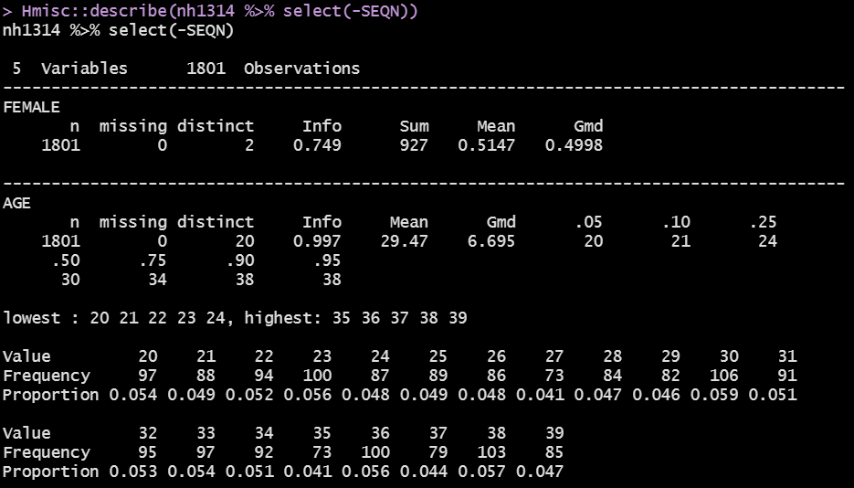
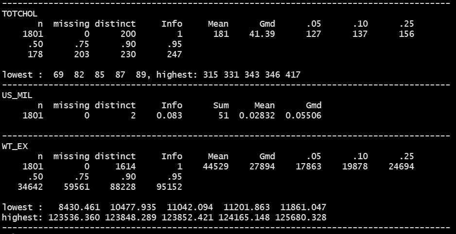
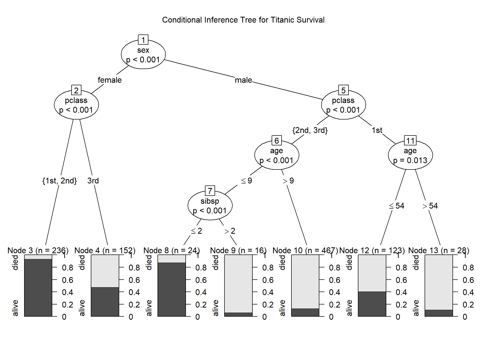

```{r set-options, echo=FALSE, cache=FALSE}
knitr::opts_chunk$set(comment=NA)
options(width = 60)
```

## Today's Agenda

- Working with weights in regression models
  - Logistic regression on aggregated data
  - Using survey weights from NHANES
- Classification & Regression Trees and the Titanic

# Part 1: Working with Weights in Regression

## Setup for Part 1

```{r, message = FALSE}
library(here); library(magrittr) 
library(janitor); library(knitr)
library(rms)
library(broom)

library(survey)
library(nhanesA); library(haven)

library(tidyverse)
theme_set(theme_bw())
```

# Part 1A. Logistic regression on aggregated data

## Colorectal Cancer Screening Data

The `screening.csv` data (imported into the R tibble `colscr`) are simulated. They mirror a subset of the actual results from Better Health Partnership's original pilot study of colorectal cancer screening in primary care clinics in Northeast Ohio. 

```{r, message = FALSE}
colscr <- read_csv(here("data/screening.csv")) %>% 
    type.convert(as.is = FALSE)
```

## Available to us are the following variables

We have 26 rows, one for each `location` (labeled A-Z), which are part of four `system`s, labeled Sys_1 through Sys_4 each of which contain 6 or 7 `location`s.

Variable | Description  | Range
----------:| :------------------------------: | :-------:
`subjects` | # of subjects reported by clinic | 803, 7677
`screen_rate` | prop. of `subjects` who were screened | 0.64, 0.90
`screened` | # of `subjects` who were screened |572, 6947
`notscreened` | # of `subjects` not screened | 231, 1356
`meanage` | mean age of subjects in years | 58, 66
`female` | % of subjects who are female | 46, 70
`pct_lowins` | % of subjects Medicaid or uninsured | 0.3, 51.3

## Fitting a Logistic Regression Model to Proportion Data

Here, we have a binary outcome (was the subject screened or not?) but we have aggregated the results to the clinic level. 

We can use the counts of the subjects at each clinic (in `subjects`) and the proportion screened (in `screen_rate`) to fit a logistic regression model, as follows:

```{r}
m_screen1 <-  glm(screen_rate ~ meanage + female + 
                    pct_lowins + system, family = binomial, 
                  weights = subjects, data = colscr)
```

- Note the use of the subject counts as weights to apply an appropriate count to each proportion.

## Model `m_screeen1`

```{r}
tidy(m_screen1, exponentiate = TRUE, conf.int = TRUE) %>%
  select(term, estimate, conf.low, conf.high) %>%
  kable(digits = 3)
```

## Fitting Counts of Successes and Failures

Alternatively, we can use the counts of successes and failures within each location to fit our model.

```{r}
m_screen2 <-  glm(cbind(screened, notscreened) ~ 
                    meanage + female + pct_lowins + system, 
           family = binomial, data = colscr)
```

- Now, we don't need weights, since the sample sizes are incorporated into `cbind(screened, notscreened)`.

## Model `m_screen2`

```{r}
tidy(m_screen2, exponentiate = TRUE, conf.int = TRUE) %>%
  select(term, estimate, conf.low, conf.high) %>%
  kable(digits = 3)
```

- Results are, of course, identical to `m_screen1`.


## How does one address this problem in `rms`?

We can use `Glm`, which allows for a broader group of generalized linear models than just `lrm`...

```{r}
d <- datadist(colscr)
options(datadist = "d")

m_screen3 <-  Glm(screen_rate ~ meanage + female + 
                    pct_lowins + system, 
                  family = binomial, weights = subjects, 
                  data = colscr, x = T, y = T)
```

## `m_screen3`

```{r}
exp(m_screen3$coefficients)
```

- Again, this is the same result that we saw in the other models for the same data.
- Note that `Glm` doesn't provide the `validate` function for this weighted model, so it's not as strong as in other settings.

# Part 1B. Incorporating survey weights in a regression model

## What are survey weights?

In many surveys, each sampled subject is assigned a weight that is equivalent to the reciprocal of his/her probability of selection into the sample.

$$
\mbox{Sample Subject's Weight} = \frac{1}{Prob(selection)}
$$

but more sophisticated sampling designs require more complex weighting schemes. Usually these are published as part of the survey data.

There are several packages available to help incorporate survey weights in R, but I will describe the `survey` package.

## An NHANES Example

Let's use the NHANES 2013-14 data and pull in both the demographics (`DEMO_H`) and total cholesterol (`TCHOL_H`) databases.

```{r}
demo_raw <- nhanes('DEMO_H')
tchol_raw <- nhanes('TCHOL_H')
```

Detailed descriptions available at

- https://wwwn.cdc.gov/Nchs/Nhanes/2013-2014/DEMO_H.htm
- https://wwwn.cdc.gov/Nchs/Nhanes/2013-2014/TCHOL_H.htm

## Weighting in NHANES

Weights are created in NHANES to account for the complex survey design. A sample weight is assigned to each sample person. It is a measure of the number of people in the population represented by that sample person.

The sample weight is created in three steps:

1. the base weight is computed, which accounts for the unequal probabilities of selection given that some demographic groups were over-sampled;
2. adjustments are made for non-response; and
3. post-stratification adjustments are made to match estimates of the U.S. civilian non-institutionalized population available from the Census Bureau.

Source: https://wwwn.cdc.gov/nchs/nhanes/tutorials/Module3.aspx


## Weights in our NHANES data

The `DEMO` file contains two kinds of sampling weights:

- the interview weight (`WTINT2yr`), and
- the MEC exam weight (`WTMEC2yr`)

NHANES also provides several weights for subsamples. A good rule for NHANES is to identify the variable of interest that was collected on the smallest number of respondents. The sample weight that applies to that variable is the appropriate one to use in your analysis.

In our case, we will use the weights from the MEC exam.

## What Variables Do We Need?

- `SEQN` = subject identifying code
- `RIAGENDR` = sex (1 = M, 2 = F)
- `RIDAGEYR` = age (in years at screening, topcode at 80)
- `DMQMILIZ` = served active duty in US Armed Forces (1 = yes, 2 = no)
- `RIDSTATR` = 2 if subject took both interview and MEC exam
- `WTMEC2YR` - Full sample 2 year MEC exam weight
- `LBXTC` = Total Cholesterol (mg/dl)

The first five of these came from the `DEMO_H` file, and the first and last comes from `TCHOL_H`.

## Merge the `DEMO` and `TCHOL` files

```{r}
dim(demo_raw)
dim(tchol_raw)

joined_df <- inner_join(demo_raw, tchol_raw, by = c("SEQN"))

dim(joined_df)
```

## Create a small analytic tibble

```{r}
nh1314 <- joined_df %>% # has n = 8291
    tibble() %>%
    zap_label() %>% # still have n = 8291
    filter(complete.cases(LBXTC)) %>% # now n = 7624
    filter(RIDSTATR == 2) %>% # still 7624
    filter(RIDAGEYR > 19 & RIDAGEYR < 40) %>% # now n = 1802
    filter(DMQMILIZ < 3) %>% # drop 7 = refused, n = 1801
    mutate(FEMALE = RIAGENDR - 1,
           AGE = RIDAGEYR,
           US_MIL = ifelse(DMQMILIZ == 1, 1, 0),
           WT_EX = WTMEC2YR,
           TOTCHOL = LBXTC) %>%
    select(SEQN, FEMALE, AGE, TOTCHOL, US_MIL, WT_EX)
```

## Our `nh1314` analytic sample (1/2)

```{r, eval = FALSE}
Hmisc::describe(nh1314 %>% select(-SEQN))
```



## Our `nh1314` analytic sample (2/2)



Each weight represents the number of people exemplified by that subject.

## Create `nh_design` survey design

```{r}
nh_design <- 
    svydesign(
        id = ~ SEQN,
        weights = ~ WT_EX,
        data = nh1314) 

nh_design <- update( nh_design, one = 1) # helps with counting
```

## Unweighted counts, overall and by sex

```{r}
sum(weights(nh_design, "sampling") != 0)
svyby( ~ one, ~ FEMALE, nh_design, unwtd.count)
svyby( ~ one, ~ FEMALE + US_MIL, nh_design, unwtd.count)
```

## Weighted counts, overall and by groups

Weighted size of the generalizable population, overall and by groups.

```{r}
svytotal( ~ one, nh_design )

svyby( ~ one, ~ FEMALE * US_MIL, nh_design, svytotal)
```

## Use the survey design to get weighted means

What is the mean of total cholesterol, overall and in groups?

```{r}
svymean( ~ TOTCHOL, nh_design, na.rm = TRUE)

svyby(~ TOTCHOL, ~ FEMALE + US_MIL, nh_design, 
      svymean, na.rm = TRUE)
```

## Unweighted Group Means of TOTCHOL

```{r}
nh1314 %>% dplyr::summarize(n = n(), mean(TOTCHOL))
```


```{r, message = FALSE}
nh1314 %>% group_by(FEMALE, US_MIL) %>%
  dplyr::summarize(n = n(), mean(TOTCHOL)) %>%
  kable(digits = 2)
```


## Measures of uncertainty (Survey-Weighted)

Mean of total cholesterol within groups with 90% CI?

```{r}
grouped_result <- svyby(~ TOTCHOL, ~ FEMALE + US_MIL, 
                        nh_design, svymean, na.rm = TRUE)
coef(grouped_result)
confint(grouped_result, level = 0.90)
```

- Get standard errors with `se(grouped_result)`, too.

## Perform a survey-weighted generalized linear model

Actually, we'll run two models, first without and second with an interaction term between `FEMALE` and `US_MIL`.

```{r}
glm1_res <- svyglm(
    TOTCHOL ~ AGE + FEMALE + US_MIL, 
    nh_design, family = gaussian())
```

```{r}
glm2_res <- svyglm(
    TOTCHOL ~ AGE + FEMALE * US_MIL, 
    nh_design, family = gaussian())
```

Gaussian family used to generate linear regressions here.

## Model 1 Results

```{r}
summary(glm1_res)
```

## Model 2 Results

```{r}
summary(glm2_res)
```

## Do tidy and glance work?

```{r}
tidy(glm2_res)

glance(glm2_res)
```

# Part 2: CART and the Titanic

## Packages and Setup for our CART work

```{r, message=FALSE, warning = FALSE}
library(readxl)
library(Hmisc)
library(rpart) # new today
library(rpart.plot) # new today
library(party) # new today
library(tidyverse)
```

## CART and the Titanic

My goal with this material is to:

1. take a batch of data about survival on the Titanic and 
2. build a conditional inference tree to help classify passengers into groups in a way that makes accurate predictions.

---



## Sources and Resources

There are three new libraries we'll use in this work, that you'll have to install, called `rpart`, `rpart.plot` and `party`. The rest of this is (generously) 10% original material from me. Sources:

- [\textcolor{blue}{statmethods.net}](http://www.statmethods.net/advstats/cart.html) (lots of the descriptions are here)
- [\textcolor{blue}{CART with rpart}](https://rpubs.com/minma/cart_with_rpart) (uses the titanic data)
- [\textcolor{blue}{rpart vignette}](https://cran.r-project.org/web/packages/rpart/vignettes/longintro.pdf)
- [\textcolor{blue}{party vignette}](https://cran.r-project.org/web/packages/party/vignettes/party.pdf)
- [\textcolor{blue}{milbo.org}](http://www.milbo.org/rpart-plot/prp.pdf) (tutorial on rpart.plot for tree plotting)

Less immediately useful for this document, but useful in other settings were:

- [\textcolor{blue}{CART talk}](http://statweb.stanford.edu/~lpekelis/13_datafest_cart/13_datafest_cart_talk.pdf)
- [\textcolor{blue}{RandomForests}](https://www.stat.berkeley.edu/~breiman/RandomForests/) is old, but still useful

## The data set

The dataset was compiled by Frank Harrell and Robert Dawson and Philip Hind, among others. 

- The `titanic3.xls` data I provide on the course website describes the survival status of individual passengers on the Titanic.  The data frame does not contain information for the crew, but it does contain actual and estimated ages for almost 80% of the passengers. 

- The data are available at [\textcolor{blue}{this link at Vanderbilt}](http://biostat.mc.vanderbilt.edu/wiki/pub/Main/DataSets/titanic3.xls), and [\textcolor{blue}{see this file}](http://biostat.mc.vanderbilt.edu/twiki/pub/Main/DataSets/titanic3info.txt) for additional details.

## Some initial tidying

```{r}
titan <- read_excel("data/titanic3.xls") %>%
  mutate(pclass = factor(pclass, levels = c(1, 2, 3), 
                         labels = c("1st", "2nd", "3rd")),
         sex = factor(sex),
         survived = factor(survived, levels = c(0, 1), 
                          labels = c("died", "alive"))) %>%
  select(pclass, survived, sex, age, sibsp, parch, name) %>%
  na.omit
```

## The Variables

We're just going to look at the first six variables here, ignoring the passenger's `name`.

- **pclass** = passenger class (1 = 1st, 2 = 2nd, 3 = 3rd), this is a proxy for socio-economic status, with 1 = Upper, 2 = Middle, 3 = Lower
- **survival** = survival (0 = No, 1 = Yes)
- **sex** = male or female
- **age**, in years
- **sibsp**, the number of siblings/spouses aboard
- **parch**, the number of parents/children aboard

## Building a Classification Tree

Recursive partitioning is a fundamental tool in data mining. It helps us explore the structure of a set of data, while developing easy to visualize decision rules for predicting a categorical (classification tree) or continuous (regression tree) outcome. Paraphrasing the [\textcolor{blue}{rpart vignette}](https://cran.r-project.org/web/packages/rpart/vignettes/longintro.pdf): Classification and regression trees are built by the following process: 

1. The single variable is found which best splits the data into two groups (so that the two groups are as "pure" as possible, essentially, is what we mean by "best splits").
2. The data are separated, and then this process is applied separately to each subgroup.
3. and so on recursively until the subgroups either reach a minimum size or until no improvement can be
made.

- The tree is trying to make the nodes as decisive as possible, with as few misclassifications as possible.

## Step 1 Begin with a small cp value

```{r}
set.seed(432)
tree <- rpart(survived ~ pclass + sex + age + sibsp + parch, 
              data = titan, 
     control = rpart.control(minsplit = 30, cp = 0.0001))
```

- `minsplit` is the minimum number of observations that must exist in a node in order for a split to be attempted. The default is only 20, but I would like to show you a relatively small tree here.
- `cp` here stands for complexity parameter. Any split that does not decrease the overall lack of fit by a factor of `cp` is not attempted. You will eventually determine the value for this parameter to use through cross-validation.

## Step 2 Pick the tree size that minimizes misclassification rate (prediction error)


## Prune the tree to match `cp` suggestion

```{r}
bestcp <- tree$cptable[which.min
                       (tree$cptable[,"xerror"]),"CP"]
tree.pruned <- prune(tree, cp = bestcp)
```

### Building the Classification Tree Plot

```{r, eval = FALSE}
prp(tree.pruned, faclen = 0, cex = 0.8, extra = 1, 
    main = "Classification Tree for 1,046 Titanic Passengers")
## faclen = 0 means to use full names of the factor labels
## extra = 1 adds number of observations at each node
```

## The Classification Tree

```{r, echo = FALSE}
prp(tree.pruned, faclen = 0, cex = 0.8, extra = 1, 
    main = "Classification Tree for 1,046 Titanic Passengers")
```

## A Regression Tree

Suppose we use the same data, but a continuous outcome: age, rather than survival.

```{r}
set.seed(0434)
tree2 <- rpart(age ~ pclass + sex + survived + sibsp + parch, 
              data = titan, 
              control = rpart.control(minsplit = 20, 
                                      cp = 0.0001))
```

### Now identify the best choice of cp, and prune

```{r}
bestcp2 <- tree2$cptable[which.min(
                    tree2$cptable[,"xerror"]),"CP"]

tree2.pruned <- prune(tree2, cp = bestcp)
```

## The Regression Tree

```{r}
prp(tree2.pruned, faclen = 0, cex = 0.8, extra = 1, 
    main = "Pruned Regression Tree for Age")
```

## Conditional Inference Trees via `party`

The `party` package gives us nonparametric regression trees for all sorts of outcomes. Let's look at our two examples:

### Conditional Inference Tree for `survived` in Titanic data

```{r, eval = FALSE}
tree.sur <- ctree(survived ~ pclass + sex + age + 
                      sibsp + parch, 
              data = titan)
plot(tree.sur, 
     main = "Conditional Inference Tree for Titanic Survival")
```

## Resulting Tree for `survived`

```{r, echo = FALSE}
tree.sur <- ctree(survived ~ pclass + sex + age + sibsp + parch, 
              data = titan)
plot(tree.sur, main = "Conditional Inference Tree for Titanic Survival")
```

## Conditional Inference Tree for `age` in Titanic data

```{r, eval = FALSE}
tree.age <- ctree(age ~ pclass + sex + survived + 
                      sibsp + parch, 
              data = titan)
plot(tree.age, 
     main = "Conditional Inference Tree for Titanic Age")
```

## Resulting Tree for `age`

```{r, echo = FALSE}
tree.age <- ctree(age ~ pclass + sex + survived + 
                      sibsp + parch, 
              data = titan)
plot(tree.age, 
     main = "Conditional Inference Tree for Titanic Age")
```

## Next Time

Ridge Regression and The Lasso
