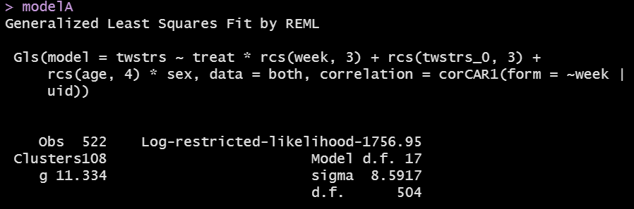
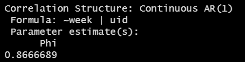
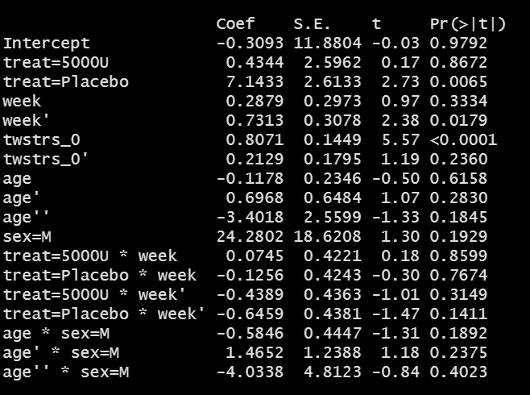
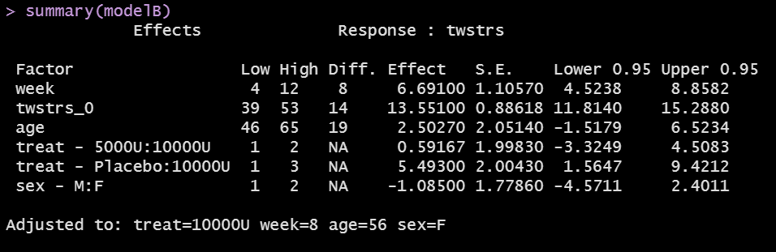
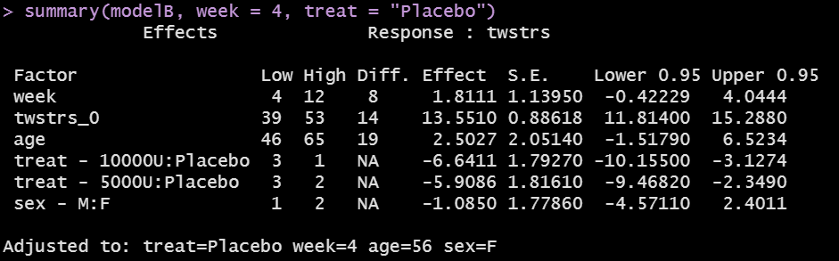
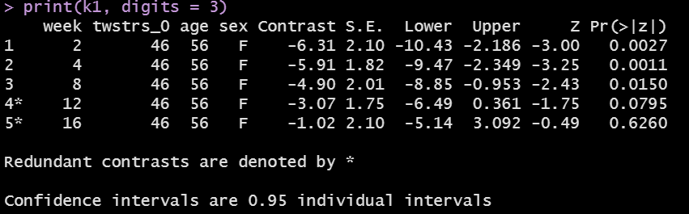
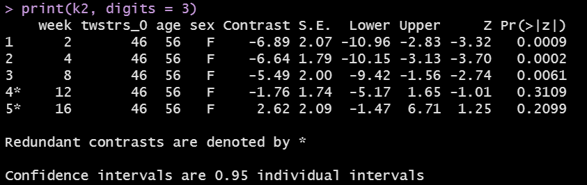

```{r set-options, echo=FALSE, cache=FALSE}
knitr::opts_chunk$set(comment=NA)
options(width = 60)
```

## Today's Topic

- Generalized Least Squares (growth curve models) for longitudinal data

## Today's R Packages

```{r, message = FALSE}
library(janitor); library(here)
library(knitr); library(magrittr)
library(patchwork)
library(haven) # for zap_label
library(nlme)  # for modeling with gls
library(rms)
library(tidyverse)

theme_set(theme_bw())
```

## Today's Key Reference

Harrell (2015) Chapter 7 is the source for most of this material, with some adjustments to the coding and some details of the presentation. Remember that this text is part of our Sources page, and if you're interested in more, start there. 

- More details on the cervical dystonia data set we'll use today are found at https://hbiostat.org/data/repo/cdystonia.html.

- Cervical dystonia, also called spasmodic torticollis, is a painful condition in which your neck muscles contract involuntarily, causing your head to twist or turn to one side. Cervical dystonia can also cause your head to uncontrollably tilt forward or backward.

# Generalized Least Squares for Modeling Longitudinal Data (see Harrell 2015, Chapter 7)

## Modeling an Outcome Measured Serially Over Time

Suppose we have a quantitative outcome which we will measure at multiple times for each subject.

- This creates correlations between measurements on the same subject that must be taken into account.
- The model we'll use, generalized least squares, has some nice properties, and in fact OLS is a special case of generalized least squares, so that's appealing.
- Generalized Least Squares models like those I'll demonstrate today are also called *growth curve models*.

## Setting Up

- We will have 109 subjects in our study, which is an RCT.
- We will have some baseline covariates (age, sex) for each subject.
- We will use the baseline (pre-randomization) value of the outcome as a covariate.
    - There are lots of good reasons to put initial measurements of the outcome into the set of predictors. See our next slide.
- We will have up to 6 measurements of our outcome on each subject.
- We will have differing patterns of measurements for some subjects, just because of practical reasons, so not all subjects will have all six measurements.
- We will focus on a model that includes several non-linear terms to predict the trajectory of our outcome over time on the basis of the covariates.

## Using pre-randomization outcomes as covariates

> For RCTs, I draw a sharp line at the point when the intervention begins. The LHS [left hand side of the model equation] is reserved for something that is a response to treatment. Anything before this point can potentially be included as a covariate in the regression model. This includes the "baseline" value of the outcome variable. Indeed, the best predictor of the outcome at the end of the study is typically where the patient began at the beginning. It drinks up a lot of
variability in the outcome; and, the effect of other covariates is typically
mediated through this variable. I treat anything after the intervention begins as an outcome. In the western scientific method, an "effect" must follow the "cause" even if by a split second.

- Jim Rochon, quoted in Harrell (2015, Chapter 7)

## Harrell (Chapter 7) on Longitudinal Modeling

> The real value of longitudinal data comes from modeling the entire time course. Estimating the time course leads to understanding slopes, shapes, overall trajectories, and periods of treatment effectiveness.

> To allow the slope or shape of the time-response profile to depend on some
of the Xs we add product terms for desired interaction effects.

> Once the right hand side of the model is formulated, predicted values,
contrasts, and ANOVAs are obtained just as with a univariate model. For
these purposes time is no different than any other covariate except for what
is described in the next slide.

## Modeling Within-Sample Dependence

> Sometimes understanding within-subject correlation patterns is of interest in itself. More commonly, accounting for intra-subject correlation is crucial for inferences to be valid.

The main alternative strategies to the GLS approach we'll use are:

- Repeated Measures ANOVA
- Generalized Estimating Equations (GEEs)
- Mixed Effects Models

Harrell (2015) provides a chart (page 145) which describes which methods to use for repeated measurements / serial data.

## Two Other Things To Be Aware Of

- Last Observation Carried Forward (LOCF) is an ad hoc attempt to account for people who drop out partway through the study, or who have inconsistent measuring patterns.

- Summary Statistics can convert multivariate responses to unvariate ones (say, within-subject regression slopes, or means over time) with few assumptions so long as there are minimal dropouts, while suffering some (perhaps unimportant) loss of information. We do have to assume that the summary measure is an adequate descriptor of the time profile for our research question.

## Assumptions of the Growth Curve Model (GLS)

- All the assumptions of OLS at a single time point including correct modeling
of predictor effects and univariate normality of responses conditional
on the predictors X are still in place.
- The distribution of two responses at two different times for the same subject, conditional on X, is bivariate normal with a specified correlation coefficient.
- The joint distribution of all responses for the ith subject is multivariate
normal with a specified correlation pattern (there are multiple options)
- Responses from two different subjects are uncorrelated

## Common Correlation Structures

- We usually restrict ourselves to **isotropic** correlation structures which assume the correlation between responses within subject at two times depends only on a measure of the distance between the two times, not the individual times.
- Harrell (2015) presents seven options (all from the `nlme` package) on page 148.

## The `cdystonia` data

The data (described in Harrell 2015, Chapter 7) come from a multi-center RCT of botulinum toxin type B (BotB) in adult subjects with cervical dystonia from nine US sites.

-   Subjects were randomized to receive Placebo (N = 36), 5000 units of BotB (N = 36) or 10,000 units of BotB (N = 37).
-   The outcome is TWSTRS, the Toronto Western Spasmodic Torticollis Rating Scale, which measures severity, pain, and disability of cervical dystonia (high scores mean more impairment).
    -   TWSTRS is measured at baseline (week 0) and at weeks 2, 4, 8, 12 and 16 after treatment began.

## Obtaining the `cdystonia` data

```{r, fig.height = 6}
getHdata(cdystonia) # obtain data set (includes labels)
datadensity(cdystonia)
```

## Some Cleanup

```{r}
cdystonia <- cdystonia %>% tibble() %>% 
    zap_label() %>% # for some reason, this only sort of works
    mutate(uid = factor(paste(site, id)),
           age = as.numeric(age),
           week = as.numeric(week),
           id = factor(id), 
           twstrs = as.numeric(twstrs)) %>%
    relocate(uid)

str(cdystonia)
```

## The `cdystonia` tibble (without labels)

```{r}
cdystonia
```

## The `cdystonia` codebook

*n* = 631 observations, on 7 variables, describing 109 unique subjects, no NA

|   Name | Label                                               |
|-------:|:----------------------------------------------------|
|    uid | unique subject ID (combined Site then ID)           |
|   week | Weeks after Treatment began (0, 2, 4, 8, 12 or 16)  |
|   site | Site (Center, labeled 1-9)                          |
|     id | ID (specific to a Site, labeled 1-19)               |
|  treat | Placebo (n = 36), 5000U (n = 36) or 10000U (n = 37) |
|    age | Age (in years, observed range 26-83)                |
|    sex | Sex (F or M)                                        |
| twstrs | TWSTRS total score (observed range: 6-71)           |

## Plot with Quartiles

```{r, eval = FALSE}
ggplot(cdystonia, aes(x = week, y = twstrs)) +
    geom_smooth(stat = "summary",
                fun.data = median_hilow,
                fun.args = (conf.int = 0.5)) +
    lims(y = c(0, 75)) +
    facet_wrap(~ treat, nrow = 2) +
    labs(title = "TWSTRS per week by Treatment",
         subtitle = "Median and Quartiles")
```

- `median_hilow` from `Hmisc` gives median and quartiles (with 50% CI)
- Result on next slide.

---

```{r, echo = FALSE}
ggplot(cdystonia, aes(x = week, y = twstrs)) +
    geom_smooth(stat = "summary",
                fun.data = median_hilow,
                fun.args = (conf.int = 0.5)) +
    lims(y = c(0, 75)) +
    facet_wrap(~ treat, nrow = 2) +
    labs(title = "TWSTRS per week by Treatment",
         subtitle = "Median and Quartiles")
```


## Spaghetti Plot of raw TWSTRS scores, by subject

```{r, eval = FALSE}
ggplot(cdystonia, aes(x = week, y = twstrs, 
                      col = factor(id))) +
    geom_line() +
    facet_grid(treat ~ site, labeller = "label_both") +
    guides(col = "none") +
    labs(x = "Week", y = "TWSTRS total score",
         title = "Raw TWSTRS scores, for n = 109 subjects")
```

-   Result on next slide

------------------------------------------------------------------------

```{r, echo = FALSE}
ggplot(cdystonia, aes(x = week, y = twstrs, 
                      col = factor(id))) +
    geom_line() +
    facet_grid(treat ~ site, labeller = "label_both") +
    guides(col = "none") +
    labs(x = "Week", y = "TWSTRS total score",
         title = "Raw TWSTRS scores, by site, subject, week")
```

## How often were the subjects measured?

- Each of the 109 subjects were supposed to be measured at 0, 2, 4, 8, 12 and 16 weeks after treatment.

```{r}
cdystonia %>% tabyl(week)
```

## Actual Measurement Patterns

- Although each of the 109 subjects were supposed to be measured at 0, 2, 4, 8, 12 and 16 weeks after treatment, only 94 of the 109 subjects actually were.

```{r}
table(tapply(cdystonia$week, cdystonia$uid, 
             function(w) 
                 paste(sort(unique(w)), collapse = ' ')))
```

## Identify all of the baseline measures

- We want to use the baseline level of our outcome (`twstrs`) as a predictor going forward.

```{r}
baseline <- cdystonia %>% 
    filter(week == 0) %>%
    rename(twstrs_0 = twstrs)

baseline
```

## Identify all follow-up measures

```{r}
followup <- cdystonia %>%
    filter(week > 0) %>%
    select(uid, week, twstrs)

followup
```

## Try to merge `baseline` and `followup` data

```{r}
temp <- merge(baseline, followup, by = "uid")
temp
```

## Merge the `baseline` and `followup` data

Let's clean things up a bit.

```{r}
both <- merge(baseline, followup, by = "uid") %>%
    tibble() %>% select(-week.x) %>% rename(week = week.y)

both
```

## OK, let's create a `datadist` to do `rms` modeling

```{r}
dd <- datadist(both)
options(datadist = "dd")
```

## Model A: An Incredibly Naive Model

- Interaction terms let treatment effects vary by time, and lets the effect of sex depend on age, without assuming linearity.
- Ignore everything about the longitudinal nature of the data, and pretend that each of our 522 follow-up observations of TWSTRS comes from a different individual.
- Actually, remember that we only have 109 subjects, and most are represented multiple times in our follow-up data.
- So building this Model A is a very bad idea.

```{r, warning = FALSE}
modelA <- ols(twstrs ~ treat * rcs(week, 3) + 
                  rcs(twstrs_0, 3) + 
                  rcs(age, 4) * sex, 
              data = both)
```

## Model A: ANOVA results

```{r, fig.height = 5}
plot(anova(modelA))
```

## Model A: `summary` results

```{r, fig.height = 5}
plot(summary(modelA))
```

## Model A: Does the treatment seem to help?

```{r, fig.height = 4}
ggplot(Predict(modelA, week, treat, conf.int = FALSE),
       adj.subtitle = FALSE, legend.position = "top") +
    lims(y = c(25, 60))
```

## Model A: Residuals vs. Fitted Values

```{r, echo = FALSE, fig.height = 5}
both_a <- both %>%
    mutate(.resA = resid(modelA), .fitA = fitted(modelA))

ggplot(both_a, aes(x = .fitA, y = .resA)) +
    geom_point() +
    geom_smooth(method = "loess",
                formula = y ~ x, se = FALSE) +
    labs(y = "Residuals", x = "Fitted Values",
         title = "Model A Residuals vs. Fitted Values")
```

## But Model A is completely insufficient.

We have to take into account the correlations between subjects, and we also want to account for the entire time course.

- Generalized Least Squares will get us to a better place.

## What should our correlation structure be?

We stay with baseline adjustment and consider a variety of correlation structures, with constant variance. 

- Time is modeled as a restricted cubic spline with 3 knots, because there are only 3 unique interior values of week. 

- On the next couple of slides, six correlation patterns are attempted. In general it is better to use scientific knowledge to guide the choice of the correlation structure.

## Check all of the possible correlation structures?

```{r, warning = FALSE}
cp <- list(corCAR1, corExp, corCompSymm,
         corLin, corGaus, corSpher)

z <- vector( 'list' , length(cp))

for(k in 1:length(cp) ){
    z[[k]] <- gls(twstrs ~ treat * rcs(week, 3) +
                      rcs(twstrs_0 , 3) + rcs(age, 4) * sex , 
                  data=both,
                  correlation=cp[[k]]( form = ~ week | uid))
}
```

## Checking ANOVA Results for AIC and BIC

```{r}
anova(z[[1]], z[[2]], z[[3]], z[[4]], z[[5]], z[[6]])
```

>- Which approach shows the best AIC and BIC?
>- We'll use option 1 (the continuous-time AR1) going forward.

## Fit the Continuous Time AR1 model using `Gls`

```{r, warning = FALSE}
modelB <- Gls(twstrs ~ treat * rcs(week, 3) + 
                  rcs(twstrs_0, 3) + 
                  rcs(age, 4) * sex,
              data = both,
              correlation = corCAR1(form = ~ week | uid))
```


## Model B output (including AR1 parameter)

```{r, echo = FALSE, fig.align = "center", out.width = '80%'}

```

```{r, echo = FALSE, fig.align = "center", out.width = '60%'}

```

- This value $\hat{\rho} = 0.867$, is the estimate of the correlation between two measurements taken one week apart on the same subject.
- The estimated correlation for measurements 4 weeks apart is $0.867^4 = 0.57$.

## Variogram to check assumptions

```{r, fig.height = 4}
vargB <- Variogram(modelB, form = ~ week | uid)
plot(vargB)
```

- The empirical variogram is largely in agreement with the pattern dictated by
AR(1).

## Model B output (Coefficients)

```{r, echo = FALSE, fig.align = "center", out.height = '80%'}

```

## Check residuals for assumptions?

We're mostly concerned about constant variance and Normality of our residuals.

```{r}
both <- both %>%
    mutate(.res = resid(modelB), .fit = fitted(modelB))
```

```{r, eval = FALSE}
ggplot(both, aes(x = .fit, y = .res)) +
    geom_point() +
    geom_smooth(method = "loess", 
                formula = y ~ x, se = FALSE) +
    labs(y = "Residuals", x = "Fitted Values",
         title = "Model B Residuals vs. Fitted Values")
```

- Plot shown on next slide.

---

```{r, echo = FALSE}
ggplot(both, aes(x = .fit, y = .res)) +
    geom_point() +
    geom_smooth(method = "loess", 
                formula = y ~ x, se = FALSE) +
    labs(y = "Residuals", x = "Fitted Values",
         title = "Model B Residuals vs. Fitted Values")
```


## Within each treatment group?

```{r, eval = FALSE}
ggplot(both, aes(x = .fit, y = .res)) +
    geom_point() + 
    geom_smooth(method = "loess", 
                formula = y ~ x, se = FALSE) +
    facet_grid(~ treat) +
    labs(y = "Residuals", x = "Fitted Values",
         title = "Model B Residuals vs. Fitted Values",
         subtitle = "within each Treatment")
```

- Plot shown on next slide.

---

```{r, echo = FALSE}
ggplot(both, aes(x = .fit, y = .res)) +
    geom_point() + 
    geom_smooth(method = "loess", 
                formula = y ~ x, se = FALSE) +
    facet_grid(~ treat) +
    labs(y = "Residuals", x = "Fitted Values",
         title = "Model B Residuals vs. Fitted Values",
         subtitle = "within each Treatment")
```

## Model B Residuals by Week

```{r, eval = FALSE}
ggplot(both, aes(x = week, y = .res)) +
    stat_summary(fun.data = "mean_sdl", 
                 geom = "smooth", se = TRUE) +
    labs(y = "Model B Residuals",
         title = "Model B Residuals by Week",
         subtitle = "Weekly Mean +/- 2 SD")
```


- Plot shown on next slide.

## Model B Residuals by Week

```{r, echo = FALSE}
ggplot(both, aes(x = week, y = .res)) +
    stat_summary(fun.data = "mean_sdl", 
                 geom = "smooth", se = TRUE) +
    labs(y = "Model B Residuals",
         title = "Model B Residuals by Week",
         subtitle = "Weekly Mean +/- 2 SD")
```

## Normal Q-Q plot of Residuals

```{r, echo = FALSE}
ggplot(both, aes(sample = .res)) +
    geom_qq() + 
    geom_qq_line(col = "red") + 
    theme(asp = 1) +
    labs(title = "Normal Q-Q plot of Model B Residuals")
```

## ANOVA Results from Model B

- As expected, the baseline value of TWSTRS dominates.

```{r, fig.height = 5}
plot(anova(modelB))
```

## Estimated effects of time, baseline TWSTRS, age and sex

- Here's the code. Results on next slide.

```{r, eval = FALSE, warning = FALSE}
p1 <- ggplot(Predict(modelB, week, treat, conf.int = FALSE),
       adj.subtitle = FALSE, legend.position = "top") +
    lims(y = c(25, 60))
p2 <- ggplot(Predict(modelB, twstrs_0), adj.subtitle = FALSE) +
    lims(y = c(25, 60))
p3 <- ggplot(Predict(modelB, age, sex), adj.subtitle = FALSE,
             legend.position = "top") +
    lims(y = c(25, 60))

p1 + (p2/p3)
```

---

```{r, echo = FALSE, warning = FALSE}
p1 <- ggplot(Predict(modelB, week, treat, conf.int = FALSE),
       adj.subtitle = FALSE, legend.position = "top") +
    lims(y = c(25, 60))
p2 <- ggplot(Predict(modelB, twstrs_0), adj.subtitle = FALSE) +
    lims(y = c(25, 60))
p3 <- ggplot(Predict(modelB, age, sex), adj.subtitle = FALSE,
             legend.position = "top") +
    lims(y = c(25, 60))

p1 + (p2/p3)
```

## Does the treatment help? 

```{r, echo = FALSE, fig.height = 6}
p1
```


## Get Estimates

```{r, fig.height = 5}
plot(summary(modelB))
```

## What's in the summary?

```{r, echo = FALSE, fig.align = "center", out.width = '90%'}

```

### Summary for a different Week and Treatment reference?

```{r, echo = FALSE, fig.align = "center", out.width = '90%'}

```

## Compare low dose with placebo at each time

```{r}
k1 <- contrast(modelB, 
       list(week = c(2, 4, 8, 12, 16), treat = "5000U"),
       list(week = c(2, 4, 8, 12, 16), treat = "Placebo"))
```

- Results on next slide.

## Compare low dose with placebo at each time

```{r, echo = FALSE, fig.align = "center", out.width = '90%'}

```

## Compare high dose with placebo at each time

```{r}
k2 <- contrast(modelB, 
       list(week = c(2, 4, 8, 12, 16), treat = "10000U"),
       list(week = c(2, 4, 8, 12, 16), treat = "Placebo"))
```

- Results on next slide.

## Compare high dose with placebo at each time

```{r, echo = FALSE, fig.align = "center", out.width = '90%'}

```

## Contrast Plots (most of the code)

```{r, eval = FALSE}
k1_t <- as_tibble(k1[c("week", "Contrast", "Lower", "Upper")])
k2_t <- as_tibble(k2[c("week", "Contrast", "Lower", "Upper")])

p1 <- ggplot(k1_t, aes(x = week, y = Contrast)) +
    geom_point() + geom_line() +
    geom_hline(yintercept = 0, col = "red") +
    geom_errorbar(aes(ymin = Lower, ymax = Upper), width = 0) +
    lims(y = c(-12, 8)) + labs(y = "Low dose - Placebo")

p2 <- ggplot(k2_t, aes(x = week, y = Contrast)) +
    geom_point() + geom_line() +
    geom_hline(yintercept = 0, col = "red") +
    geom_errorbar(aes(ymin = Lower, ymax = Upper), width = 0) +
    lims(y = c(-12, 8)) + labs(y = "High dose - Placebo")

p1 + p2 + 
    plot_annotation(title = "Contrasts and 0.95 confidence limits from GLS fit (Model B)")
```

## Contrasts with 95% Confidence Intervals

```{r, echo = FALSE, fig.height = 5}
k1_t <- as_tibble(k1[c("week", "Contrast", "Lower", "Upper")])
k2_t <- as_tibble(k2[c("week", "Contrast", "Lower", "Upper")])

p1 <- ggplot(k1_t, aes(x = week, y = Contrast)) +
    geom_point() + geom_line() +
    geom_hline(yintercept = 0, col = "red") +
    geom_errorbar(aes(ymin = Lower, ymax = Upper), width = 0) +
    lims(y = c(-12, 8)) +
    labs(y = "Low dose - Placebo")

p2 <- ggplot(k2_t, aes(x = week, y = Contrast)) +
    geom_point() + geom_line() +
    geom_hline(yintercept = 0, col = "red") +
    geom_errorbar(aes(ymin = Lower, ymax = Upper), width = 0) +
    lims(y = c(-12, 8)) +
    labs(y = "High dose - Placebo")

p1 + p2 + 
    plot_annotation(title = "Contrasts and 0.95 confidence limits from GLS fit (Model B)")
```

- The treatment, despite causing an early improvement, wears off by 16 weeks at which time no benefit is seen.

## Nomogram to obtain predicted values (code)

```{r, eval = FALSE}
nomB <- nomogram(modelB, age = c(seq(20, 80, by = 10), 85))
plot(nomB, cex.axis = 0.6, cex.var = 0.8, lmgp = 0.25)
```

## Model B Nomogram to get predicted values

```{r, echo = FALSE}
nomB <- nomogram(modelB, age = c(seq(20, 80, by = 10), 85))
plot(nomB, cex.axis = 0.6, cex.var = 0.8, lmgp = 0.25)
```

## Next Time

- Setup for Quiz 2
- Feedback on Minute Paper after Class 24
- Other interesting things

