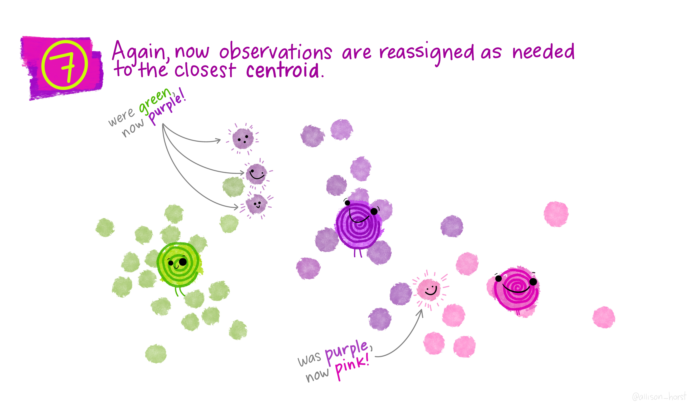

```{r set-options, echo=FALSE, cache=FALSE}
knitr::opts_chunk$set(comment=NA)
options(width = 60)
```

## Today's Topics

- K-Means Cluster Analysis
- ... and a little bit of Principal Components Analysis

## Today's R Packages

```{r, message = FALSE}
library(janitor); library(here)
library(knitr); library(magrittr)
library(naniar)
library(palmerpenguins)
library(mdsr) # for the world_cities data set
library(tidymodels)
library(tidyverse)

theme_set(theme_bw())
```

## Clustering the 4,000 Biggest Cities in the World

- We'll start with an example from section 9.1.2 of Baumer, Kaplan and Horton's *Modern Data Science with R*.

```{r}
BigCities <- world_cities %>%
    arrange(desc(population)) %>%
    head(4000) %>%
    select(longitude, latitude)

glimpse(BigCities)
```

## Cluster by the 6-means algorithm

```{r}
set.seed(432)
city_clusts <- BigCities %>%
    kmeans(centers = 6) %>%
    fitted("classes") %>%
    as.character()

BigCities <- BigCities %>%
    mutate(cluster = city_clusts)

head(BigCities, 2)
```

## Map the cities and color by clusters

```{r, fig.height = 5}
ggplot(BigCities, aes( x = longitude, y = latitude)) + 
    geom_point(aes(color = cluster), alpha = 0.5)
```

- The clustering algorithm has (essentially) identified the continents.

## How does K-Mean Clustering Work?

You can visit https://www.tidymodels.org/learn/statistics/k-means/ for a brief explanation of the clustering process using an animation from Allison Horst. Here, I'll look at the pieces one slide at a time.

Allison's materials are available at https://github.com/allisonhorst/stats-illustrations/tree/master/other-stats-artwork

## From Allison Horst (1/11)


## From Allison Horst (2/11)


## From Allison Horst (3/11)


## From Allison Horst (4/11)


## From Allison Horst (5/11)


## From Allison Horst (6/11)


## From Allison Horst (7/11)


## From Allison Horst (8/11)


## From Allison Horst (9/11)



## From Allison Horst (10/11)


## From Allison Horst (11/11)


## The Palmer Penguins


## The Palmer Penguins

```{r}
pen <- penguins %>% ## from palmerpenguins package
    select(bill_length_mm, bill_depth_mm, species) %>%
    drop_na()

glimpse(pen)
```

## What is being measured


## Getting Started

1. Create a data set with only numeric variables

```{r}
pen1 <- pen %>% select(-species)
```

2. Scale each variable to have mean 0 and sd 1

```{r}
pen1 <- pen1 %>% scale()

summary(pen1)
```

## Decide on the number of clusters, then run k-means

We know there are three types of penguins included, so let's try $k$ = 3. We'll show the remainder of this output on the next slide.

```{r}
pen_clust <- kmeans(pen1, centers = 3)
pen_clust
```

---


## What do `tidy()` and `glance()` do?

```{r}
tidy(pen_clust)
```

```{r}
glance(pen_clust)
```

## What does `augment()` do?

```{r}
pen_aug <- augment(pen_clust, pen)

glimpse(pen_aug)
```

## Next Two Slides will show the results from ...

### Plot of clusters

```{r, eval = FALSE}
ggplot(pen_aug, 
       aes(x = bill_length_mm, y = bill_depth_mm)) +
    geom_point(aes(color = .cluster, shape = .cluster), 
               size = 4, alpha = 0.8) 
```

### Plot of clusters, faceted by species

```{r, eval = FALSE}
ggplot(pen_aug, 
       aes(x = bill_length_mm, y = bill_depth_mm)) +
    geom_point(aes(color = .cluster, shape = .cluster), 
               size = 4, alpha = 0.8) +
    facet_wrap(~ species)
```

## Plot clusters

```{r, echo = FALSE, fig.height = 6}
ggplot(pen_aug, 
       aes(x = bill_length_mm, y = bill_depth_mm)) +
    geom_point(aes(color = .cluster, shape = .cluster), 
               size = 4, alpha = 0.8) 
```

## Plot clusters, faceted by species?

```{r, echo = FALSE, fig.height = 6}
ggplot(pen_aug, 
       aes(x = bill_length_mm, y = bill_depth_mm)) +
    geom_point(aes(color = .cluster, shape = .cluster), 
               size = 4, alpha = 0.8) +
    facet_wrap(~ species)
```

## Comparison of Cluster Results to Original `species`

```{r}
pen_aug %>% tabyl(.cluster, species)
```


## What if we used a different number of clusters?

```{r}
p_clusts <-
    tibble(k = 1:6) %>%
    mutate(
        pclust = purrr::map(k, ~ kmeans(pen1, .x)),
        ptidy = purrr::map(pclust, tidy),
        pglance = purrr::map(pclust, glance),
        paug = purrr::map(pclust, augment, pen))

p_clusters <- p_clusts %>% unnest(cols = c(ptidy))
p_assigns <- p_clusts %>% unnest(cols = c(paug))
p_clusterings <- p_clusts %>% unnest(cols = c(pglance))
```

## What do these clusters look like? (code)

```{r, eval = FALSE}
ggplot(p_assigns, 
       aes(x = bill_length_mm, y = bill_depth_mm)) +
    geom_point(aes(color = .cluster), alpha = 0.8) +
    facet_wrap(~ k)
```

## What these clusters look like

```{r, echo = FALSE, fig.height = 6}
ggplot(p_assigns, 
       aes(x = bill_length_mm, y = bill_depth_mm)) +
    geom_point(aes(color = .cluster), alpha = 0.8) +
    facet_wrap(~ k)
```

## Scree Plot to determine best choice of k

```{r, fig.height = 5}
ggplot(p_clusterings, aes(x = k, y = tot.withinss)) +
    geom_line() + geom_point()
```

## Could we consider other penguin characteristics?

- Only if they are numeric.

```{r}
pen_new <- penguins %>%
    select(flipper_length_mm, body_mass_g, 
           species, island) %>%
    drop_na()

pen2 <- pen_new %>% select(-species, -island) %>% scale()

pen_clust2 <- kmeans(pen2, centers = 3)
```

## Augment with the clusters, and tabulate

```{r}
pen_aug2 <- augment(pen_clust2, pen_new)
pen_aug2 %>% tabyl(.cluster, species)
pen_aug2 %>% tabyl(.cluster, island)
```

## Plot second set of clusters, facet by species

```{r, echo = FALSE, fig.height = 6}
ggplot(pen_aug2,
       aes(x = flipper_length_mm, y = body_mass_g)) +
    geom_point(aes(color = .cluster, shape = .cluster),
               size = 4, alpha = 0.8) +
    facet_wrap(~ species)
```

# Principal Components and the Palmer Penguins

## Principal Components Analysis (PCA)

The goal here is to summarize the information contained in a large set of variables by means of a smaller set of "summary index" values that can be more easily visualized and analyzed.

Statistically, PCA finds lines, planes and hyper-planes in K-dimensional space that approximate the data as well as possible, specifically by identifying components that maximize the variance of the projected data.

> ... in regression analysis, the larger the number of explanatory variables allowed, the greater is the chance of overfitting the model, producing conclusions that fail to generalise to other datasets. One approach, especially when there are strong correlations between different possible explanatory variables, is to reduce them to a few principal components and then run the regression against them, a method called principal component regression. (Wikipedia)

## Principal Components Analysis (PCA) on the Penguins?

Sure. See https://allisonhorst.github.io/palmerpenguins/articles/pca.html which is the basis for my next few slides.

We'll build this within the `tidymodels` framework, and first use a few `recipe` steps to pre-process the data for PCA, specifically:

1. remove all NA values
2. center and scale all predictors

## Penguin PCA Recipe

```{r}
penguin_recipe <-
    recipe(~., data = penguins) %>%
    update_role(species, island, sex, 
                year, new_role = "id") %>%
    step_naomit(all_predictors()) %>%
    step_normalize(all_predictors()) %>%
    step_pca(all_predictors(), id = "pca") %>%
    prep()

penguin_pca <- 
    penguin_recipe %>%
    tidy(id = "pca")
```

## Results for Penguin PCA

```{r}
penguin_pca
```


## An Easier-to-Use Presentation

```{r}
penguins %>%
  dplyr::select(body_mass_g, ends_with("_mm")) %>%
  tidyr::drop_na() %>%
  scale() %>%
  prcomp() %>%
  .$rotation
```

## How much variance does each component account for?

```{r, eval = FALSE}
penguin_recipe %>%
  tidy(id = "pca", type = "variance") %>%
  dplyr::filter(terms == "percent variance") %>%
  ggplot(aes(x = component, y = value)) +
  geom_col(fill = "navy") +
  xlim(c(0, 5)) +
  ylab("% of total variance")
```

## How much variance does each component account for?

```{r, echo = FALSE, fig.height = 6}
penguin_recipe %>%
  tidy(id = "pca", type = "variance") %>%
  dplyr::filter(terms == "percent variance") %>%
  ggplot(aes(x = component, y = value)) +
  geom_col(fill = "navy") +
  xlim(c(0, 5)) +
  ylab("% of total variance")
```

## Plot PCA Loadings

```{r, echo = FALSE, fig.height = 6}
penguin_pca %>%
  mutate(terms = tidytext::reorder_within(terms,
                                          abs(value),
                                          component)) %>%
  ggplot(aes(abs(value), terms, fill = value > 0)) +
  geom_col() +
  facet_wrap(~component, scales = "free_y") +
  tidytext::scale_y_reordered() +
  scale_fill_manual(values = c("#b6dfe2", "#0A537D")) +
  labs(
    x = "Absolute value of contribution",
    y = NULL, fill = "Positive?"
  )
```

## Plot PCA Loadings (code)

```{r, eval = FALSE}
penguin_pca %>%
  mutate(terms = tidytext::reorder_within(terms,
                                          abs(value),
                                          component)) %>%
  ggplot(aes(abs(value), terms, fill = value > 0)) +
  geom_col() +
  facet_wrap(~component, scales = "free_y") +
  tidytext::scale_y_reordered() +
  scale_fill_manual(values = c("#b6dfe2", "#0A537D")) +
  labs(
    x = "Absolute value of contribution",
    y = NULL, fill = "Positive?"
  )
```


# Another Example of K-Means Clustering

## The `USArrests` data, from base R

The `USArrests` data set from base R is a table containing the number of arrests per 100,000 residents in each US state in 1973 for `Murder`, `Assault` and `Rape`, along with the percentage of the population in each state that lives in urban areas, called `UrbanPop`.

```{r}
USArr73 <- USArrests %>%
    mutate(state = row.names(USArrests)) %>%
    relocate(state) %>%
    as_tibble()

n_miss(USArr73)
```

## The cleaned `USArr73` tibble

```{r}
USArr73
```

## Scale each variable to have mean 0 and sd 1

```{r}
USArr73_s <- USArr73 %>% select(-state) %>% scale()

row.names(USArr73_s) <- row.names(USArrests)

head(USArr73_s)
```

## Fit 3-means clustering

```{r}
kclust <- kmeans(USArr73_s, centers = 3)
kclust
```

## Complete output from `kclust`

```{r, echo = FALSE, fig.align = "center", out.height = '85%'}

```

## Summary of 3-means clustering

```{r}
summary(kclust)
```

## Use `augment()` from `broom`

```{r}
augment(kclust, USArr73_s)
```

## Use `tidy()` and `glance()` from `broom`

```{r}
tidy(kclust)
```

```{r}
glance(kclust)
```

## Use 1-9 clusters now

```{r}
kclusts <- 
  tibble(k = 1:9) %>%
  mutate(
    kclust = purrr::map(k, ~ kmeans(USArr73_s, .x)),
    tidied = purrr::map(kclust, tidy),
    glanced = purrr::map(kclust, glance),
    augmented = purrr::map(kclust, augment, USArr73_s)
  )
```

```{r}
clusters <- kclusts %>% unnest(cols = c(tidied))
assignments <- kclusts %>% unnest(cols = c(augmented))
clusterings <- kclusts %>% unnest(cols = c(glanced))
```

## Plots on Next Three Slides (code)

### Plot 1

```{r, eval = FALSE}
ggplot(assignments, aes(x = UrbanPop, y = Murder)) +
    geom_point(aes(color = .cluster), alpha = 0.8) +
    facet_wrap(~ k)
```

### Plot 2

```{r, eval = FALSE}
ggplot(assignments, aes(x = UrbanPop, y = Murder)) +
    geom_point(aes(color = .cluster), alpha = 0.8) +
    geom_point(data = clusters, size = 10, shape = "x") +
    facet_wrap(~ k)
```

### Plot 3

```{r, eval = FALSE}
ggplot(clusterings, aes(x = k, y = tot.withinss)) +
    geom_line() + geom_point()
```

## Plot 1

```{r, echo = FALSE, fig.height = 6}
ggplot(assignments, aes(x = UrbanPop, y = Murder)) +
    geom_point(aes(color = .cluster), alpha = 0.8) +
    facet_wrap(~ k)
```

## Plot 2

```{r, echo = FALSE, fig.height = 6}
ggplot(assignments, aes(x = UrbanPop, y = Murder)) +
    geom_point(aes(color = .cluster), alpha = 0.8) +
    geom_point(data = clusters, size = 10, shape = "x") +
    facet_wrap(~ k)
```

## Plot 3

```{r, echo = FALSE, fig.height = 6}
ggplot(clusterings, aes(x = k, y = tot.withinss)) +
    geom_line() + geom_point()
```

## Next Time

Quiz 2 is due Tuesday at 9 AM (in the morning.)

- No class next Tuesday 2022-04-19.

Last Class is Thursday 2022-04-21. We'll discuss lots of "little things" and dispense some advice for going forward and making the world a better place.

