# R Packages and Setup

    library(knitr)
    library(janitor)
    library(magrittr)
    library(naniar)
    library(broom)
    library(patchwork)
    library(nhanesA)
    library(readxl)
    library(Hmisc)
    library(simputation)
    library(rms)
    library(GGally)
    library(car)
    library(mice)
    library(ROCR)
    library(tidyverse)

    theme_set(theme_bw())

# Data Source

The data for this project was acquired from the *National Health and
Nutrition Examination Survey* (i.e. NHANES), specifically from their
[2017-2018 data
files](https://wwwn.cdc.gov/nchs/nhanes/continuousnhanes/default.aspx?BeginYear=2017),
as this was the last year that the National Center for Health Statistics
was able to finish without interference from the pandemic. The National
Center for Health Statistics, as a [division of the
CDC](https://www.cdc.gov/nchs/about/organization.htm), collects this
data to assess the health and nutritional status of adults and children
in the United States, and has been continuously collecting and
publishing this data for public use every 2 years since 1999. According
to the CDC’s [National Health and Nutrition Examination Survey: Plan and
Operations, 1999-2010
documentation](https://www.cdc.gov/nchs/data/series/sr_01/sr01_056.pdf),
the 2-year cycle for collecting and publishing data was chosen to ensure
the stability/accuracy of these measurements, as well as to mitigate the
possibility of unintentional disclosure of a sample person’s identity.
Additionally, the documentation states the general sample design
methodology used to determine the selection of subjects for this survey,
however some alterations were made to these methods for the 2015-2018
cycles, as is detailed in the CDC’s [National Health and Nutrition
Examination Survey, 2015-2018: Sample Design and Estimation Procedures
documentation](https://www.cdc.gov/nchs/data/series/sr_02/sr02-184-508.pdf).
The documentation states that the general sample design for their data
collection was not simple random sampling, but complex, multistage
probability sampling, utilized to develop a representative sample of the
United States’ civilian non-institutionalized household population.
Briefly, this involved four steps:

-   First, selecting for primary sampling units, which consisted of
    either counties or small groups of contiguous counties

-   Then selecting segments within these areas that contain a cluster of
    households

-   Then selecting for specific households within the segments chosen
    above

-   Lastly then selecting for individuals within each household for
    sampling

For the 2015-2018 cycles, this same methodology was used, however some
sub-groups were over-sampled to increase the precision of the associated
sub-group estimates. These sub-groups are as follows:

-   Hispanic persons

-   Non-Hispanic black persons

-   Non-Hispanic, non-black Asian persons

-   Non-Hispanic white persons and persons of other races and
    ethnicities at or below 185% of the federal poverty level

-   Non-Hispanic white persons and persons of other races and
    ethnicities aged 0–11 years or 80 years and over

# The Subjects

The subjects in my analyses will be individuals selected from the
2017-2018 NHANES datasets as discussed above, where each row represents
one participant. The goal will be to generate models to examine two
different outcomes - the systolic blood pressure of the participants as
measured with an oscillometric device (quantitative outcome), and
whether or not they have been diagnosed with high blood pressure by
their doctor (binary outcome) - by using the participant’s sodium levels
(mmol/L), potassium levels (mmol/L), insomnia diagnosis, and milk
consumption type as the predictors.

# Loading and Tidying the Data

This section will involve downloading the necessary data files from the
respective sources for use in this project, and will process these files
as necessary to prepare them for use in creating the analysis dataset.

## Loading the Raw Data

The code below utilizes the `nhanesA` library to download the necessary
data files from the NHANES databases by loading them into RStudio as
tibbles, saving them as .Rds files so they do not need to be downloaded
again, and then redefining the variables currently assigned to load the
files from the website to load the local copies back instead to use to
create the analysis dataset:

    DEMO_J_raw <- nhanes('DEMO_J') %>% tibble()

    Processing SAS dataset DEMO_J    ..

    BPXO_J_raw <- nhanes('BPXO_J') %>% tibble()

    Processing SAS dataset BPXO_J    ..

    BPQ_J_raw <- nhanes('BPQ_J') %>% tibble()

    Processing SAS dataset BPQ_J     ..

    BIOPRO_J_raw <- nhanes('BIOPRO_J') %>% tibble()

    Processing SAS dataset BIOPRO_J      ..

    DBQ_J_raw <- nhanes('DBQ_J') %>% tibble()

    Processing SAS dataset DBQ_J     ..

    SLQ_J_raw <- nhanes('SLQ_J') %>% tibble()

    Processing SAS dataset SLQ_J     ..

    saveRDS(DEMO_J_raw, "data/DEMO_J.Rds")
    saveRDS(BPXO_J_raw, "data/BPXO_J.Rds")
    saveRDS(BPQ_J_raw, "data/BPQ_J.Rds")
    saveRDS(BIOPRO_J_raw, "data/BIOPRO_J.Rds")
    saveRDS(DBQ_J_raw, "data/DBQ_J.Rds")
    saveRDS(SLQ_J_raw, "data/SLQ_J.Rds")

    DEMO_J_raw <- readRDS("data/DEMO_J.Rds")
    BPXO_J_raw <- readRDS("data/BPXO_J.Rds")
    BPQ_J_raw <- readRDS("data/BPQ_J.Rds")
    BIOPRO_J_raw <- readRDS("data/BIOPRO_J.Rds")
    DBQ_J_raw <- readRDS("data/DBQ_J.Rds")
    SLQ_J_raw <- readRDS("data/SLQ_J.Rds")

## Cleaning the Data

The predictors and outcome variables will be clearly defined in the
**Defining the Variables** sub-section of **The Code Book** section
below, but before that the raw data files need to be processed and
ultimately combined into an aggregated tibble for use in each analysis.
This will be accomplished in steps in the following section.

### Selecting and Filtering for the Relevant Data

The first step of the data cleaning process will be to select for and
filter each of the raw data files for just the variables needed, and
also filter out any unwanted results from the variables where
appropriate. This is accomplished with the following code, and while
again each variable will be clarified in **The Code Book** section, it’s
worth noting the following about the keys from the NHANES website at
this point to understand the code below:

-   7 represents instances where the respondent refused to respond to
    the question

-   9 represents instances where the respondent reported that they
    didn’t know the answer to the question

Additionally, it’s worth noting the following about the demographics
data selection from the `DEMO_J` data shown below:

-   `RIDAGEYR` represents the respondent’s age, and for the following
    analyses we will only be interested in respondents that are between
    the ages of 18 and 79, as ages past 79 are all recorded as 80, and
    while we could include children in this study, we will omit them and
    focus the study on adults of 18 or older.

The code for selecting and filtering the data is as follows:

    DEMO_J_data = DEMO_J_raw %>% 
      select(c(SEQN, RIDAGEYR)) %>%
      filter(RIDAGEYR <= 79) %>%
      filter(RIDAGEYR >= 18)

    BPXO_J_data = BPXO_J_raw %>% 
      select(c(SEQN, BPXOSY3))

    BPQ_J_data = BPQ_J_raw %>%
      select(c(SEQN, BPQ020)) %>%
      filter(BPQ020 != 7) %>%
      filter(BPQ020 != 9)

    SLQ_J_data = SLQ_J_raw %>%
      select(c(SEQN, SLQ050)) %>%
      filter(SLQ050 != 7) %>%
      filter(SLQ050 != 9)

    BIOPRO_J_data = BIOPRO_J_raw %>% 
      select(c(SEQN, LBXSNASI, LBXSKSI))

It’s worth noting that the code above selects and filters for all but 1
variable that will be used in this analysis. This last variable will
require a more complex approach than the above, so it will be addressed
in its own sub-section after the rest of the variables above have been
addressed. For now, we can proceed to the next step in preparing the
above data.

### Renaming & Formatting the Data

The next logical step for preparing the data is to properly format each
variable, and provide each with a more appropriate name, both of which
are accomplished below with the following code:

    DEMO_J_data = DEMO_J_data %>% 
      mutate(SEQN = as.numeric(SEQN)) %>%
      mutate(RIDAGEYR = as.numeric(RIDAGEYR)) %>%
      rename(Age = RIDAGEYR)

    BPXO_J_data = BPXO_J_data %>% 
      mutate(SEQN = as.numeric(SEQN)) %>%
      mutate(BPXOSY3 = as.numeric(BPXOSY3)) %>%
      rename("Systolic_BP" = BPXOSY3)

    BPQ_J_data = BPQ_J_data %>%
      mutate(SEQN = as.numeric(SEQN)) %>%
      mutate(BPQ020 = fct_recode(as.factor(BPQ020),
                                 "Yes" = "1",
                                 "No" = "2")) %>%
      rename("High_BP" = BPQ020)

    SLQ_J_data = SLQ_J_data %>%
      mutate(SEQN = as.numeric(SEQN)) %>%
      mutate(SLQ050 = fct_recode(as.factor(SLQ050),
                                 "Yes" = "1",
                                 "No" = "2")) %>%
      rename("Insomnia" = SLQ050)

    BIOPRO_J_data = BIOPRO_J_data %>% 
      mutate(SEQN = as.numeric(SEQN)) %>%
      mutate(LBXSNASI = as.numeric(LBXSNASI)) %>%
      mutate(LBXSKSI = as.numeric(LBXSKSI)) %>%
      rename(Sodium = LBXSNASI) %>%
      rename(Potassium = LBXSKSI)

With the code above, all but two of the variables have been properly
extracted and reformatted. The only variables that has not been
addressed yet are the `SEQN` variable, which is the subject ID variable,
and another variable from the `DBQ_J` data file, which will become the
`Milk` multi-categorical variable. Both of these have been set aside
intentionally, as it will be more efficient to rename the `SEQN`
variable in the analysis tibble itself after it is generated, instead of
altering each instance of it in each of the individual data files above,
and the `Milk` variable is complicated enough to warrant its own
sub-section, which will be addressed next.

### The Milk Variable

As mentioned above, all of the variables have been addressed above, with
only two exceptions - the subject ID variable `SEQN`, which will be
renamed once the tibble is generated, and the Milk variable, which will
be addressed in this section. The intent is to use this variable as an
additional multi-categorical variable for both analyses, however
preparing it for such use will require additional and more sophisticated
steps because of the manner in which it was recorded in the NHANES
dataset. In particular, the survey participants were asked two
questions:

-   How often did they drink milk in the past 30 day period?

-   If they did drink any milk, what type of milk did they mainly drink?

While the former question’s results were recorded as a single,
multi-categorical variable, the results to the latter, which is what we
are interested in, were stored in 6 unique variables, depending on their
answer - Whole Milk, 2% Milk, 1% Milk, Skim Milk, Soy Milk, or Other
Milk. Additionally, if the participant was uncertain of which milk they
mainly drink, the survey recorder was to record all of the milk types
that the participant reported that they drank. This means that to
prepare this variable for use in the later analyses, the results from
all 6 answer variables need to be collapsed into one multi-categorical
field that both keeps the NA values for later imputation, but also
removes participants that were uncertain as to which milk they mainly
drank and as such reported multiple milk types, as there would be no
clear way to classify the latter results into any of the other
pre-defined fields. To accomplish this, the first step was taken with
the code below, which extracts the variables from the raw data file and
stores the positive values and NA values in separate data frames:

    DBQ_J_data1 = DBQ_J_raw %>%
      select(c(SEQN, DBQ223A)) %>%
      filter(DBQ223A == 10) %>%
      mutate(DBQ223A = as.numeric(DBQ223A))
      
    DBQ_J_data2 = DBQ_J_raw %>%
      select(c(SEQN, DBQ223B)) %>%
      filter(DBQ223B == 11) %>%
      mutate(DBQ223B = as.numeric(DBQ223B))
      
    DBQ_J_data3 = DBQ_J_raw %>%
      select(c(SEQN, DBQ223C)) %>%
      filter(DBQ223C == 12) %>%
      mutate(DBQ223C = as.numeric(DBQ223C))

    DBQ_J_data4 = DBQ_J_raw %>%
      select(c(SEQN, DBQ223D)) %>%
      filter(DBQ223D == 13) %>%
      mutate(DBQ223D = as.numeric(DBQ223D))

    DBQ_J_data5 = DBQ_J_raw %>%
      select(c(SEQN, DBQ223E)) %>%
      filter(DBQ223E == 14) %>%
      mutate(DBQ223E = as.numeric(DBQ223E))
      
    DBQ_J_data6 = DBQ_J_raw %>%
      select(c(SEQN, DBQ223U)) %>%
      filter(DBQ223U == 30) %>%
      mutate(DBQ223U = as.numeric(DBQ223U))

    DBQ_J_data1_NA = DBQ_J_raw %>%
      select(c(SEQN, DBQ223A)) %>%
      filter(is.na(DBQ223A)) %>%
      rename(DBQ223 = DBQ223A) %>%
      mutate(DBQ223 = as.numeric(DBQ223))

    DBQ_J_data2_NA = DBQ_J_raw %>%
      select(c(SEQN, DBQ223B)) %>%
      filter(is.na(DBQ223B)) %>%
      rename(DBQ223 = DBQ223B) %>%
      mutate(DBQ223 = as.numeric(DBQ223))
      
    DBQ_J_data3_NA = DBQ_J_raw %>%
      select(c(SEQN, DBQ223C)) %>%
      filter(is.na(DBQ223C)) %>%
      rename(DBQ223 = DBQ223C) %>%
      mutate(DBQ223 = as.numeric(DBQ223))

    DBQ_J_data4_NA = DBQ_J_raw %>%
      select(c(SEQN, DBQ223D)) %>%
      filter(is.na(DBQ223D)) %>%
      rename(DBQ223 = DBQ223D) %>%
      mutate(DBQ223 = as.numeric(DBQ223))

    DBQ_J_data5_NA = DBQ_J_raw %>%
      select(c(SEQN, DBQ223E)) %>%
      filter(is.na(DBQ223E)) %>%
      rename(DBQ223 = DBQ223E) %>%
      mutate(DBQ223 = as.numeric(DBQ223))
      
    DBQ_J_data6_NA = DBQ_J_raw %>%
      select(c(SEQN, DBQ223U)) %>%
      filter(is.na(DBQ223U)) %>%
      rename(DBQ223 = DBQ223U) %>%
      mutate(DBQ223 = as.numeric(DBQ223))

Now that the variables have been properly extracted from the raw files,
the milk results and NA results for each milk type can be combined to
form two files - one for people who responded with at least one milk
type, and one where the participant did not answer with any milk type,
which will be the missing values for this variable. The former will be
generated using `full_join` to preserve all responses, and the latter
will be generated using `inner_join` to filter only for missing
responses present in all 6 variables, effectively filtering only for
participants with missing data:

    DBQ_J_data_milk = full_join(
      full_join(
        full_join(
          full_join(
            full_join(DBQ_J_data1,
                      DBQ_J_data2,
                      by = c("SEQN")),
            DBQ_J_data3,
            by = c("SEQN")),
          DBQ_J_data4,
          by = c("SEQN")),
        DBQ_J_data5,
        by = c("SEQN")),
      DBQ_J_data6,
      by = c("SEQN"))

    DBQ_J_data_NA = inner_join(
      inner_join(
        inner_join(
          inner_join(
            inner_join(DBQ_J_data1_NA,
                       DBQ_J_data2_NA,
                       by = c("SEQN", "DBQ223")),
            DBQ_J_data3_NA,
            by = c("SEQN", "DBQ223")),
          DBQ_J_data4_NA,
          by = c("SEQN", "DBQ223")),
        DBQ_J_data5_NA,
        by = c("SEQN", "DBQ223")),
      DBQ_J_data6_NA,
      by = c("SEQN", "DBQ223"))

Before the two resulting tables above can be combined, the results in
`DBQ_J_data_milk` need to be further processed to collapse all of the
results down into one column in a manner that also creates a means for
removing any participants that answered with multiple milk types. This
will be accomplished by creating a new field that sums all of the fields
together per row - as each answer was given a unique numeric identifier
in the survey data, and since no combination(s) of these numbers when
summed equal each other, summing their responses is one method that can
be used to determine whether or not a participant answered with multiple
milk types without affecting those that only provided a single answer.
As such, the code below generates this new column to this end, filtering
out any unsuitable participants, and after doing so formats and renames
the column as appropriate:

    DBQ_J_data_milk = DBQ_J_data_milk %>%
      mutate(DBQ223 = rowSums(across(DBQ223A:DBQ223U), na.rm = TRUE)) %>%
      select(c(SEQN, DBQ223)) %>%
      filter(DBQ223 == 10 |
               DBQ223 == 11 |
               DBQ223 == 12 |
               DBQ223 == 13 |
               DBQ223 == 14 |
               DBQ223 == 30)

Now that the responses have been properly filtered for participants who
only answered with one milk type, the `DBQ_J_data_milk` and
`DBQ_J_data_NA` files can be joined together using `full_join` as shown
below:

    DBQ_J_data = full_join(DBQ_J_data_milk, DBQ_J_data_NA, by = c("SEQN", "DBQ223"))

As the last step, the milk type variable will be reformatted as a factor
variable, with appropriate names given to each factor level, and will be
renamed more appropriately using the code below:

    DBQ_J_data = DBQ_J_data %>%
      mutate(SEQN = as.numeric(SEQN)) %>%
      mutate(DBQ223 = fct_recode(as.factor(DBQ223),
                                      "Whole Milk" = "10",
                                      "2% Milk" = "11",
                                      "1% Milk" = "12",
                                      "Skim Milk" = "13",
                                      "Soy Milk" = "14",
                                      "Other Milk" = "30")) %>%
      rename(Milk = DBQ223)

With all of the above finally out of the way, all of the necessary
preparation steps have been taken for each variable, and the data can be
pulled together to form the analysis tibble, which will be accomplished
in the last sub-section below.

## Creating the Tibble

Now that the data for all of the variables have been properly selected
and formatted, the files can be pulled together to create the analysis
tibble, reorder the variables for more logical discussion in **The Code
Book** section, and the subject ID variable `SEQN` can be renamed to
something more suitable, all of which have been accomplished with the
code below:

    analysis_data_raw = inner_join(inner_join(inner_join(inner_join(inner_join(DEMO_J_data, BPXO_J_data, by = c("SEQN")), BPQ_J_data, by = c("SEQN")), SLQ_J_data, by = c("SEQN")), BIOPRO_J_data, by = c("SEQN")), DBQ_J_data, by = c("SEQN")) %>%
      rename(Subject_ID = SEQN)

    col_order = c("Subject_ID", "Systolic_BP", "High_BP", "Age", "Sodium", "Potassium", "Insomnia", "Milk")

    analysis_data_raw = analysis_data_raw[, col_order]

Now that the analysis dataset has been generated, we need to make sure
that it fits the necessary criteria for this project. First of all, the
dataset needs to have no more than 1200 subjects, so lets check how many
it has:

    count(analysis_data_raw)

    # A tibble: 1 x 1
          n
      <int>
    1  4955

It clearly has more than 1200 samples, currently having 4955 currently.
As such we’ll use the following code to create a sub-set of this dataset
for this project using the following code:

    set.seed(43202)

    analysis_data = analysis_data_raw %>%
      slice_sample(n = 1200)

For confirmation that this worked as intended, let’s check the subject
count again:

    count(analysis_data)

    # A tibble: 1 x 1
          n
      <int>
    1  1200

Looks good - now let’s check each of the categorical predictor/input
variables - `Milk` and `Insomnia` - and the outcome variable, `High_BP`,
to ensure that they all have a minimum of 30 values in each category:

    analysis_data %>% count(Milk)

    # A tibble: 7 x 2
      Milk           n
      <fct>      <int>
    1 Whole Milk   328
    2 2% Milk      349
    3 1% Milk       84
    4 Skim Milk     42
    5 Soy Milk      30
    6 Other Milk    87
    7 <NA>         280

    analysis_data %>% count(Insomnia)

    # A tibble: 2 x 2
      Insomnia     n
      <fct>    <int>
    1 Yes        328
    2 No         872

    analysis_data %>% count(High_BP)

    # A tibble: 2 x 2
      High_BP     n
      <fct>   <int>
    1 Yes       433
    2 No        767

The **Soy Milk** category in the `Milk` variable just barely passes,
having exactly 30 instances, however it is unwise to use a categorical
variable with so few instances, so to rectify this the `1% Milk` and
`Skim Milk` categories will be collapsed together to form a single
category. Additionally, since the counts are rather low for the
`Soy Milk` and `Other Milk` categories, these two categories will be
collapsed together as well, which will create a 4-level categorical
variable instead:

    analysis_data = analysis_data %>%
      mutate(Milk = fct_recode(as.factor(Milk),
             "1% or Skim Milk" = "1% Milk",
             "1% or Skim Milk" = "Skim Milk",
             "Soy or Other Milk" = "Soy Milk",
             "Soy or Other Milk" = "Other Milk"))

    analysis_data %>% count(Milk)

    # A tibble: 5 x 2
      Milk                  n
      <fct>             <int>
    1 Whole Milk          328
    2 2% Milk             349
    3 1% or Skim Milk     126
    4 Soy or Other Milk   117
    5 <NA>                280

For the last check, let’s check each of the quantitative variables -
`Age`, `Sodium`, and `Potassium` - and the outcome variable,
`Systolic_BP`, to ensure that they all have a minimum of 10 different,
ordered, observed values:

    analysis_data %$% n_distinct(Age)

    [1] 62

    analysis_data %$% n_distinct(Sodium)

    [1] 20

    analysis_data %$% n_distinct(Potassium)

    [1] 29

    analysis_data %$% n_distinct(Systolic_BP)

    [1] 92

The variable with the lowest number of distinct values, `Sodium`, has 20
distinct values, so the data meets the this criteria, and should be
suitable for the following analyses.

# The Tidy Tibble

## Listing the Tibble

The following code lists the first 10 rows of the tibble:

    analysis_data

    # A tibble: 1,200 x 8
       Subject_ID Systolic_BP High_BP   Age Sodium Potassium Insomnia Milk          
            <dbl>       <dbl> <fct>   <dbl>  <dbl>     <dbl> <fct>    <fct>         
     1      95380         122 No         62    138       4.3 No       Soy or Other ~
     2      98905          NA Yes        63    137       4.5 Yes      <NA>          
     3      99128         105 No         36    143       3.9 No       2% Milk       
     4      94105         107 No         46    144       4.1 No       2% Milk       
     5     101756         110 Yes        61    140       3.6 No       Whole Milk    
     6      97319         123 Yes        32    139       4.1 No       Whole Milk    
     7     101001         145 No         67    144       4.4 No       Soy or Other ~
     8      95330         124 Yes        77    137       3.9 Yes      Soy or Other ~
     9      94525          NA Yes        66    141       4   No       2% Milk       
    10     101336         147 No         72    145       4.3 No       2% Milk       
    # ... with 1,190 more rows

## Size and Identifiers

### Size

The size of the `analysis_data` dataset was technically already
established in the previous sub-section above, as the generated tibble
states that the dataset has 1200 rows (as we reduced it to for this
analysis) and 8 columns. This can be verified again through the use of
the `nrow` and `ncol` functions as shown below:

    nrow(analysis_data)

    [1] 1200

    ncol(analysis_data)

    [1] 8

With this verified, we can proceed to the next step of verifying the
unique row identifiers in the next sub-section.

### Identifiers

As already mentioned during the data preparation phase, the `Subject ID`
variable (formally the `SEQN` variable) represents each subject’s unique
ID, and as such can be used to uniquely identify each entry in the
`analysis_data` dataset. This is illustrated with the use of the
following code below:

    analysis_data %$% n_distinct(Subject_ID)

    [1] 1200

## Saving the R data set

The following code will save the `analysis_data` tibble as an .Rds file:

    saveRDS(analysis_data, "data/analysis_data.Rds")

# The Code Book

## Defining the Variables

<table>
<colgroup>
<col style="width: 24%" />
<col style="width: 12%" />
<col style="width: 12%" />
<col style="width: 51%" />
</colgroup>
<thead>
<tr class="header">
<th>Variable</th>
<th>Role</th>
<th>Type</th>
<th>Description</th>
</tr>
</thead>
<tbody>
<tr class="odd">
<td><code>Subject_ID</code></td>
<td>Identifier</td>
<td>-</td>
<td>The unique numeric code assigned to each NHANES respondent/subject/participant.</td>
</tr>
<tr class="even">
<td><code>Systolic_BP</code></td>
<td>Outcome</td>
<td>Quantitative</td>
<td>Respondent’s/Subject’s/Participant’s 3rd reading for their Systolic Blood Pressure, in mm Hg, as measured with an oscillometric device.</td>
</tr>
<tr class="odd">
<td><code>High_BP</code></td>
<td>Outcome</td>
<td>2-Categorical</td>
<td>Has the respondent/subject/participant been diagnosed with high blood pressure by their doctor? (Yes or No)</td>
</tr>
<tr class="even">
<td><code>Age</code></td>
<td>Input</td>
<td>Quantitative</td>
<td>What was the age of the respondent/subject/participant at the time the data was collected?</td>
</tr>
<tr class="odd">
<td><code>Sodium</code></td>
<td>Input</td>
<td>Quantitative</td>
<td>Respondent’s/Subject’s/Participant’s sodium level in mmol/L, as indicated by their blood test.</td>
</tr>
<tr class="even">
<td><code>Potassium</code></td>
<td>Input</td>
<td>Quantitative</td>
<td>Respondent’s/Subject’s/Participant’s potassium level in mmol/L, as indicated by their blood test.</td>
</tr>
<tr class="odd">
<td><code>Insomnia</code></td>
<td>Input</td>
<td>2-Categorical</td>
<td>Has the respondent/subject/participant disclosed that they have been having trouble sleeping to their doctor? (Yes or No)</td>
</tr>
<tr class="even">
<td><code>Milk</code></td>
<td>Input</td>
<td>4-Categorical</td>
<td>What type of milk does the respondent/subject/participant mainly drink? (Whole Milk, 2% Milk, 1% or Skim Milk, Soy or Other Milk)</td>
</tr>
</tbody>
</table>

## Numerical Description

The following code provides a numerical description of the
`analysis_data` dataset through the use of the `describe` function from
the `Hmisc` package:

    describe(analysis_data)

    analysis_data 

     8  Variables      1200  Observations
    --------------------------------------------------------------------------------
    Subject_ID 
           n  missing distinct     Info     Mean      Gmd      .05      .10 
        1200        0     1200        1    98273     3137    94094    94562 
         .25      .50      .75      .90      .95 
       95867    98208   100620   102033   102616 

    lowest :  93708  93709  93714  93718  93721, highest: 102907 102908 102947 102949 102956
    --------------------------------------------------------------------------------
    Systolic_BP 
           n  missing distinct     Info     Mean      Gmd      .05      .10 
        1049      151       91        1    123.2    20.42       97      101 
         .25      .50      .75      .90      .95 
         110      121      134      148      157 

    lowest :  73  88  89  90  91, highest: 176 177 184 185 187
    --------------------------------------------------------------------------------
    High_BP 
           n  missing distinct 
        1200        0        2 
                          
    Value        Yes    No
    Frequency    433   767
    Proportion 0.361 0.639
    --------------------------------------------------------------------------------
    Age 
           n  missing distinct     Info     Mean      Gmd      .05      .10 
        1200        0       62        1       48    20.17       20       23 
         .25      .50      .75      .90      .95 
          33       50       62       70       74 

    lowest : 18 19 20 21 22, highest: 75 76 77 78 79
    --------------------------------------------------------------------------------
    Sodium 
           n  missing distinct     Info     Mean      Gmd      .05      .10 
        1121       79       19    0.987    140.3    3.047      136      137 
         .25      .50      .75      .90      .95 
         138      140      142      144      145 

    lowest : 128 130 132 133 134, highest: 144 145 146 147 148
                                                                                
    Value        128   130   132   133   134   135   136   137   138   139   140
    Frequency      2     1     1     3     7    28    47    68   134   126   174
    Proportion 0.002 0.001 0.001 0.003 0.006 0.025 0.042 0.061 0.120 0.112 0.155
                                                              
    Value        141   142   143   144   145   146   147   148
    Frequency    159   137    95    75    33    20    10     1
    Proportion 0.142 0.122 0.085 0.067 0.029 0.018 0.009 0.001
    --------------------------------------------------------------------------------
    Potassium 
           n  missing distinct     Info     Mean      Gmd      .05      .10 
        1121       79       28    0.992    4.084   0.4078      3.5      3.6 
         .25      .50      .75      .90      .95 
         3.8      4.1      4.3      4.5      4.7 

    lowest : 2.9 3.0 3.1 3.2 3.3, highest: 5.2 5.3 5.4 6.0 6.6
    --------------------------------------------------------------------------------
    Insomnia 
           n  missing distinct 
        1200        0        2 
                          
    Value        Yes    No
    Frequency    328   872
    Proportion 0.273 0.727
    --------------------------------------------------------------------------------
    Milk 
           n  missing distinct 
         920      280        4 
                                                                    
    Value             Whole Milk           2% Milk   1% or Skim Milk
    Frequency                328               349               126
    Proportion             0.357             0.379             0.137
                                
    Value      Soy or Other Milk
    Frequency                117
    Proportion             0.127
    --------------------------------------------------------------------------------

# Linear Regression Plans

With my linear model as detailed below, I hope to answer the following
question:

-   Can an adult’s systolic blood pressure be effectively predicted as a
    function of their sodium levels, potassium levels, age, milk
    consumption type, and their insomnia disclosure?

## My Quantitative Outcome

While this was briefly broached in **The Subjects** section above, the
quantitative outcome that will be used for the linear regression model
in this project is the 3rd systolic blood pressure measurement as taken
with an oscillometric device, which is listed as `Systolic_BP` in **The
Code Book** section above. The 3rd measurement taken with an
oscillometric device was specifically chosen in an effort to use the
most accurate “at rest” systolic blood pressure as possible. In order to
assess this outcome graphically without imputing data, we’ll need to
filter out any missing data, which consequently will allow us to provide
a count of rows with complete data on this outcome. The code necessary
to create a new dataset that has been filtered for complete data only,
for `Systolic_BP` in particular, and provides the count for the number
of rows (i.e. subjects) with complete data on this metric is as follows:

    demo_data = analysis_data %>%
      filter(Systolic_BP != ".")

    nrow(demo_data)

    [1] 1049

As can be seen above, there are 1049 rows with complete data on this
outcome - using just the complete data, we can create the following
Normal Q-Q plot, Histogram with an overlaying Density Plot, and Violin
Box-plot to assess the distribution of this outcome:

    a1 <- ggplot(demo_data, aes(x = "", y = Systolic_BP)) +
      geom_violin(fill = "dodgerblue", alpha = 0.3) +
      geom_boxplot(width = 0.25, fill = "dodgerblue", notch = TRUE) +
      coord_flip() +
      labs(title = "Violin Boxplot: SBP", x = "", y = "Systolic Blood Pressure (mm Hg)")

    a2 <- ggplot(demo_data, aes(x = Systolic_BP)) +
      geom_histogram(aes(y = stat(density)), bins = nclass.scott(demo_data$Systolic_BP), col = "white", fill = "dodgerblue") +
      stat_function(fun = dnorm, args = list(mean = mean(demo_data$Systolic_BP), sd = sd(demo_data$Systolic_BP)), col = "red", lwd = 1) +
      labs(title = "Density Function: SBP", x = "Systolic Blood Pressure (mm Hg)")

    a3 <- ggplot(demo_data, aes(sample = Systolic_BP)) +
      geom_qq(col = "dodgerblue") +
      geom_qq_line(col = "red") +
      labs(title = "Normal Q-Q plot: SBP", x = "", y = "Systolic Blood Pressure (mm Hg)")

    (a3 + a2) / a1 + 
      plot_layout(heights = c(5,2)) +
      plot_annotation(title = "Systolic Blood Pressure",
                      subtitle = "Distribution & Normality Assessment of subject's 3rd systolic blood pressure measurement,\n as taken with an oscillometric device",
                      caption = "All data above pulled from 2017-2018 NHANES datasets")

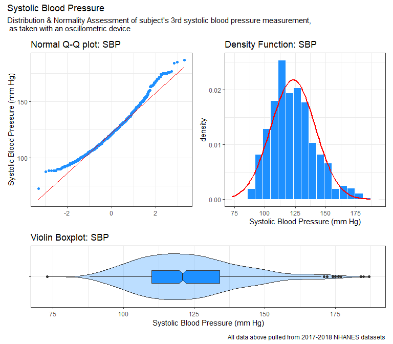

As we might expect for systolic blood pressure data, there does appear
to be some right-skew in the distribution, however it does appear to be
fairly continuous, with the only noticeable gap appearing from about 75
to 100 mm Hg. Given both these results and the simple fact that it is
blood pressure data, a natural logarithmic transformation may be
appropriate here, however this will be determined for certain in
analyses sections.

Additionally, while this was already demonstrated in the **Creating the
Tibble** sub-section of the **Loading and Tidying ** section above, this
outcome variable has a least 10 different, ordered, observed values,
specifically having 92, which can once again be seen with the following
code:

    analysis_data %$% n_distinct(Systolic_BP)

    [1] 92

This code produces a tibble showing all of the unique values, counting
how many times each one occurs:

    analysis_data %>% count(Systolic_BP)

    # A tibble: 92 x 2
       Systolic_BP     n
             <dbl> <int>
     1          73     1
     2          88     1
     3          89     5
     4          90     5
     5          91     2
     6          92     4
     7          93     6
     8          94     7
     9          95     9
    10          96    10
    # ... with 82 more rows

## My Planned Predictors (Linear Model)

This model will be generated by using all 5 input variables selected for
in the data preparation steps above, with `Age`, `Sodium`, and
`Potassium` all representing quantitative variables,
`Insomnia Diagnosis` representing the binary categorical variable, and
`Milk` representing the multi-categorical variable. Again, it was
already demonstrated in the **Creating the Tibble** sub-section of the
**Loading and Tidying ** section above, however all of the quantitative
variables have at least 10 different, ordered, observed values, both the
binary and multi-categorical variable have at least 30 observations in
each categorical level, and the multi-categorical has been limited to 6
categories (Whole Milk, 2% Milk, 1% Milk, Skim Milk, Soy Milk, and Other
Milk). This has been demonstrated again below for each, starting first
with the quantitative variables:

    analysis_data %$% n_distinct(Age)

    [1] 62

    analysis_data %$% n_distinct(Sodium)

    [1] 20

    analysis_data %$% n_distinct(Potassium)

    [1] 29

As with the outcome variable `Systolic_BP` shown above, the following
code produces a tibble for each, each showing all of the unique values
and counting how many times each one occurs:

    analysis_data %>% count(Age)

    # A tibble: 62 x 2
         Age     n
       <dbl> <int>
     1    18    32
     2    19    26
     3    20    17
     4    21    16
     5    22    20
     6    23    24
     7    24    17
     8    25    16
     9    26    24
    10    27    15
    # ... with 52 more rows

    analysis_data %>% count(Sodium)

    # A tibble: 20 x 2
       Sodium     n
        <dbl> <int>
     1    128     2
     2    130     1
     3    132     1
     4    133     3
     5    134     7
     6    135    28
     7    136    47
     8    137    68
     9    138   134
    10    139   126
    11    140   174
    12    141   159
    13    142   137
    14    143    95
    15    144    75
    16    145    33
    17    146    20
    18    147    10
    19    148     1
    20     NA    79

    analysis_data %>% count(Potassium)

    # A tibble: 29 x 2
       Potassium     n
           <dbl> <int>
     1       2.9     2
     2       3       3
     3       3.1     2
     4       3.2     3
     5       3.3     9
     6       3.4    19
     7       3.5    30
     8       3.6    45
     9       3.7    72
    10       3.8   102
    # ... with 19 more rows

and the following code produces a tibble for both categorical variables,
demonstrating that each categorical level has at least 30 observations,
and the multi-categorical variable `Milk` has 6 total levels,
disregarding missing data:

    analysis_data %>% count(Milk)

    # A tibble: 5 x 2
      Milk                  n
      <fct>             <int>
    1 Whole Milk          328
    2 2% Milk             349
    3 1% or Skim Milk     126
    4 Soy or Other Milk   117
    5 <NA>                280

    analysis_data %>% count(Insomnia)

    # A tibble: 2 x 2
      Insomnia     n
      <fct>    <int>
    1 Yes        328
    2 No         872

Lastly, given that the `analysis_data` dataset has 1200 samples, then
the suggested maximum number of candidate regression inputs would be 4 +
(1200-100)/100 = 15 inputs, which is well above the 5 we have suggested
using, so we should be alright proceeding with the creation of this
model.

# Logistic Regression Plans

With my suggested logistic regression model as detailed below, I hope to
be able to answer the following question:

-   Can a high blood pressure diagnoses be effectively predicted as a
    function of a subject’s age, sodium levels, potassium levels,
    insomnia disclosure, and their main milk consumption type?

## My Binary Outcome

Again while this was briefly broached in **The Subjects** section above,
the binary outcome that will be used for this logistic regression model
in this project will whether or not the subject’s doctor has diagnosed
the subject with high blood pressure, which is recorded as `High_BP` in
**The Code Book** section above. This variable was chosen because I
thought it would compliment the `Systolic_BP` quantitative outcome
rather well, and from a practical standpoint, would allow me to use the
same predictors for this model as were chosen for the linear regression
model. Like with the quantitative outcome variable, this was already
demonstrated above as well, but this outcome variable does have at least
30 observations for both categories, and the variable does not actually
appear to have any missing values. The code below demonstrates this
again for the purposes of this section:

    analysis_data %>% count(High_BP)

    # A tibble: 2 x 2
      High_BP     n
      <fct>   <int>
    1 Yes       433
    2 No        767

## My Planned Predictors (Logistic Model)

I will be using the same predictors for this model as I will be using
for the linear regression model detailed above - `Age`, `Sodium`,
`Potassium`, `Insomnia`, and `Milk`.

# Linear Regression Modeling

With the preliminary work now in place, we can now begin to develop our
regression models in earnest. This process will be broken down into
eight steps:

-   1.  Missingness

-   1.  Outcome Transformation

-   1.  Scatterplot Matrix and Collinearity

-   1.  Model A

-   1.  Non-Linearity

-   1.  Model B

-   1.  Validating the Models

-   1.  Final Model

As implied, the first 7 of which will culminate with the production of
an “effects” model and an “augmented” model, and the final step will
evaluate the results and select the preferred model between the two.

## Missingness

While it was demonstrated in section 6.1 above that an outcome
transformation will likely be necessary, the missing data in the
`analysis_data` dataset will need to be addressed first.

As a reminder, there are 4 variables that have missing data in the
`analysis_data` dataset - the outcome `Systolic_BP`, and the predictors
`Milk`, `Sodium`, and `Potassium`, as shown again with the missing
variables summary below:

    miss_var_summary(analysis_data) %>%
      kable(digits = 4)

<table>
<thead>
<tr class="header">
<th style="text-align: left;">variable</th>
<th style="text-align: right;">n_miss</th>
<th style="text-align: right;">pct_miss</th>
</tr>
</thead>
<tbody>
<tr class="odd">
<td style="text-align: left;">Milk</td>
<td style="text-align: right;">280</td>
<td style="text-align: right;">23.3333</td>
</tr>
<tr class="even">
<td style="text-align: left;">Systolic_BP</td>
<td style="text-align: right;">151</td>
<td style="text-align: right;">12.5833</td>
</tr>
<tr class="odd">
<td style="text-align: left;">Sodium</td>
<td style="text-align: right;">79</td>
<td style="text-align: right;">6.5833</td>
</tr>
<tr class="even">
<td style="text-align: left;">Potassium</td>
<td style="text-align: right;">79</td>
<td style="text-align: right;">6.5833</td>
</tr>
<tr class="odd">
<td style="text-align: left;">Subject_ID</td>
<td style="text-align: right;">0</td>
<td style="text-align: right;">0.0000</td>
</tr>
<tr class="even">
<td style="text-align: left;">High_BP</td>
<td style="text-align: right;">0</td>
<td style="text-align: right;">0.0000</td>
</tr>
<tr class="odd">
<td style="text-align: left;">Age</td>
<td style="text-align: right;">0</td>
<td style="text-align: right;">0.0000</td>
</tr>
<tr class="even">
<td style="text-align: left;">Insomnia</td>
<td style="text-align: right;">0</td>
<td style="text-align: right;">0.0000</td>
</tr>
</tbody>
</table>

`Systolic_BP` is the outcome variable for the linear regression
analysis, and as such is not permitted to have missing data in it for
the purposes of this project. As such, we will filter for complete cases
in the `analysis_data` dataset for this varible before performing our
imputation for the linear regression data, accomplished with the code
below:

    lin_mod_data = analysis_data %>%
      filter(complete.cases(Systolic_BP))

    miss_var_summary(lin_mod_data) %>%
      kable(digits = 4)

<table>
<thead>
<tr class="header">
<th style="text-align: left;">variable</th>
<th style="text-align: right;">n_miss</th>
<th style="text-align: right;">pct_miss</th>
</tr>
</thead>
<tbody>
<tr class="odd">
<td style="text-align: left;">Milk</td>
<td style="text-align: right;">247</td>
<td style="text-align: right;">23.5462</td>
</tr>
<tr class="even">
<td style="text-align: left;">Sodium</td>
<td style="text-align: right;">58</td>
<td style="text-align: right;">5.5291</td>
</tr>
<tr class="odd">
<td style="text-align: left;">Potassium</td>
<td style="text-align: right;">58</td>
<td style="text-align: right;">5.5291</td>
</tr>
<tr class="even">
<td style="text-align: left;">Subject_ID</td>
<td style="text-align: right;">0</td>
<td style="text-align: right;">0.0000</td>
</tr>
<tr class="odd">
<td style="text-align: left;">Systolic_BP</td>
<td style="text-align: right;">0</td>
<td style="text-align: right;">0.0000</td>
</tr>
<tr class="even">
<td style="text-align: left;">High_BP</td>
<td style="text-align: right;">0</td>
<td style="text-align: right;">0.0000</td>
</tr>
<tr class="odd">
<td style="text-align: left;">Age</td>
<td style="text-align: right;">0</td>
<td style="text-align: right;">0.0000</td>
</tr>
<tr class="even">
<td style="text-align: left;">Insomnia</td>
<td style="text-align: right;">0</td>
<td style="text-align: right;">0.0000</td>
</tr>
</tbody>
</table>

Now that the `Systolic_BP` outcome data has been filtered for complete
cases, the imputation of the data for the linear regression analysis may
proceed.

There are at least three methods that could be used to address this
missingness - any samples with missing data could be filtered out so
that a complete case analysis could be performed (as was done with
`Systolic_BP`), or the missing data could be imputed, either via single
imputation or multiple imputation. In an effort to produce the most
accurate results possible without throwing out data, a combination of
single and multiple imputation will be used to impute the missing data.
The single imputation will be used to assess for an appropriate outcome
transformation in section 8.2, to check for collinearity via a
scatterplot matrix in section 8.3, and to assess for non-linearity in
section 8.5, however the multiple imputation data will be used for
actually fitting our models.

### Single Imputation

There’s a variety of methods for performing single imputation, each with
advantages and disadvantages. Ultimately, determining the most
appropriate methods comes down to the type of data missing the the
overall amount missing. For example, predictive mean matching can be
suitable if there’s only a few missing values, however using this method
when multiple missing values are present is not advisable as it can
introduce substantial
bias([3](https://www.ncbi.nlm.nih.gov/pmc/articles/PMC4716933/)).
Alternatively, regression imputation methods such as robust linear
regression (`impute_rlm` in `simputation` library for example) may
produce more intelligent values, at the cost of increased correlation
coefficients
([3](https://www.ncbi.nlm.nih.gov/pmc/articles/PMC4716933/)). Bearing
all of this in mind, and based upon the data missing from the
`analysis_data` dataset, the following methods shown in the code below
have been chosen, and the single imputation has been generated through
the use of the `mice` package:

    set.seed(43202)
    dd = datadist(lin_mod_data)
    options(datadist = "dd")

    lin_mod_simp = lin_mod_data %>%
      select(Systolic_BP, Sodium, Potassium, Age, High_BP, Insomnia, Milk) %>%
      mice(., m = 1, method = c("", "midastouch", "midastouch", "", "", "", "cart"), printFlag = FALSE)

With this accomplished, the creation of the multiple imputation data may
now proceed.

### Multiple Imputation

By utilizing the `mice` package again, we can alter the single
imputation code used above to generate The multiple imputation has been
accomplished with the following code:

    set.seed(43202)
    dd = datadist(lin_mod_data)
    options(datadist = "dd")

    lin_mod_mimp = lin_mod_data %>%
      select(Systolic_BP, Sodium, Potassium, Age, High_BP, Insomnia, Milk) %>%
      mice(., m = 25, method = c("", "midastouch", "midastouch", "", "", "", "cart"), printFlag = FALSE)

With the code above, the missing data has been successfully imputed via
multiple imputation and saved as `lin_mod_mimp`. The next step of the
analysis will be to complete the outcome transformation assessment that
was begun in the project proposal.

## Outcome Transformation

As already examined in section 6.1 above, an outcome transformation
appears necessary for the data. To assess which transformation, if any,
would be most appropriate, a BoxCox plot has been generated using the
`lin_mod_simp` dataset below:

    lin_mod_simp %>% complete() %$% boxCox(Systolic_BP ~ Sodium + Potassium + Age + High_BP + Insomnia + Milk)

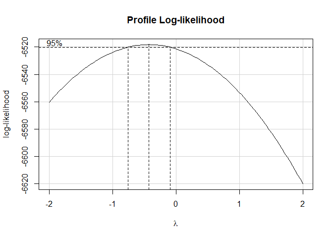

From the BoxCox plot shown above, it appears that an inverse
transformation will be ideal for this model, as the peak of the BoxCox
plot’s curve is at about λ = -0.4. The exact transformation value can be
seen using the `powerTransform` function as shown below:

    lin_mod_simp %>% complete() %$% powerTransform(Systolic_BP ~ Sodium + Potassium + Age + High_BP + Insomnia + Milk)

    Estimated transformation parameter 
            Y1 
    -0.4241074 

Again, this confirms the results of the BoxCox plot shown above, as the
approximate value of λ = -0.42. Using this information, this
transformation has been applied to the `Systolic_BP` data in the
exported imputed data from the single imputation `lin_mod_simp` for use
in the following analyses. This has been accomplished with the code
below, which names the resultant transformed data `inv_sbp`, and the
dataset itself as `lin_mod_simp_data`:

    lin_mod_simp_data = lin_mod_simp %>% complete() %>% 
        mutate(inv_sbp = (1/Systolic_BP))

As a final assessment to demonstrate and verify that this outcome
transformation appropriately removed the skew from the data, the normal
q-q plot, histogram, and violin box-plot for both the unaltered and
transformed outcomes have been provided below:

    a4 <- ggplot(lin_mod_simp_data, aes(x = "", y = 1/Systolic_BP)) +
      geom_violin(fill = "dodgerblue", alpha = 0.3) +
      geom_boxplot(width = 0.25, fill = "dodgerblue", notch = TRUE) +
      coord_flip() +
      labs(title = "Violin Boxplot: 1/SBP", x = "", y = "Inverse Systolic Blood Pressure (mm Hg)")

    a5 <- ggplot(lin_mod_simp_data, aes(x = 1/Systolic_BP)) +
      geom_histogram(aes(y = stat(density)), bins = nclass.scott(1/lin_mod_simp_data$Systolic_BP), col = "white", fill = "dodgerblue") +
      stat_function(fun = dnorm, args = list(mean = mean(1/lin_mod_simp_data$Systolic_BP), sd = sd(1/lin_mod_simp_data$Systolic_BP)), col = "red", lwd = 1) +
      labs(title = "Density Function: 1/SBP", x = "Inverse Systolic Blood Pressure (mm Hg)")

    a6 <- ggplot(lin_mod_simp_data, aes(sample = 1/Systolic_BP)) +
      geom_qq(col = "dodgerblue") +
      geom_qq_line(col = "red") +
      labs(title = "Normal Q-Q plot: 1/SBP", x = "", y = "Inverse Systolic Blood Pressure (mm Hg)")

    (a3 + a2) / a1 + 
      plot_layout(heights = c(5,2)) +
      plot_annotation(title = "Inverse Systolic Blood Pressure",
                      subtitle = "Distribution & Normality Assessment of subject's 3rd systolic blood pressure measurement,\n as taken with an oscillometric device",
                      caption = "All data above pulled from 2017-2018 NHANES datasets")

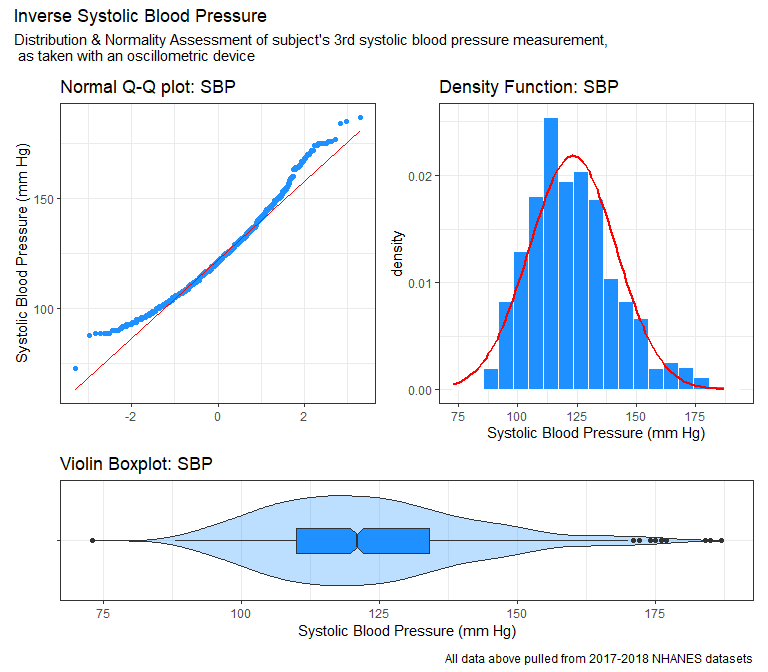

    (a6 + a5) / a4 + 
      plot_layout(heights = c(5,2)) +
      plot_annotation(title = "Inverse Systolic Blood Pressure",
                      subtitle = "Distribution & Normality Assessment of the inverse of subject's 3rd systolic blood pressure\n measurement, as taken with an oscillometric device",
                      caption = "All data above pulled from 2017-2018 NHANES datasets")

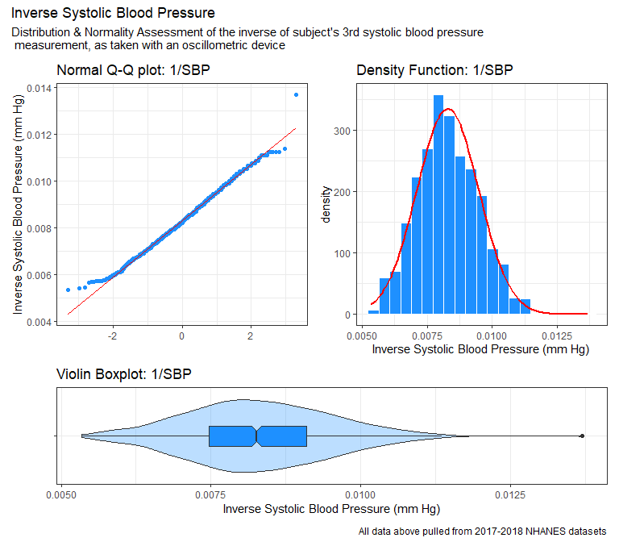

While the outcome data does appear to have some outliers, this
transformation appears to be largely appropriate, so this transformation
will be used when generating the models below.

## Scatterplot Matrix and Collinearity

The next step in the linear regression analysis will be to assess the
variables for any collinearity. To accomplish this, a scatterplot matrix
will be generated below:

    ggpairs(lin_mod_simp_data %>% select(Sodium, Potassium, Age, High_BP, Insomnia, Milk, inv_sbp),
            lower = list(combo = wrap("facethist", binwidth = 1)),
            title = "1149 subjects in `linear_model_simp")

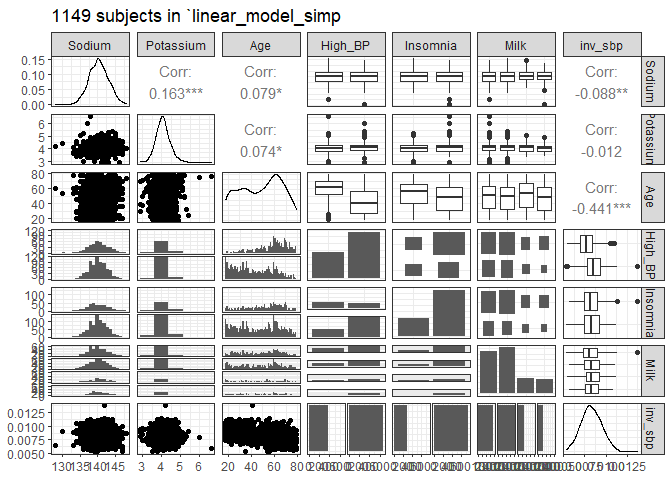

The results of the scatterplot matrix above suggest very little
collinearity between any of the predictor variables, so removal of any
predictor variables does not appear necessary. As a precaution, we can
also examine the variance inflation factors with the code below:

    vif(lm(data = lin_mod_simp_data, inv_sbp ~ Sodium + Potassium + Age + High_BP + Insomnia + Milk))

                  GVIF Df GVIF^(1/(2*Df))
    Sodium    1.033610  1        1.016666
    Potassium 1.046703  1        1.023085
    Age       1.305473  1        1.142573
    High_BP   1.334009  1        1.154993
    Insomnia  1.055545  1        1.027397
    Milk      1.016270  3        1.002693

Again, all of the variance inflation factors are well below 5,
confirming the results of the scatterplot matrix examined above.

## Model A - the main effects model

In light of the outcome transformation and collinearity assessments
performed above, two versions of **Model A** will be generated below,
one using an lm fit and the other an ols fit:

    model_a_lm = fit.mult.impute(1/Systolic_BP ~ Sodium + Potassium + Age + High_BP + Insomnia + Milk,
                        fitter = lm, xtrans = lin_mod_mimp,
                        data = lin_mod_data, x = TRUE, y = TRUE, pr = FALSE)

    model_a_ols = fit.mult.impute(1/Systolic_BP ~ Sodium + Potassium + Age + High_BP + Insomnia + Milk,
                        fitter = ols, xtrans = lin_mod_mimp,
                        data = lin_mod_data, x = TRUE, y = TRUE, pr = FALSE)

The coefficients for **Model A** as taken from the `lm` fitted model
have been provided below:

    tidy(model_a_lm, conf.int = TRUE) %>%
      select(term, estimate, std.error, p.value, conf.low, conf.high) %>%
      kable(digits = 7)

<table>
<thead>
<tr class="header">
<th style="text-align: left;">term</th>
<th style="text-align: right;">estimate</th>
<th style="text-align: right;">std.error</th>
<th style="text-align: right;">p.value</th>
<th style="text-align: right;">conf.low</th>
<th style="text-align: right;">conf.high</th>
</tr>
</thead>
<tbody>
<tr class="odd">
<td style="text-align: left;">(Intercept)</td>
<td style="text-align: right;">0.0126761</td>
<td style="text-align: right;">0.0016890</td>
<td style="text-align: right;">0.0000000</td>
<td style="text-align: right;">0.0092751</td>
<td style="text-align: right;">0.0160772</td>
</tr>
<tr class="even">
<td style="text-align: left;">Sodium</td>
<td style="text-align: right;">-0.0000259</td>
<td style="text-align: right;">0.0000122</td>
<td style="text-align: right;">0.0332867</td>
<td style="text-align: right;">-0.0000506</td>
<td style="text-align: right;">-0.0000012</td>
</tr>
<tr class="odd">
<td style="text-align: left;">Potassium</td>
<td style="text-align: right;">0.0000372</td>
<td style="text-align: right;">0.0000869</td>
<td style="text-align: right;">0.6684398</td>
<td style="text-align: right;">-0.0001465</td>
<td style="text-align: right;">0.0002210</td>
</tr>
<tr class="even">
<td style="text-align: left;">Age</td>
<td style="text-align: right;">-0.0000243</td>
<td style="text-align: right;">0.0000021</td>
<td style="text-align: right;">0.0000000</td>
<td style="text-align: right;">-0.0000285</td>
<td style="text-align: right;">-0.0000201</td>
</tr>
<tr class="odd">
<td style="text-align: left;">High_BPNo</td>
<td style="text-align: right;">0.0004844</td>
<td style="text-align: right;">0.0000777</td>
<td style="text-align: right;">0.0000000</td>
<td style="text-align: right;">0.0003314</td>
<td style="text-align: right;">0.0006374</td>
</tr>
<tr class="even">
<td style="text-align: left;">InsomniaNo</td>
<td style="text-align: right;">-0.0001594</td>
<td style="text-align: right;">0.0000740</td>
<td style="text-align: right;">0.0315332</td>
<td style="text-align: right;">-0.0003046</td>
<td style="text-align: right;">-0.0000141</td>
</tr>
<tr class="odd">
<td style="text-align: left;">Milk2% Milk</td>
<td style="text-align: right;">0.0000792</td>
<td style="text-align: right;">0.0000757</td>
<td style="text-align: right;">0.2959080</td>
<td style="text-align: right;">-0.0000948</td>
<td style="text-align: right;">0.0002532</td>
</tr>
<tr class="even">
<td style="text-align: left;">Milk1% or Skim Milk</td>
<td style="text-align: right;">0.0003070</td>
<td style="text-align: right;">0.0001022</td>
<td style="text-align: right;">0.0027247</td>
<td style="text-align: right;">0.0000639</td>
<td style="text-align: right;">0.0005501</td>
</tr>
<tr class="odd">
<td style="text-align: left;">MilkSoy or Other Milk</td>
<td style="text-align: right;">0.0000242</td>
<td style="text-align: right;">0.0001060</td>
<td style="text-align: right;">0.8197614</td>
<td style="text-align: right;">-0.0002240</td>
<td style="text-align: right;">0.0002724</td>
</tr>
</tbody>
</table>

Additionally, the R^2, adjusted R^2, AIC, and BIC values for the `lm`
fitted model have been provided below:

    glance(model_a_lm) %>%
        select(r.squared, adj.r.squared, sigma, AIC, BIC) %>%
        kable(digits = c(3, 3, 3, 1, 1))

<table>
<thead>
<tr class="header">
<th style="text-align: right;">r.squared</th>
<th style="text-align: right;">adj.r.squared</th>
<th style="text-align: right;">sigma</th>
<th style="text-align: right;">AIC</th>
<th style="text-align: right;">BIC</th>
</tr>
</thead>
<tbody>
<tr class="odd">
<td style="text-align: right;">0.233</td>
<td style="text-align: right;">0.227</td>
<td style="text-align: right;">0.001</td>
<td style="text-align: right;">-11407.5</td>
<td style="text-align: right;">-11358</td>
</tr>
</tbody>
</table>

The validated R^2 statistic has been calculated using the `validate`
function as shown below, which when corrected for optimism, was
approximately 0.2250:

    set.seed(43202)
    validate(model_a_ols)

              index.orig training   test optimism index.corrected  n
    R-square      0.2335   0.2353 0.2267   0.0086          0.2250 40
    MSE           0.0000   0.0000 0.0000   0.0000          0.0000 40
    g             0.0007   0.0007 0.0007   0.0000          0.0007 40
    Intercept     0.0000   0.0000 0.0001  -0.0001          0.0001 40
    Slope         1.0000   1.0000 0.9828   0.0172          0.9828 40

Lastly, the residual plots for the `lm` fitted version of **Model A**
have been provided below:

    par(mfrow = c(2,2)); plot(model_a_lm); par(mfrow = c(1,1))

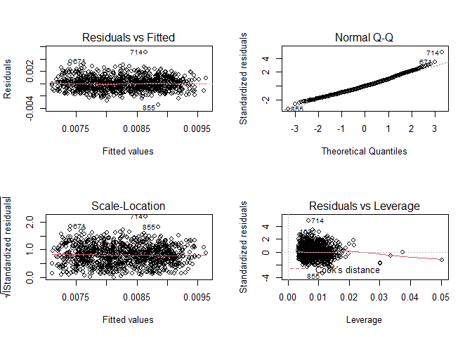

It’s worth noting that there doesn’t appear to be any serious issues
with linearity, constant variance, or leverage, however we do appear to
have some unusually high residuals as seen in the normal q-q plot.
Additionally, there also seems to be a few notable outliers in these
residuals as well that would warrant further investigation, however as
this is beyond the scope of the project they will not be addressed at
this time.

## Non-Linearity

Now that the initial model has been generated, we should examine whether
or not it would be prudent to consider non-linear terms for this model.
To accomplish this, a Spearman p2 Plot has been generated below:

    spear_lin_mod = spearman2(inv_sbp ~ Sodium + Potassium + Age + High_BP + Insomnia + Milk, data = lin_mod_simp_data)

    plot(spear_lin_mod)

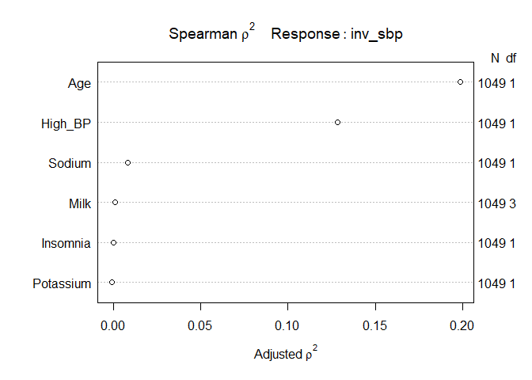

From the model above, we can clearly see that if we are to spend any
degrees of freedom on non-linear terms, the best option would be to
choose the `Age` variable. As such, we will create a linear model with a
non-linear term for `Age` in the next section.

## Model B - the augmented model

In light of the non-linearity assessment performed in the previous
section, two versions of model b will be generated, one using an lm fit
and the other an ols fit, with both using `Age` as a non-linear term:

    model_b_lm = fit.mult.impute(1/Systolic_BP ~ Potassium + Sodium + rcs(Age, 3) + High_BP + Insomnia + Milk, fitter = lm, xtrans = lin_mod_mimp, data = lin_mod_data, x = TRUE, y = TRUE, pr = FALSE)
    model_b_ols = fit.mult.impute(1/Systolic_BP ~ Potassium + Sodium + rcs(Age, 3) + High_BP + Insomnia + Milk, fitter = ols, xtrans = lin_mod_mimp, data = lin_mod_data, x = TRUE, y = TRUE, pr = FALSE)

    plot(nomogram(model_b_ols))

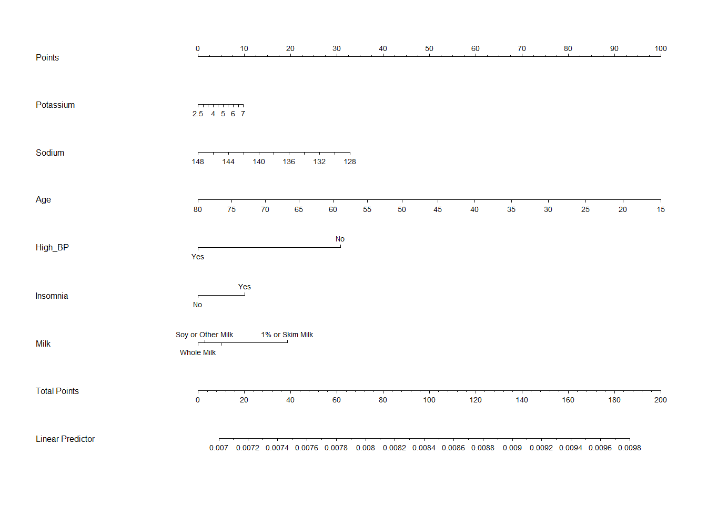

    anova(model_a_lm, model_b_lm)

    Analysis of Variance Table

    Model 1: 1/Systolic_BP ~ Sodium + Potassium + Age + High_BP + Insomnia + 
        Milk
    Model 2: 1/Systolic_BP ~ Potassium + Sodium + rcs(Age, 3) + High_BP + 
        Insomnia + Milk
      Res.Df       RSS Df  Sum of Sq      F Pr(>F)
    1   1040 0.0011408                            
    2   1039 0.0011407  1 1.4551e-07 0.1325 0.7159

    par(mfrow = c(2,2)); plot(model_b_lm); par(mfrow = c(1,1))

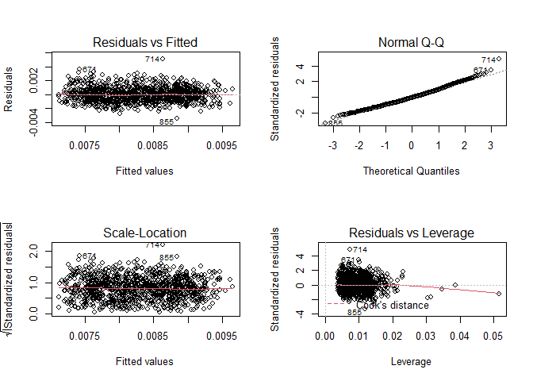

Once again, it’s worth noting that there doesn’t appear to be any
serious issues with linearity, constant variance, or leverage, however
we do appear to have some unusually high residuals as seen in the normal
q-q plot. Additionally, there also seems to be a few notable outliers in
these residuals as well that would warrant further investigation,
however as this is beyond the scope of the project they will not be
addressed at this time.

## Validating the Models

    validate(model_a_ols)

              index.orig training   test optimism index.corrected  n
    R-square      0.2335   0.2415 0.2268   0.0147          0.2188 40
    MSE           0.0000   0.0000 0.0000   0.0000          0.0000 40
    g             0.0007   0.0007 0.0007   0.0000          0.0006 40
    Intercept     0.0000   0.0000 0.0002  -0.0002          0.0002 40
    Slope         1.0000   1.0000 0.9816   0.0184          0.9816 40

    validate(model_b_ols)

              index.orig training   test optimism index.corrected  n
    R-square      0.2336   0.2374 0.2267   0.0107          0.2229 40
    MSE           0.0000   0.0000 0.0000   0.0000          0.0000 40
    g             0.0007   0.0007 0.0007   0.0000          0.0007 40
    Intercept     0.0000   0.0000 0.0002  -0.0002          0.0002 40
    Slope         1.0000   1.0000 0.9775   0.0225          0.9775 40

## Final Model

Based on all of the summary statistics regarding Model A and Model B
above, I conclude that

# Logistic Regression Modeling

## Missingness

As with the linear regression models examined above, the missingness
from the `analysis_data` dataset will be dealt with via multiple
imputation. However, since there is no data missing from the `High_BP`
outcome variable, we will not filter any samples out, but will instead
impute all missing values. A single imputation will also be performed
again for use in determining

    set.seed(43202)
    dd = datadist(analysis_data)
    options(datadist = "dd")

    model_y_imp = aregImpute(formula = ~ High_BP + Systolic_BP + Potassium + Sodium + Age + Milk + Insomnia, tlinear = FALSE, nk = c(0, 3:5), data = analysis_data, B = 10, n.impute = 40)

    Iteration 1 Iteration 2 Iteration 3 Iteration 4 Iteration 5 Iteration 6 Iteration 7 Iteration 8 Iteration 9 Iteration 10 Iteration 11 Iteration 12 Iteration 13 Iteration 14 Iteration 15 Iteration 16 Iteration 17 Iteration 18 Iteration 19 Iteration 20 Iteration 21 Iteration 22 Iteration 23 Iteration 24 Iteration 25 Iteration 26 Iteration 27 Iteration 28 Iteration 29 Iteration 30 Iteration 31 Iteration 32 Iteration 33 Iteration 34 Iteration 35 Iteration 36 Iteration 37 Iteration 38 Iteration 39 Iteration 40 Iteration 41 Iteration 42 Iteration 43 

While it was demonstrated in section 6.1 above that an outcome
transformation will likely be necessary, the missing data in the
`analysis_data` dataset will need to be addressed first.

As a reminder, there are 4 variables that have missing data in the
`analysis_data` dataset - the outcome `Systolic_BP`, and the predictors
`Milk`, `Sodium`, and `Potassium`, as shown again with the missing
variables summary below:

    miss_var_summary(analysis_data) %>%
      kable(digits = 4)

<table>
<thead>
<tr class="header">
<th style="text-align: left;">variable</th>
<th style="text-align: right;">n_miss</th>
<th style="text-align: right;">pct_miss</th>
</tr>
</thead>
<tbody>
<tr class="odd">
<td style="text-align: left;">Milk</td>
<td style="text-align: right;">280</td>
<td style="text-align: right;">23.3333</td>
</tr>
<tr class="even">
<td style="text-align: left;">Systolic_BP</td>
<td style="text-align: right;">151</td>
<td style="text-align: right;">12.5833</td>
</tr>
<tr class="odd">
<td style="text-align: left;">Sodium</td>
<td style="text-align: right;">79</td>
<td style="text-align: right;">6.5833</td>
</tr>
<tr class="even">
<td style="text-align: left;">Potassium</td>
<td style="text-align: right;">79</td>
<td style="text-align: right;">6.5833</td>
</tr>
<tr class="odd">
<td style="text-align: left;">Subject_ID</td>
<td style="text-align: right;">0</td>
<td style="text-align: right;">0.0000</td>
</tr>
<tr class="even">
<td style="text-align: left;">High_BP</td>
<td style="text-align: right;">0</td>
<td style="text-align: right;">0.0000</td>
</tr>
<tr class="odd">
<td style="text-align: left;">Age</td>
<td style="text-align: right;">0</td>
<td style="text-align: right;">0.0000</td>
</tr>
<tr class="even">
<td style="text-align: left;">Insomnia</td>
<td style="text-align: right;">0</td>
<td style="text-align: right;">0.0000</td>
</tr>
</tbody>
</table>

There are at least three methods that could be used to address this
missingness - any samples with missing data could be filtered out so
that a complete case analysis could be performed, or the missing data
could be imputed, either via single imputation or multiple imputation.
In an effort to produce the most accurate results possible without
throwing out data, a combination of single and multiple imputation will
be used to impute the missing data. The single imputation will be used
to assess for an appropriate outcome transformation in the following
section, to check for collinearity via a scatterplot matrix in section
8.3 below, and to assess for non-linearity in section 8.5, however the
multiple imputation data will be used for actually fitting our models.

### Single Imputation

As with the imputation steps in the linear regression analyses, the
`mice` package will once again be used to create both the single and
multiple imputation data necessary to perform this logistic regression
analysis. The single imputation

    set.seed(43202)
    dd = datadist(analysis_data)
    options(datadist = "dd")

    log_mod_simp = analysis_data %>%
      select(Systolic_BP, Sodium, Potassium, Age, High_BP, Insomnia, Milk) %>%
      mice(., m = 1, method = c("midastouch", "midastouch", "midastouch", "", "", "", "cart"), printFlag = FALSE)

With this accomplished, the creation of the multiple imputation data may
now proceed.

### Multiple Imputation

By utilizing the `mice` package again, we can alter the single
imputation code used above to generate The multiple imputation has been
accomplished with the following code:

    set.seed(43202)
    dd = datadist(analysis_data)
    options(datadist = "dd")

    log_mod_mimp = analysis_data %>%
      select(Systolic_BP, Sodium, Potassium, Age, High_BP, Insomnia, Milk) %>%
      mice(., m = 25, method = c("midastouch", "midastouch", "midastouch", "", "", "", "cart"), printFlag = FALSE)

With the code above, the missing data has been successfully imputed via
multiple imputation and saved as `log_mod_mimp`. The next step of the
analysis will be to complete the outcome transformation assessment that
was begun in the project proposal.

## Model Y

    model_y_glm = fit.mult.impute(High_BP == "Yes" ~ Systolic_BP + Potassium + Sodium + Age + Insomnia + Milk, fitter = glm, xtrans = log_mod_mimp, data = analysis_data, x = TRUE, y = TRUE, pr = FALSE)
    model_y_lrm = fit.mult.impute(High_BP == "Yes" ~ Systolic_BP + Potassium + Sodium + Age + Insomnia + Milk, fitter = lrm, xtrans = log_mod_mimp, data = analysis_data, x = TRUE, y = TRUE, pr = FALSE)

    tidy(model_y_glm, conf.int = TRUE) %>%
      select(term, estimate, std.error, p.value, conf.low, conf.high) %>%
      kable(digits = 3)

<table>
<thead>
<tr class="header">
<th style="text-align: left;">term</th>
<th style="text-align: right;">estimate</th>
<th style="text-align: right;">std.error</th>
<th style="text-align: right;">p.value</th>
<th style="text-align: right;">conf.low</th>
<th style="text-align: right;">conf.high</th>
</tr>
</thead>
<tbody>
<tr class="odd">
<td style="text-align: left;">(Intercept)</td>
<td style="text-align: right;">0.228</td>
<td style="text-align: right;">0.608</td>
<td style="text-align: right;">0.707</td>
<td style="text-align: right;">-0.968</td>
<td style="text-align: right;">1.415</td>
</tr>
<tr class="even">
<td style="text-align: left;">Systolic_BP</td>
<td style="text-align: right;">0.005</td>
<td style="text-align: right;">0.001</td>
<td style="text-align: right;">0.000</td>
<td style="text-align: right;">0.004</td>
<td style="text-align: right;">0.006</td>
</tr>
<tr class="odd">
<td style="text-align: left;">Potassium</td>
<td style="text-align: right;">-0.085</td>
<td style="text-align: right;">0.032</td>
<td style="text-align: right;">0.008</td>
<td style="text-align: right;">-0.149</td>
<td style="text-align: right;">-0.024</td>
</tr>
<tr class="even">
<td style="text-align: left;">Sodium</td>
<td style="text-align: right;">-0.004</td>
<td style="text-align: right;">0.004</td>
<td style="text-align: right;">0.412</td>
<td style="text-align: right;">-0.012</td>
<td style="text-align: right;">0.005</td>
</tr>
<tr class="odd">
<td style="text-align: left;">Age</td>
<td style="text-align: right;">0.010</td>
<td style="text-align: right;">0.001</td>
<td style="text-align: right;">0.000</td>
<td style="text-align: right;">0.009</td>
<td style="text-align: right;">0.012</td>
</tr>
<tr class="even">
<td style="text-align: left;">InsomniaNo</td>
<td style="text-align: right;">-0.168</td>
<td style="text-align: right;">0.027</td>
<td style="text-align: right;">0.000</td>
<td style="text-align: right;">-0.221</td>
<td style="text-align: right;">-0.116</td>
</tr>
<tr class="odd">
<td style="text-align: left;">Milk2% Milk</td>
<td style="text-align: right;">0.028</td>
<td style="text-align: right;">0.028</td>
<td style="text-align: right;">0.303</td>
<td style="text-align: right;">-0.031</td>
<td style="text-align: right;">0.077</td>
</tr>
<tr class="even">
<td style="text-align: left;">Milk1% or Skim Milk</td>
<td style="text-align: right;">0.052</td>
<td style="text-align: right;">0.037</td>
<td style="text-align: right;">0.158</td>
<td style="text-align: right;">-0.022</td>
<td style="text-align: right;">0.121</td>
</tr>
<tr class="odd">
<td style="text-align: left;">MilkSoy or Other Milk</td>
<td style="text-align: right;">-0.047</td>
<td style="text-align: right;">0.039</td>
<td style="text-align: right;">0.224</td>
<td style="text-align: right;">-0.133</td>
<td style="text-align: right;">0.018</td>
</tr>
</tbody>
</table>

    model_y_lrm

    Logistic Regression Model
     
     fit.mult.impute(formula = High_BP == "Yes" ~ Systolic_BP + Potassium + 
         Sodium + Age + Insomnia + Milk, fitter = lrm, xtrans = log_mod_mimp, 
         data = analysis_data, pr = FALSE, x = TRUE, y = TRUE)
     
                            Model Likelihood    Discrimination    Rank Discrim.    
                                  Ratio Test           Indexes          Indexes    
     Obs          1200    LR chi2     393.95    R2       0.384    C       0.823    
      FALSE        767    d.f.             8    g        1.723    Dxy     0.646    
      TRUE         433    Pr(> chi2) <0.0001    gr       5.601    gamma   0.646    
     max |deriv| 2e-07                          gp       0.299    tau-a   0.298    
                                                Brier    0.164                     
     
                            Coef    S.E.   Wald Z Pr(>|Z|)
     Intercept              -0.4740 3.7823 -0.13  0.9003  
     Systolic_BP             0.0270 0.0048  5.66  <0.0001 
     Potassium              -0.5439 0.2003 -2.72  0.0066  
     Sodium                 -0.0269 0.0273 -0.99  0.3239  
     Age                     0.0616 0.0053 11.66  <0.0001 
     Insomnia=No            -0.9568 0.1571 -6.09  <0.0001 
     Milk=2% Milk            0.1500 0.1871  0.80  0.4229  
     Milk=1% or Skim Milk    0.3160 0.2574  1.23  0.2196  
     Milk=Soy or Other Milk -0.3391 0.2630 -1.29  0.1972  
     

    set.seed(43202)
    validate(model_y_lrm)

              index.orig training    test optimism index.corrected  n
    Dxy           0.6499   0.6589  0.6452   0.0137          0.6362 40
    R2            0.3836   0.3979  0.3806   0.0174          0.3662 40
    Intercept     0.0000   0.0000 -0.0105   0.0105         -0.0105 40
    Slope         1.0000   1.0000  0.9615   0.0385          0.9615 40
    Emax          0.0000   0.0000  0.0104   0.0104          0.0104 40
    D             0.3275   0.3425  0.3244   0.0180          0.3094 40
    U            -0.0017  -0.0017  0.0005  -0.0022          0.0005 40
    Q             0.3291   0.3441  0.3239   0.0203          0.3089 40
    B             0.1634   0.1609  0.1650  -0.0041          0.1674 40
    g             1.7228   1.7857  1.7084   0.0773          1.6455 40
    gp            0.2987   0.3040  0.2974   0.0065          0.2922 40

    prob = predict(model_y_lrm, type="fitted")
    pred = prediction(prob, analysis_data$High_BP == "Yes")
    perf = performance(pred, measure = "tpr", x.measure = "fpr")
    auc = performance(pred, measure="auc")

    auc = round(auc@y.values[[1]],3)
    roc.data = data.frame(fpr=unlist(perf@x.values), 
                           tpr = unlist(perf@y.values), 
                           model="LRM")

    ggplot(roc.data, aes(x = fpr, ymin = 0, ymax = tpr)) +
      geom_ribbon(alpha = 0.2, fill = "blue") +
      geom_line(aes(y = tpr), col = "blue") +
      geom_abline(intercept = 0, slope = 1, lty = "dashed") +
      labs(title = paste0("Model Y: ROC Curve w/ AUC=", auc))

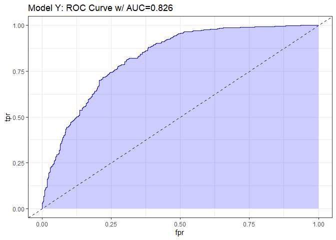

    model_y_aug = augment(model_y_glm, type.predict = "response")

    confuse_model_y = model_y_aug %>%
      mutate(High_BP_obs = factor(`High_BP == "Yes"` == "TRUE"),
             High_BP_pred = factor(.fitted >= 0.50),
             High_BP_obs = fct_relevel(High_BP_obs, "TRUE"),
             High_BP_pred = fct_relevel(High_BP_pred, "TRUE")) %$%
      table(High_BP_pred, High_BP_obs)
    confuse_model_y

                High_BP_obs
    High_BP_pred TRUE FALSE
           TRUE   264   133
           FALSE  169   634

    plot(nomogram(model_y_lrm))

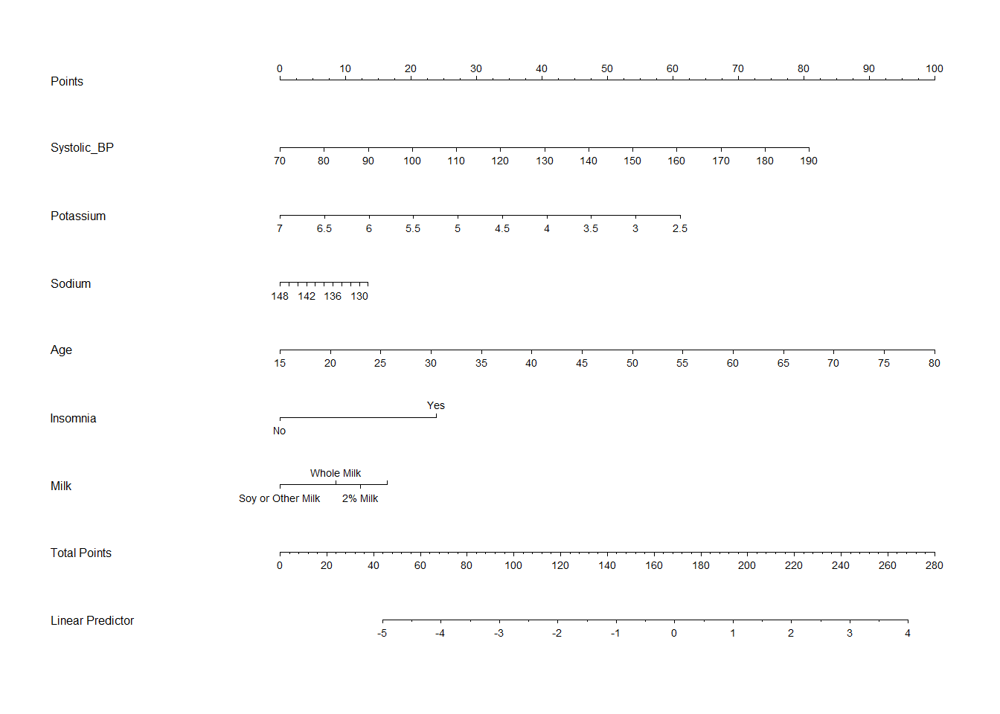

## Non-Linearity

As was done with the linear regression analysis, we should examine
whether or not it would be prudent to consider non-linear terms, now
that the main effects model Model Y has been generated. To accomplish
this, a Spearman p2 Plot has been generated below:

    spear_log_mod = spearman2(High_BP == "Yes" ~ Systolic_BP + Sodium + Potassium + Age + Insomnia + Milk, data = complete(log_mod_simp))

    plot(spear_log_mod)

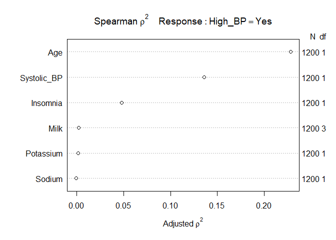

As was the case with the linear regression analysis for predicting
inverse systolic blood pressure, the `Age` variable appears to be the
most ideal variable to spend additional degrees of freedom on if we wish
to consider the addition of non-linear terms. `Systolic_BP` could also
be considered, however if we have a limit to the degrees of freedom we
can expend the plot suggest that the `Age` variable should be
prioritized first.

## Model Z

In light of the non-linearity assessment performed in the previous
section, two versions of model z will be generated, one using an glm fit
and the other an lrm fit, with both incorporating non-linear terms for
`Age` and `Systolic_BP`:

    model_z_glm = fit.mult.impute(High_BP == "Yes" ~ rcs(Systolic_BP, 3) + Potassium + Sodium + rcs(Age, 3) + Insomnia + Milk, fitter = glm, xtrans = log_mod_mimp, data = analysis_data, x = TRUE, y = TRUE, pr = FALSE)
    model_z_lrm = fit.mult.impute(High_BP == "Yes" ~ rcs(Systolic_BP, 3) + Potassium + Sodium + rcs(Age, 3) + Insomnia + Milk, fitter = lrm, xtrans = log_mod_mimp, data = analysis_data, x = TRUE, y = TRUE, pr = FALSE)

    tidy(model_z_glm, conf.int = TRUE) %>%
      select(term, estimate, std.error, p.value, conf.low, conf.high) %>%
      kable(digits = 3)

<table>
<thead>
<tr class="header">
<th style="text-align: left;">term</th>
<th style="text-align: right;">estimate</th>
<th style="text-align: right;">std.error</th>
<th style="text-align: right;">p.value</th>
<th style="text-align: right;">conf.low</th>
<th style="text-align: right;">conf.high</th>
</tr>
</thead>
<tbody>
<tr class="odd">
<td style="text-align: left;">(Intercept)</td>
<td style="text-align: right;">0.292</td>
<td style="text-align: right;">0.627</td>
<td style="text-align: right;">0.641</td>
<td style="text-align: right;">-0.909</td>
<td style="text-align: right;">1.548</td>
</tr>
<tr class="even">
<td style="text-align: left;">rcs(Systolic_BP, 3)Systolic_BP</td>
<td style="text-align: right;">0.005</td>
<td style="text-align: right;">0.002</td>
<td style="text-align: right;">0.002</td>
<td style="text-align: right;">0.002</td>
<td style="text-align: right;">0.008</td>
</tr>
<tr class="odd">
<td style="text-align: left;">rcs(Systolic_BP, 3)Systolic_BP’</td>
<td style="text-align: right;">-0.001</td>
<td style="text-align: right;">0.002</td>
<td style="text-align: right;">0.776</td>
<td style="text-align: right;">-0.004</td>
<td style="text-align: right;">0.004</td>
</tr>
<tr class="even">
<td style="text-align: left;">Potassium</td>
<td style="text-align: right;">-0.091</td>
<td style="text-align: right;">0.032</td>
<td style="text-align: right;">0.004</td>
<td style="text-align: right;">-0.155</td>
<td style="text-align: right;">-0.030</td>
</tr>
<tr class="odd">
<td style="text-align: left;">Sodium</td>
<td style="text-align: right;">-0.004</td>
<td style="text-align: right;">0.004</td>
<td style="text-align: right;">0.421</td>
<td style="text-align: right;">-0.012</td>
<td style="text-align: right;">0.005</td>
</tr>
<tr class="even">
<td style="text-align: left;">rcs(Age, 3)Age</td>
<td style="text-align: right;">0.008</td>
<td style="text-align: right;">0.002</td>
<td style="text-align: right;">0.000</td>
<td style="text-align: right;">0.004</td>
<td style="text-align: right;">0.011</td>
</tr>
<tr class="odd">
<td style="text-align: left;">rcs(Age, 3)Age’</td>
<td style="text-align: right;">0.003</td>
<td style="text-align: right;">0.002</td>
<td style="text-align: right;">0.092</td>
<td style="text-align: right;">-0.001</td>
<td style="text-align: right;">0.007</td>
</tr>
<tr class="even">
<td style="text-align: left;">InsomniaNo</td>
<td style="text-align: right;">-0.170</td>
<td style="text-align: right;">0.027</td>
<td style="text-align: right;">0.000</td>
<td style="text-align: right;">-0.223</td>
<td style="text-align: right;">-0.118</td>
</tr>
<tr class="odd">
<td style="text-align: left;">Milk2% Milk</td>
<td style="text-align: right;">0.027</td>
<td style="text-align: right;">0.028</td>
<td style="text-align: right;">0.336</td>
<td style="text-align: right;">-0.032</td>
<td style="text-align: right;">0.076</td>
</tr>
<tr class="even">
<td style="text-align: left;">Milk1% or Skim Milk</td>
<td style="text-align: right;">0.048</td>
<td style="text-align: right;">0.037</td>
<td style="text-align: right;">0.193</td>
<td style="text-align: right;">-0.025</td>
<td style="text-align: right;">0.119</td>
</tr>
<tr class="odd">
<td style="text-align: left;">MilkSoy or Other Milk</td>
<td style="text-align: right;">-0.049</td>
<td style="text-align: right;">0.039</td>
<td style="text-align: right;">0.210</td>
<td style="text-align: right;">-0.133</td>
<td style="text-align: right;">0.018</td>
</tr>
</tbody>
</table>

    model_z_lrm

    Logistic Regression Model
     
     fit.mult.impute(formula = High_BP == "Yes" ~ rcs(Systolic_BP, 
         3) + Potassium + Sodium + rcs(Age, 3) + Insomnia + Milk, 
         fitter = lrm, xtrans = log_mod_mimp, data = analysis_data, 
         pr = FALSE, x = TRUE, y = TRUE)
     
                            Model Likelihood    Discrimination    Rank Discrim.    
                                  Ratio Test           Indexes          Indexes    
     Obs          1200    LR chi2     397.11    R2       0.386    C       0.822    
      FALSE        767    d.f.            10    g        1.778    Dxy     0.644    
      TRUE         433    Pr(> chi2) <0.0001    gr       5.917    gamma   0.644    
     max |deriv| 8e-05                          gp       0.299    tau-a   0.297    
                                                Brier    0.164                     
     
                            Coef    S.E.   Wald Z Pr(>|Z|)
     Intercept              -2.6638 3.9980 -0.67  0.5052  
     Systolic_BP             0.0410 0.0123  3.33  0.0009  
     Systolic_BP'           -0.0172 0.0137 -1.26  0.2074  
     Potassium              -0.5172 0.2009 -2.57  0.0100  
     Sodium                 -0.0269 0.0272 -0.99  0.3227  
     Age                     0.0757 0.0148  5.10  <0.0001 
     Age'                   -0.0144 0.0142 -1.02  0.3081  
     Insomnia=No            -0.9518 0.1580 -6.03  <0.0001 
     Milk=2% Milk            0.1591 0.1867  0.85  0.3941  
     Milk=1% or Skim Milk    0.3287 0.2580  1.27  0.2027  
     Milk=Soy or Other Milk -0.3359 0.2618 -1.28  0.1995  
     

    set.seed(43202)
    validate(model_z_lrm)

              index.orig training    test optimism index.corrected  n
    Dxy           0.6471   0.6583  0.6418   0.0164          0.6307 40
    R2            0.3862   0.4015  0.3807   0.0208          0.3653 40
    Intercept     0.0000   0.0000 -0.0113   0.0113         -0.0113 40
    Slope         1.0000   1.0000  0.9529   0.0471          0.9529 40
    Emax          0.0000   0.0000  0.0126   0.0126          0.0126 40
    D             0.3301   0.3462  0.3245   0.0217          0.3084 40
    U            -0.0017  -0.0017  0.0008  -0.0024          0.0008 40
    Q             0.3318   0.3478  0.3238   0.0241          0.3077 40
    B             0.1634   0.1605  0.1653  -0.0048          0.1682 40
    g             1.7776   1.8449  1.7492   0.0958          1.6818 40
    gp            0.2995   0.3050  0.2971   0.0079          0.2916 40

    prob = predict(model_z_lrm, type="fitted")
    pred = prediction(prob, analysis_data$High_BP == "Yes")
    perf = performance(pred, measure = "tpr", x.measure = "fpr")
    auc = performance(pred, measure="auc")

    auc = round(auc@y.values[[1]],3)
    roc.data = data.frame(fpr=unlist(perf@x.values), 
                           tpr = unlist(perf@y.values), 
                           model="LRM")

    ggplot(roc.data, aes(x = fpr, ymin = 0, ymax = tpr)) +
      geom_ribbon(alpha = 0.2, fill = "blue") +
      geom_line(aes(y = tpr), col = "blue") +
      geom_abline(intercept = 0, slope = 1, lty = "dashed") +
      labs(title = paste0("Model Z: ROC Curve w/ AUC=", auc))

    model_z_aug = augment(model_z_glm, type.predict = "response")

    confuse_model_z = model_z_aug %>%
      mutate(High_BP_obs = factor(`High_BP == "Yes"` == "TRUE"),
             High_BP_pred = factor(.fitted >= 0.50),
             High_BP_obs = fct_relevel(High_BP_obs, "TRUE"),
             High_BP_pred = fct_relevel(High_BP_pred, "TRUE")) %$%
      table(High_BP_pred, High_BP_obs)
    confuse_model_z

                High_BP_obs
    High_BP_pred TRUE FALSE
           TRUE   257   132
           FALSE  176   635

    plot(nomogram(model_z_lrm))

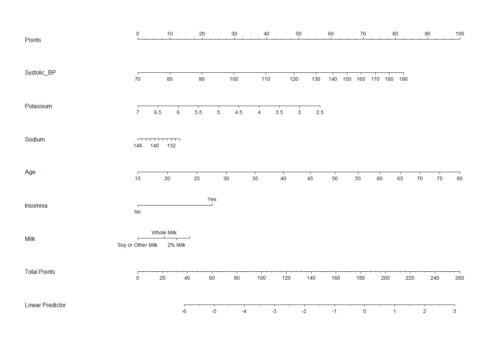

    anova(model_y_glm, model_z_glm)

    Analysis of Deviance Table

    Model 1: High_BP == "Yes" ~ Systolic_BP + Potassium + Sodium + Age + Insomnia + 
        Milk
    Model 2: High_BP == "Yes" ~ rcs(Systolic_BP, 3) + Potassium + Sodium + 
        rcs(Age, 3) + Insomnia + Milk
      Resid. Df Resid. Dev Df Deviance
    1      1191     196.80            
    2      1189     196.38  2  0.42444

## Validating the Models

    set.seed(43202)
    validate(model_y_lrm)

              index.orig training    test optimism index.corrected  n
    Dxy           0.6499   0.6589  0.6452   0.0137          0.6362 40
    R2            0.3836   0.3979  0.3806   0.0174          0.3662 40
    Intercept     0.0000   0.0000 -0.0105   0.0105         -0.0105 40
    Slope         1.0000   1.0000  0.9615   0.0385          0.9615 40
    Emax          0.0000   0.0000  0.0104   0.0104          0.0104 40
    D             0.3275   0.3425  0.3244   0.0180          0.3094 40
    U            -0.0017  -0.0017  0.0005  -0.0022          0.0005 40
    Q             0.3291   0.3441  0.3239   0.0203          0.3089 40
    B             0.1634   0.1609  0.1650  -0.0041          0.1674 40
    g             1.7228   1.7857  1.7084   0.0773          1.6455 40
    gp            0.2987   0.3040  0.2974   0.0065          0.2922 40

    validate(model_z_lrm)

              index.orig training   test optimism index.corrected  n
    Dxy           0.6471   0.6579 0.6416   0.0163          0.6308 40
    R2            0.3862   0.3999 0.3808   0.0191          0.3670 40
    Intercept     0.0000   0.0000 0.0008  -0.0008          0.0008 40
    Slope         1.0000   1.0000 0.9569   0.0431          0.9569 40
    Emax          0.0000   0.0000 0.0100   0.0100          0.0100 40
    D             0.3301   0.3439 0.3246   0.0192          0.3109 40
    U            -0.0017  -0.0017 0.0009  -0.0026          0.0009 40
    Q             0.3318   0.3455 0.3237   0.0218          0.3099 40
    B             0.1634   0.1603 0.1654  -0.0051          0.1685 40
    g             1.7776   1.8394 1.7503   0.0891          1.6885 40
    gp            0.2995   0.3035 0.2972   0.0063          0.2931 40

## Final Model

# Discussion

With my linear model as detailed below, I hope to answer the following
question:

-   Can an adult’s systolic blood pressure be effectively predicted as a
    function of their sodium levels, potassium levels, age, milk
    consumption type, and their insomnia disclosure?

With my suggested logistic regression model as detailed below, I hope to
be able to answer the following question:

-   Can a high blood pressure diagnoses be effectively predicted as a
    function of a subject’s age, sodium levels, potassium levels,
    insomnia disclosure, and their main milk consumption type?

# Affirmation

I am certain that it is completely appropriate for these data to be
shared with anyone, without any conditions. There are no concerns about
privacy or security.

# References

[1. National Health and Nutrition Examination Survey, 2017 - 2018 Data
Files](https://wwwn.cdc.gov/nchs/nhanes/continuousnhanes/default.aspx?BeginYear=2017)

[2. Zhang Z. Missing data imputation: focusing on single imputation. Ann
Transl Med. 2016 Jan;4(1):9. doi: 10.3978/j.issn.2305-5839.2015.12.38.
PMID: 26855945; PMCID:
PMC4716933.](https://www.ncbi.nlm.nih.gov/pmc/articles/PMC4716933/)

# Session Information

    xfun::session_info()

    R version 4.1.2 (2021-11-01)
    Platform: x86_64-w64-mingw32/x64 (64-bit)
    Running under: Windows 10 x64 (build 19044)

    Locale:
      LC_COLLATE=English_United States.1252 
      LC_CTYPE=English_United States.1252   
      LC_MONETARY=English_United States.1252
      LC_NUMERIC=C                          
      LC_TIME=English_United States.1252    

    Package version:
      abind_1.4-5         askpass_1.1         assertthat_0.2.1   
      backports_1.4.1     base64enc_0.1-3     bit_4.0.4          
      bit64_4.0.5         bitops_1.0.7        blob_1.2.2         
      boot_1.3.28         brio_1.1.3          broom_0.7.12       
      bslib_0.3.1         callr_3.7.0         car_3.0-12         
      carData_3.0-5       caTools_1.18.2      cellranger_1.1.0   
      checkmate_2.0.0     cli_3.2.0           clipr_0.8.0        
      cluster_2.1.2       codetools_0.2-18    colorspace_2.0-3   
      compiler_4.1.2      cpp11_0.4.2         crayon_1.5.0       
      curl_4.3.2          data.table_1.14.2   DBI_1.1.2          
      dbplyr_2.1.1        desc_1.4.1          diffobj_0.3.5      
      digest_0.6.29       dplyr_1.0.8         dtplyr_1.2.1       
      ellipsis_0.3.2      evaluate_0.15       fansi_1.0.2        
      farver_2.1.0        fastmap_1.1.0       forcats_0.5.1      
      foreign_0.8-81      Formula_1.2-4       fs_1.5.2           
      gargle_1.2.0        generics_0.1.2      GGally_2.1.2       
      ggplot2_3.3.5       glue_1.6.2          googledrive_2.0.0  
      googlesheets4_1.0.0 gower_1.0.0         gplots_3.1.1       
      graphics_4.1.2      grDevices_4.1.2     grid_4.1.2         
      gridExtra_2.3       gtable_0.3.0        gtools_3.9.2       
      haven_2.4.3         highr_0.9           Hmisc_4.6-0        
      hms_1.1.1           htmlTable_2.4.0     htmltools_0.5.2    
      htmlwidgets_1.5.4   httr_1.4.2          ids_1.0.1          
      isoband_0.2.5       janitor_2.1.0       jpeg_0.1-9         
      jquerylib_0.1.4     jsonlite_1.8.0      KernSmooth_2.23.20 
      knitr_1.37          labeling_0.4.2      lattice_0.20-45    
      latticeExtra_0.6-29 lifecycle_1.0.1     lme4_1.1.28        
      lubridate_1.8.0     magrittr_2.0.2      maptools_1.1.3     
      MASS_7.3-54         Matrix_1.3-4        MatrixModels_0.5-0 
      methods_4.1.2       mgcv_1.8.38         mice_3.14.0        
      mime_0.12           minqa_1.2.4         modelr_0.1.8       
      multcomp_1.4-18     munsell_0.5.0       mvtnorm_1.1-3      
      naniar_0.6.1        nhanesA_0.6.5.3     nlme_3.1-153       
      nloptr_2.0.0        nnet_7.3-16         norm_1.0.9.5       
      numDeriv_2016.8.1.1 openssl_2.0.0       parallel_4.1.2     
      patchwork_1.1.1     pbkrtest_0.5.1      pillar_1.7.0       
      pkgconfig_2.0.3     pkgload_1.2.4       plyr_1.8.6         
      png_0.1-7           polspline_1.1.19    praise_1.0.0       
      prettyunits_1.1.1   processx_3.5.2      progress_1.2.2     
      ps_1.6.0            purrr_0.3.4         quantreg_5.88      
      R6_2.5.1            rappdirs_0.3.3      RColorBrewer_1.1-2 
      Rcpp_1.0.8          RcppEigen_0.3.3.9.1 readr_2.1.2        
      readxl_1.3.1        rematch_1.0.1       rematch2_2.1.2     
      reprex_2.0.1        reshape_0.8.8       rlang_1.0.2        
      rmarkdown_2.12      rms_6.2-0           ROCR_1.0-11        
      rpart_4.1-15        rprojroot_2.0.2     rstudioapi_0.13    
      rvest_1.0.2         sandwich_3.0-1      sass_0.4.0         
      scales_1.1.1        selectr_0.4.2       simputation_0.2.7  
      snakecase_0.11.0    sp_1.4.6            SparseM_1.81       
      splines_4.1.2       stats_4.1.2         stringi_1.7.6      
      stringr_1.4.0       survival_3.2-13     sys_3.4            
      testthat_3.1.2      TH.data_1.1-0       tibble_3.1.6       
      tidyr_1.2.0         tidyselect_1.1.2    tidyverse_1.3.1    
      tinytex_0.37        tools_4.1.2         tzdb_0.2.0         
      UpSetR_1.4.0        utf8_1.2.2          utils_4.1.2        
      uuid_1.0.3          vctrs_0.3.8         viridis_0.6.2      
      viridisLite_0.4.0   visdat_0.5.3        vroom_1.5.7        
      waldo_0.3.1         withr_2.5.0         xfun_0.30          
      xml2_1.3.3          yaml_2.3.5          zoo_1.8-9          
