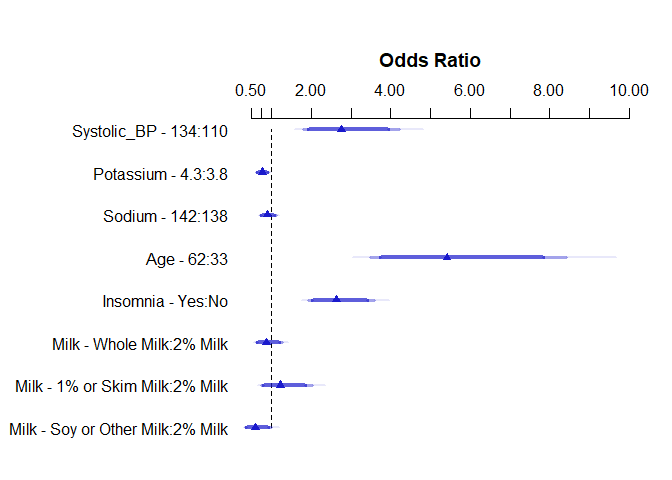

# R Packages and Setup {#r-packages-and-setup .unnumbered}

``` r
library(knitr)
library(rmdformats)
library(janitor)
library(magrittr)
library(naniar)
library(broom)
library(patchwork)
library(nhanesA)
library(measurements)
library(readxl)
library(Epi)
library(Hmisc)
library(simputation)
library(rms)
library(pander)
library(GGally)
library(car)
library(mice)
library(ROCR)
library(caret)
library(tidyverse)

theme_set(theme_bw())
```

# Data Source

The data for this project was acquired from the *National Health and
Nutrition Examination Survey* (i.e. NHANES), specifically from their
[2017-2018 data
files](https://wwwn.cdc.gov/nchs/nhanes/continuousnhanes/default.aspx?BeginYear=2017),
as this was the last year that the National Center for Health Statistics
was able to finish without interference from the pandemic. The National
Center for Health Statistics, as a [division of the
CDC](https://www.cdc.gov/nchs/about/organization.htm), collects this
data to assess the health and nutritional status of adults and children
in the United States, and has been continuously collecting and
publishing this data for public use every 2 years since 1999. According
to the CDC's [National Health and Nutrition Examination Survey: Plan and
Operations, 1999-2010
documentation](https://www.cdc.gov/nchs/data/series/sr_01/sr01_056.pdf),
the 2-year cycle for collecting and publishing data was chosen to ensure
the stability/accuracy of these measurements, as well as to mitigate the
possibility of unintentional disclosure of a sample person's identity.
Additionally, the documentation states the general sample design
methodology used to determine the selection of subjects for this survey,
however some alterations were made to these methods for the 2015-2018
cycles, as is detailed in the CDC's [National Health and Nutrition
Examination Survey, 2015-2018: Sample Design and Estimation Procedures
documentation](https://www.cdc.gov/nchs/data/series/sr_02/sr02-184-508.pdf).
The documentation states that the general sample design for their data
collection was not simple random sampling, but complex, multistage
probability sampling, utilized to develop a representative sample of the
United States' civilian non-institutionalized household population.
Briefly, this involved four steps:

-   First, selecting for primary sampling units, which consisted of
    either counties or small groups of contiguous counties

-   Then selecting segments within these areas that contain a cluster of
    households

-   Then selecting for specific households within the segments chosen
    above

-   Lastly then selecting for individuals within each household for
    sampling

For the 2015-2018 cycles, this same methodology was used, however some
sub-groups were over-sampled to increase the precision of the associated
sub-group estimates. These sub-groups are as follows:

-   Hispanic persons

-   Non-Hispanic black persons

-   Non-Hispanic, non-black Asian persons

-   Non-Hispanic white persons and persons of other races and
    ethnicities at or below 185% of the federal poverty level

-   Non-Hispanic white persons and persons of other races and
    ethnicities aged 0--11 years or 80 years and over

# The Subjects

The subjects in my analyses will be individuals selected from the
2017-2018 NHANES datasets as discussed above, where each row represents
one participant. The goal will be to generate models to examine two
different outcomes - the systolic blood pressure of the participants as
measured with an oscillometric device (quantitative outcome), and
whether or not they have been diagnosed with high blood pressure by
their doctor (binary outcome) - by using the participant's sodium levels
(mmol/L), potassium levels (mmol/L), insomnia diagnosis, and milk
consumption type as the predictors.

# Loading and Tidying the Data

This section will involve downloading the necessary data files from the
respective sources for use in this project, and will process these files
as necessary to prepare them for use in creating the analysis dataset.

## Loading the Raw Data

The code below utilizes the `nhanesA` library to download the necessary
data files from the NHANES databases by loading them into RStudio as
tibbles, saving them as .Rds files so they do not need to be downloaded
again, and then redefining the variables currently assigned to load the
files from the website to load the local copies back instead to use to
create the analysis dataset:

``` r
DEMO_J_raw <- nhanes('DEMO_J') %>% tibble()
```

    Processing SAS dataset DEMO_J    ..

``` r
BPXO_J_raw <- nhanes('BPXO_J') %>% tibble()
```

    Processing SAS dataset BPXO_J    ..

``` r
BPQ_J_raw <- nhanes('BPQ_J') %>% tibble()
```

    Processing SAS dataset BPQ_J     ..

``` r
BIOPRO_J_raw <- nhanes('BIOPRO_J') %>% tibble()
```

    Processing SAS dataset BIOPRO_J      ..

``` r
DBQ_J_raw <- nhanes('DBQ_J') %>% tibble()
```

    Processing SAS dataset DBQ_J     ..

``` r
SLQ_J_raw <- nhanes('SLQ_J') %>% tibble()
```

    Processing SAS dataset SLQ_J     ..

``` r
saveRDS(DEMO_J_raw, "data/DEMO_J.Rds")
saveRDS(BPXO_J_raw, "data/BPXO_J.Rds")
saveRDS(BPQ_J_raw, "data/BPQ_J.Rds")
saveRDS(BIOPRO_J_raw, "data/BIOPRO_J.Rds")
saveRDS(DBQ_J_raw, "data/DBQ_J.Rds")
saveRDS(SLQ_J_raw, "data/SLQ_J.Rds")

DEMO_J_raw <- readRDS("data/DEMO_J.Rds")
BPXO_J_raw <- readRDS("data/BPXO_J.Rds")
BPQ_J_raw <- readRDS("data/BPQ_J.Rds")
BIOPRO_J_raw <- readRDS("data/BIOPRO_J.Rds")
DBQ_J_raw <- readRDS("data/DBQ_J.Rds")
SLQ_J_raw <- readRDS("data/SLQ_J.Rds")
```

## Cleaning the Data

The predictors and outcome variables will be clearly defined in the
**Defining the Variables** sub-section of **The Code Book** section
below, but before that the raw data files need to be processed and
ultimately combined into an aggregated tibble for use in each analysis.
This will be accomplished in steps in the following section.

### Selecting and Filtering for the Relevant Data

The first step of the data cleaning process will be to select for and
filter each of the raw data files for just the variables needed, and
also filter out any unwanted results from the variables where
appropriate. This is accomplished with the following code, and while
again each variable will be clarified in **The Code Book** section, it's
worth noting the following about the keys from the NHANES website at
this point to understand the code below:

-   7 represents instances where the respondent refused to respond to
    the question

-   9 represents instances where the respondent reported that they
    didn't know the answer to the question

Additionally, it's worth noting the following about the demographics
data selection from the `DEMO_J` data shown below:

-   `RIDAGEYR` represents the respondent's age, and for the following
    analyses we will only be interested in respondents that are between
    the ages of 18 and 79, as ages past 79 are all recorded as 80, and
    while we could include children in this study, we will omit them and
    focus the study on adults of 18 or older.

The code for selecting and filtering the data is as follows:

``` r
DEMO_J_data = DEMO_J_raw %>% 
  select(c(SEQN, RIDAGEYR)) %>%
  filter(RIDAGEYR <= 79) %>%
  filter(RIDAGEYR >= 18)

BPXO_J_data = BPXO_J_raw %>% 
  select(c(SEQN, BPXOSY3))

BPQ_J_data = BPQ_J_raw %>%
  select(c(SEQN, BPQ020)) %>%
  filter(BPQ020 != 7) %>%
  filter(BPQ020 != 9)

SLQ_J_data = SLQ_J_raw %>%
  select(c(SEQN, SLQ050)) %>%
  filter(SLQ050 != 7) %>%
  filter(SLQ050 != 9)

BIOPRO_J_data = BIOPRO_J_raw %>% 
  select(c(SEQN, LBXSNASI, LBXSKSI))
```

It's worth noting that the code above selects and filters for all but 1
variable that will be used in this analysis. This last variable will
require a more complex approach than the above, so it will be addressed
in its own sub-section after the rest of the variables above have been
addressed. For now, we can proceed to the next step in preparing the
above data.

### Renaming & Formatting the Data

The next logical step for preparing the data is to properly format each
variable, and provide each with a more appropriate name, both of which
are accomplished below with the following code:

``` r
DEMO_J_data = DEMO_J_data %>% 
  mutate(SEQN = as.numeric(SEQN)) %>%
  mutate(RIDAGEYR = as.numeric(RIDAGEYR)) %>%
  rename(Age = RIDAGEYR)

BPXO_J_data = BPXO_J_data %>% 
  mutate(SEQN = as.numeric(SEQN)) %>%
  mutate(BPXOSY3 = as.numeric(BPXOSY3)) %>%
  rename("Systolic_BP" = BPXOSY3)

BPQ_J_data = BPQ_J_data %>%
  mutate(SEQN = as.numeric(SEQN)) %>%
  mutate(BPQ020 = fct_recode(as.factor(BPQ020),
                             "Yes" = "1",
                             "No" = "2")) %>%
  mutate(BPQ020 = fct_relevel(BPQ020, "No", "Yes")) %>%
  rename("High_BP" = BPQ020)

SLQ_J_data = SLQ_J_data %>%
  mutate(SEQN = as.numeric(SEQN)) %>%
  mutate(SLQ050 = fct_recode(as.factor(SLQ050),
                             "Yes" = "1",
                             "No" = "2")) %>%
  mutate(SLQ050 = fct_relevel(SLQ050, "No", "Yes")) %>%
  rename("Insomnia" = SLQ050)

BIOPRO_J_data = BIOPRO_J_data %>% 
  mutate(SEQN = as.numeric(SEQN)) %>%
  mutate(LBXSNASI = as.numeric(LBXSNASI)) %>%
  mutate(LBXSKSI = as.numeric(LBXSKSI)) %>%
  rename(Sodium = LBXSNASI) %>%
  rename(Potassium = LBXSKSI)
```

With the code above, all but two of the variables have been properly
extracted and reformatted. The only variables that has not been
addressed yet are the `SEQN` variable, which is the subject ID variable,
and another variable from the `DBQ_J` data file, which will become the
`Milk` multi-categorical variable. Both of these have been set aside
intentionally, as it will be more efficient to rename the `SEQN`
variable in the analysis tibble itself after it is generated, instead of
altering each instance of it in each of the individual data files above,
and the `Milk` variable is complicated enough to warrant its own
sub-section, which will be addressed next.

### The Milk Variable

As mentioned above, all of the variables have been addressed above, with
only two exceptions - the subject ID variable `SEQN`, which will be
renamed once the tibble is generated, and the Milk variable, which will
be addressed in this section. The intent is to use this variable as an
additional multi-categorical variable for both analyses, however
preparing it for such use will require additional and more sophisticated
steps because of the manner in which it was recorded in the NHANES
dataset. In particular, the survey participants were asked two
questions:

-   How often did they drink milk in the past 30 day period?

-   If they did drink any milk, what type of milk did they mainly drink?

While the former question's results were recorded as a single,
multi-categorical variable, the results to the latter, which is what we
are interested in, were stored in 6 unique variables, depending on their
answer - Whole Milk, 2% Milk, 1% Milk, Skim Milk, Soy Milk, or Other
Milk. Additionally, if the participant was uncertain of which milk they
mainly drink, the survey recorder was to record all of the milk types
that the participant reported that they drank. This means that to
prepare this variable for use in the later analyses, the results from
all 6 answer variables need to be collapsed into one multi-categorical
field that both keeps the NA values for later imputation, but also
removes participants that were uncertain as to which milk they mainly
drank and as such reported multiple milk types, as there would be no
clear way to classify the latter results into any of the other
pre-defined fields. To accomplish this, the first step was taken with
the code below, which extracts the variables from the raw data file and
stores the positive values and NA values in separate data frames:

``` r
DBQ_J_data1 = DBQ_J_raw %>%
  select(c(SEQN, DBQ223A)) %>%
  filter(DBQ223A == 10) %>%
  mutate(DBQ223A = as.numeric(DBQ223A))
  
DBQ_J_data2 = DBQ_J_raw %>%
  select(c(SEQN, DBQ223B)) %>%
  filter(DBQ223B == 11) %>%
  mutate(DBQ223B = as.numeric(DBQ223B))
  
DBQ_J_data3 = DBQ_J_raw %>%
  select(c(SEQN, DBQ223C)) %>%
  filter(DBQ223C == 12) %>%
  mutate(DBQ223C = as.numeric(DBQ223C))

DBQ_J_data4 = DBQ_J_raw %>%
  select(c(SEQN, DBQ223D)) %>%
  filter(DBQ223D == 13) %>%
  mutate(DBQ223D = as.numeric(DBQ223D))

DBQ_J_data5 = DBQ_J_raw %>%
  select(c(SEQN, DBQ223E)) %>%
  filter(DBQ223E == 14) %>%
  mutate(DBQ223E = as.numeric(DBQ223E))
  
DBQ_J_data6 = DBQ_J_raw %>%
  select(c(SEQN, DBQ223U)) %>%
  filter(DBQ223U == 30) %>%
  mutate(DBQ223U = as.numeric(DBQ223U))


DBQ_J_data1_NA = DBQ_J_raw %>%
  select(c(SEQN, DBQ223A)) %>%
  filter(is.na(DBQ223A)) %>%
  rename(DBQ223 = DBQ223A) %>%
  mutate(DBQ223 = as.numeric(DBQ223))

DBQ_J_data2_NA = DBQ_J_raw %>%
  select(c(SEQN, DBQ223B)) %>%
  filter(is.na(DBQ223B)) %>%
  rename(DBQ223 = DBQ223B) %>%
  mutate(DBQ223 = as.numeric(DBQ223))
  
DBQ_J_data3_NA = DBQ_J_raw %>%
  select(c(SEQN, DBQ223C)) %>%
  filter(is.na(DBQ223C)) %>%
  rename(DBQ223 = DBQ223C) %>%
  mutate(DBQ223 = as.numeric(DBQ223))

DBQ_J_data4_NA = DBQ_J_raw %>%
  select(c(SEQN, DBQ223D)) %>%
  filter(is.na(DBQ223D)) %>%
  rename(DBQ223 = DBQ223D) %>%
  mutate(DBQ223 = as.numeric(DBQ223))

DBQ_J_data5_NA = DBQ_J_raw %>%
  select(c(SEQN, DBQ223E)) %>%
  filter(is.na(DBQ223E)) %>%
  rename(DBQ223 = DBQ223E) %>%
  mutate(DBQ223 = as.numeric(DBQ223))
  
DBQ_J_data6_NA = DBQ_J_raw %>%
  select(c(SEQN, DBQ223U)) %>%
  filter(is.na(DBQ223U)) %>%
  rename(DBQ223 = DBQ223U) %>%
  mutate(DBQ223 = as.numeric(DBQ223))
```

Now that the variables have been properly extracted from the raw files,
the milk results and NA results for each milk type can be combined to
form two files - one for people who responded with at least one milk
type, and one where the participant did not answer with any milk type,
which will be the missing values for this variable. The former will be
generated using `full_join` to preserve all responses, and the latter
will be generated using `inner_join` to filter only for missing
responses present in all 6 variables, effectively filtering only for
participants with missing data:

``` r
DBQ_J_data_milk = full_join(
  full_join(
    full_join(
      full_join(
        full_join(DBQ_J_data1,
                  DBQ_J_data2,
                  by = c("SEQN")),
        DBQ_J_data3,
        by = c("SEQN")),
      DBQ_J_data4,
      by = c("SEQN")),
    DBQ_J_data5,
    by = c("SEQN")),
  DBQ_J_data6,
  by = c("SEQN"))

DBQ_J_data_NA = inner_join(
  inner_join(
    inner_join(
      inner_join(
        inner_join(DBQ_J_data1_NA,
                   DBQ_J_data2_NA,
                   by = c("SEQN", "DBQ223")),
        DBQ_J_data3_NA,
        by = c("SEQN", "DBQ223")),
      DBQ_J_data4_NA,
      by = c("SEQN", "DBQ223")),
    DBQ_J_data5_NA,
    by = c("SEQN", "DBQ223")),
  DBQ_J_data6_NA,
  by = c("SEQN", "DBQ223"))
```

Before the two resulting tables above can be combined, the results in
`DBQ_J_data_milk` need to be further processed to collapse all of the
results down into one column in a manner that also creates a means for
removing any participants that answered with multiple milk types. This
will be accomplished by creating a new field that sums all of the fields
together per row - as each answer was given a unique numeric identifier
in the survey data, and since no combination(s) of these numbers when
summed equal each other, summing their responses is one method that can
be used to determine whether or not a participant answered with multiple
milk types without affecting those that only provided a single answer.
As such, the code below generates this new column to this end, filtering
out any unsuitable participants, and after doing so formats and renames
the column as appropriate:

``` r
DBQ_J_data_milk = DBQ_J_data_milk %>%
  mutate(DBQ223 = rowSums(across(DBQ223A:DBQ223U), na.rm = TRUE)) %>%
  select(c(SEQN, DBQ223)) %>%
  filter(DBQ223 == 10 |
           DBQ223 == 11 |
           DBQ223 == 12 |
           DBQ223 == 13 |
           DBQ223 == 14 |
           DBQ223 == 30)
```

Now that the responses have been properly filtered for participants who
only answered with one milk type, the `DBQ_J_data_milk` and
`DBQ_J_data_NA` files can be joined together using `full_join` as shown
below:

``` r
DBQ_J_data = full_join(DBQ_J_data_milk, DBQ_J_data_NA, by = c("SEQN", "DBQ223"))
```

As the last step, the milk type variable will be reformatted as a factor
variable, with appropriate names given to each factor level, and will be
renamed more appropriately using the code below:

``` r
DBQ_J_data = DBQ_J_data %>%
  mutate(SEQN = as.numeric(SEQN)) %>%
  mutate(DBQ223 = fct_recode(as.factor(DBQ223),
                                  "Whole Milk" = "10",
                                  "2% Milk" = "11",
                                  "1% Milk" = "12",
                                  "Skim Milk" = "13",
                                  "Soy Milk" = "14",
                                  "Other Milk" = "30")) %>%
  rename(Milk = DBQ223)
```

With all of the above finally out of the way, all of the necessary
preparation steps have been taken for each variable, and the data can be
pulled together to form the analysis tibble, which will be accomplished
in the last sub-section below.

## Creating the Tibble

Now that the data for all of the variables have been properly selected
and formatted, the files can be pulled together to create the analysis
tibble, reorder the variables for more logical discussion in **The Code
Book** section, and the subject ID variable `SEQN` can be renamed to
something more suitable, all of which have been accomplished with the
code below:

``` r
analysis_data_raw = inner_join(inner_join(inner_join(inner_join(inner_join(DEMO_J_data, BPXO_J_data, by = c("SEQN")), BPQ_J_data, by = c("SEQN")), SLQ_J_data, by = c("SEQN")), BIOPRO_J_data, by = c("SEQN")), DBQ_J_data, by = c("SEQN")) %>%
  rename(Subject_ID = SEQN)

col_order = c("Subject_ID", "Systolic_BP", "High_BP", "Age", "Sodium", "Potassium", "Insomnia", "Milk")

analysis_data_raw = analysis_data_raw[, col_order]
```

Now that the analysis dataset has been generated, we need to make sure
that it fits the necessary criteria for this project. First of all, the
dataset needs to have no more than 1200 subjects, so lets check how many
it has:

``` r
count(analysis_data_raw)
```

    # A tibble: 1 x 1
          n
      <int>
    1  4955

It clearly has more than 1200 samples, currently having 4955 currently.
As such we'll use the following code to create a sub-set of this dataset
for this project using the following code:

``` r
set.seed(43202)

analysis_data = analysis_data_raw %>%
  slice_sample(n = 1200)
```

For confirmation that this worked as intended, let's check the subject
count again:

``` r
count(analysis_data)
```

    # A tibble: 1 x 1
          n
      <int>
    1  1200

Looks good - now let's check each of the categorical predictor/input
variables - `Milk` and `Insomnia` - and the outcome variable, `High_BP`,
to ensure that they all have a minimum of 30 values in each category:

``` r
analysis_data %>% count(Milk)
```

    # A tibble: 7 x 2
      Milk           n
      <fct>      <int>
    1 Whole Milk   328
    2 2% Milk      349
    3 1% Milk       84
    4 Skim Milk     42
    5 Soy Milk      30
    6 Other Milk    87
    7 <NA>         280

``` r
analysis_data %>% count(Insomnia)
```

    # A tibble: 2 x 2
      Insomnia     n
      <fct>    <int>
    1 No         872
    2 Yes        328

``` r
analysis_data %>% count(High_BP)
```

    # A tibble: 2 x 2
      High_BP     n
      <fct>   <int>
    1 No        767
    2 Yes       433

The **Soy Milk** category in the `Milk` variable just barely passes,
having exactly 30 instances, however it is unwise to use a categorical
variable with so few instances, so to rectify this the `1% Milk` and
`Skim Milk` categories will be collapsed together to form a single
category. Additionally, since the counts are rather low for the
`Soy Milk` and `Other Milk` categories, these two categories will be
collapsed together as well, which will create a 4-level categorical
variable instead:

``` r
analysis_data = analysis_data %>%
  mutate(Milk = fct_recode(as.factor(Milk),
         "1% or Skim Milk" = "1% Milk",
         "1% or Skim Milk" = "Skim Milk",
         "Soy or Other Milk" = "Soy Milk",
         "Soy or Other Milk" = "Other Milk"))

analysis_data %>% count(Milk)
```

    # A tibble: 5 x 2
      Milk                  n
      <fct>             <int>
    1 Whole Milk          328
    2 2% Milk             349
    3 1% or Skim Milk     126
    4 Soy or Other Milk   117
    5 <NA>                280

For the last check, let's check each of the quantitative variables -
`Age`, `Sodium`, and `Potassium` - and the outcome variable,
`Systolic_BP`, to ensure that they all have a minimum of 10 different,
ordered, observed values:

``` r
analysis_data %$% n_distinct(Age)
```

    [1] 62

``` r
analysis_data %$% n_distinct(Sodium)
```

    [1] 20

``` r
analysis_data %$% n_distinct(Potassium)
```

    [1] 29

``` r
analysis_data %$% n_distinct(Systolic_BP)
```

    [1] 92

The variable with the lowest number of distinct values, `Sodium`, has 20
distinct values, so the data meets the this criteria, and should be
suitable for the following analyses.

# The Tidy Tibble

## Listing the Tibble

The following code lists the first 10 rows of the tibble:

``` r
analysis_data
```

    # A tibble: 1,200 x 8
       Subject_ID Systolic_BP High_BP   Age Sodium Potassium Insomnia Milk          
            <dbl>       <dbl> <fct>   <dbl>  <dbl>     <dbl> <fct>    <fct>         
     1      95380         122 No         62    138       4.3 No       Soy or Other ~
     2      98905          NA Yes        63    137       4.5 Yes      <NA>          
     3      99128         105 No         36    143       3.9 No       2% Milk       
     4      94105         107 No         46    144       4.1 No       2% Milk       
     5     101756         110 Yes        61    140       3.6 No       Whole Milk    
     6      97319         123 Yes        32    139       4.1 No       Whole Milk    
     7     101001         145 No         67    144       4.4 No       Soy or Other ~
     8      95330         124 Yes        77    137       3.9 Yes      Soy or Other ~
     9      94525          NA Yes        66    141       4   No       2% Milk       
    10     101336         147 No         72    145       4.3 No       2% Milk       
    # ... with 1,190 more rows

## Size and Identifiers

### Size

The size of the `analysis_data` dataset was technically already
established in the previous sub-section above, as the generated tibble
states that the dataset has 1200 rows (as we reduced it to for this
analysis) and 8 columns. This can be verified again through the use of
the `nrow` and `ncol` functions as shown below:

``` r
nrow(analysis_data)
```

    [1] 1200

``` r
ncol(analysis_data)
```

    [1] 8

With this verified, we can proceed to the next step of verifying the
unique row identifiers in the next sub-section.

### Identifiers

As already mentioned during the data preparation phase, the `Subject ID`
variable (formally the `SEQN` variable) represents each subject's unique
ID, and as such can be used to uniquely identify each entry in the
`analysis_data` dataset. This is illustrated with the use of the
following code below:

``` r
analysis_data %$% n_distinct(Subject_ID)
```

    [1] 1200

## Saving the R data set

The following code will save the `analysis_data` tibble as an .Rds file:

``` r
saveRDS(analysis_data, "data/analysis_data.Rds")
```

# The Code Book

## Defining the Variables

  ----------------------------------------------------------------------------------------
  Variable          Role            Type            Description
  ----------------- --------------- --------------- --------------------------------------
  `Subject_ID`      Identifier      \-              The unique numeric code assigned to
                                                    each NHANES
                                                    respondent/subject/participant.

  `Systolic_BP`     Outcome/Input   Quantitative    Respondent's/Subject's/Participant's
                                                    3rd reading for their Systolic Blood
                                                    Pressure, in mm Hg, as measured with
                                                    an oscillometric device.

  `High_BP`         Outcome/Input   2-Categorical   Has the respondent/subject/participant
                                                    been diagnosed with high blood
                                                    pressure by their doctor? (Yes or No)

  `Age`             Input           Quantitative    What was the age of the
                                                    respondent/subject/participant at the
                                                    time the data was collected?

  `Sodium`          Input           Quantitative    Respondent's/Subject's/Participant's
                                                    sodium level in mmol/L, as indicated
                                                    by their blood test.

  `Potassium`       Input           Quantitative    Respondent's/Subject's/Participant's
                                                    potassium level in mmol/L, as
                                                    indicated by their blood test.

  `Insomnia`        Input           2-Categorical   Has the respondent/subject/participant
                                                    disclosed that they have been having
                                                    trouble sleeping to their doctor? (Yes
                                                    or No)

  `Milk`            Input           4-Categorical   What type of milk does the
                                                    respondent/subject/participant mainly
                                                    drink? (Whole Milk, 2% Milk, 1% or
                                                    Skim Milk, Soy or Other Milk)
  ----------------------------------------------------------------------------------------

## Numerical Description

The following code provides a numerical description of the
`analysis_data` dataset through the use of the `describe` function from
the `Hmisc` package:

``` r
describe(analysis_data)
```

    analysis_data 

     8  Variables      1200  Observations
    --------------------------------------------------------------------------------
    Subject_ID 
           n  missing distinct     Info     Mean      Gmd      .05      .10 
        1200        0     1200        1    98273     3137    94094    94562 
         .25      .50      .75      .90      .95 
       95867    98208   100620   102033   102616 

    lowest :  93708  93709  93714  93718  93721, highest: 102907 102908 102947 102949 102956
    --------------------------------------------------------------------------------
    Systolic_BP 
           n  missing distinct     Info     Mean      Gmd      .05      .10 
        1049      151       91        1    123.2    20.42       97      101 
         .25      .50      .75      .90      .95 
         110      121      134      148      157 

    lowest :  73  88  89  90  91, highest: 176 177 184 185 187
    --------------------------------------------------------------------------------
    High_BP 
           n  missing distinct 
        1200        0        2 
                          
    Value         No   Yes
    Frequency    767   433
    Proportion 0.639 0.361
    --------------------------------------------------------------------------------
    Age 
           n  missing distinct     Info     Mean      Gmd      .05      .10 
        1200        0       62        1       48    20.17       20       23 
         .25      .50      .75      .90      .95 
          33       50       62       70       74 

    lowest : 18 19 20 21 22, highest: 75 76 77 78 79
    --------------------------------------------------------------------------------
    Sodium 
           n  missing distinct     Info     Mean      Gmd      .05      .10 
        1121       79       19    0.987    140.3    3.047      136      137 
         .25      .50      .75      .90      .95 
         138      140      142      144      145 

    lowest : 128 130 132 133 134, highest: 144 145 146 147 148
                                                                                
    Value        128   130   132   133   134   135   136   137   138   139   140
    Frequency      2     1     1     3     7    28    47    68   134   126   174
    Proportion 0.002 0.001 0.001 0.003 0.006 0.025 0.042 0.061 0.120 0.112 0.155
                                                              
    Value        141   142   143   144   145   146   147   148
    Frequency    159   137    95    75    33    20    10     1
    Proportion 0.142 0.122 0.085 0.067 0.029 0.018 0.009 0.001
    --------------------------------------------------------------------------------
    Potassium 
           n  missing distinct     Info     Mean      Gmd      .05      .10 
        1121       79       28    0.992    4.084   0.4078      3.5      3.6 
         .25      .50      .75      .90      .95 
         3.8      4.1      4.3      4.5      4.7 

    lowest : 2.9 3.0 3.1 3.2 3.3, highest: 5.2 5.3 5.4 6.0 6.6
    --------------------------------------------------------------------------------
    Insomnia 
           n  missing distinct 
        1200        0        2 
                          
    Value         No   Yes
    Frequency    872   328
    Proportion 0.727 0.273
    --------------------------------------------------------------------------------
    Milk 
           n  missing distinct 
         920      280        4 
                                                                    
    Value             Whole Milk           2% Milk   1% or Skim Milk
    Frequency                328               349               126
    Proportion             0.357             0.379             0.137
                                
    Value      Soy or Other Milk
    Frequency                117
    Proportion             0.127
    --------------------------------------------------------------------------------

# Linear Regression Plans

With my linear model as detailed below, I hope to answer the following
question:

-   Can an adult's current systolic blood pressure be effectively
    predicted as a function of their sodium levels, potassium levels,
    age, milk consumption type, whether they have a past high blood
    pressure diagnosis, and their insomnia disclosure?

## My Quantitative Outcome

While this was briefly broached in **The Subjects** section above, the
quantitative outcome that will be used for the linear regression model
in this project is the 3rd systolic blood pressure measurement as taken
with an oscillometric device, which is listed as `Systolic_BP` in **The
Code Book** section above. The 3rd measurement taken with an
oscillometric device was specifically chosen in an effort to use the
most accurate "at rest" systolic blood pressure as possible. In order to
assess this outcome graphically without imputing data, we'll need to
filter out any missing data, which consequently will allow us to provide
a count of rows with complete data on this outcome. The code necessary
to create a new dataset that has been filtered for complete data only,
for `Systolic_BP` in particular, and provides the count for the number
of rows (i.e. subjects) with complete data on this metric is as follows:

``` r
demo_data = analysis_data %>%
  filter(Systolic_BP != ".")

nrow(demo_data)
```

    [1] 1049

As can be seen above, there are 1049 rows with complete data on this
outcome - using just the complete data, we can create the following
Normal Q-Q plot, Histogram with an overlaying Density Plot, and Violin
Box-plot to assess the distribution of this outcome:

``` r
a1 <- ggplot(demo_data, aes(x = "", y = Systolic_BP)) +
  geom_violin(fill = "dodgerblue", alpha = 0.3) +
  geom_boxplot(width = 0.25, fill = "dodgerblue", notch = TRUE) +
  coord_flip() +
  labs(title = "Violin Boxplot: SBP", x = "", y = "Systolic Blood Pressure (mm Hg)")

a2 <- ggplot(demo_data, aes(x = Systolic_BP)) +
  geom_histogram(aes(y = stat(density)), bins = nclass.scott(demo_data$Systolic_BP), col = "white", fill = "dodgerblue") +
  stat_function(fun = dnorm, args = list(mean = mean(demo_data$Systolic_BP), sd = sd(demo_data$Systolic_BP)), col = "red", lwd = 1) +
  labs(title = "Density Function: SBP", x = "Systolic Blood Pressure (mm Hg)")

a3 <- ggplot(demo_data, aes(sample = Systolic_BP)) +
  geom_qq(col = "dodgerblue") +
  geom_qq_line(col = "red") +
  labs(title = "Normal Q-Q plot: SBP", x = "", y = "Systolic Blood Pressure (mm Hg)")

(a3 + a2) / a1 + 
  plot_layout(heights = c(5,2)) +
  plot_annotation(title = "Systolic Blood Pressure",
                  subtitle = "Distribution & Normality Assessment of subject's 3rd systolic blood pressure measurement,\n as taken with an oscillometric device",
                  caption = "All data above pulled from 2017-2018 NHANES datasets")
```


As we might expect for systolic blood pressure data, there does appear
to be some right-skew in the distribution, however it does appear to be
fairly continuous, with the only noticeable gap appearing from about 75
to 100 mm Hg. Given both these results and the simple fact that it is
blood pressure data, a natural logarithmic transformation may be
appropriate here, however this will be determined for certain in
analyses sections.

Additionally, while this was already demonstrated in the **Creating the
Tibble** sub-section of the **Loading and Tidying ** section above, this
outcome variable has a least 10 different, ordered, observed values,
specifically having 92, which can once again be seen with the following
code:

``` r
analysis_data %$% n_distinct(Systolic_BP)
```

    [1] 92

This code produces a tibble showing all of the unique values, counting
how many times each one occurs:

``` r
analysis_data %>% count(Systolic_BP)
```

    # A tibble: 92 x 2
       Systolic_BP     n
             <dbl> <int>
     1          73     1
     2          88     1
     3          89     5
     4          90     5
     5          91     2
     6          92     4
     7          93     6
     8          94     7
     9          95     9
    10          96    10
    # ... with 82 more rows

## My Planned Predictors (Linear Model)

This model will be generated by using all 5 input variables selected for
in the data preparation steps above, with `Age`, `Sodium`, and
`Potassium` all representing quantitative variables,
`Insomnia Diagnosis` representing the binary categorical variable, and
`Milk` representing the multi-categorical variable. Again, it was
already demonstrated in the **Creating the Tibble** sub-section of the
**Loading and Tidying ** section above, however all of the quantitative
variables have at least 10 different, ordered, observed values, both the
binary and multi-categorical variable have at least 30 observations in
each categorical level, and the multi-categorical has been limited to 6
categories (Whole Milk, 2% Milk, 1% Milk, Skim Milk, Soy Milk, and Other
Milk). This has been demonstrated again below for each, starting first
with the quantitative variables:

``` r
analysis_data %$% n_distinct(Age)
```

    [1] 62

``` r
analysis_data %$% n_distinct(Sodium)
```

    [1] 20

``` r
analysis_data %$% n_distinct(Potassium)
```

    [1] 29

As with the outcome variable `Systolic_BP` shown above, the following
code produces a tibble for each, each showing all of the unique values
and counting how many times each one occurs:

``` r
analysis_data %>% count(Age)
```

    # A tibble: 62 x 2
         Age     n
       <dbl> <int>
     1    18    32
     2    19    26
     3    20    17
     4    21    16
     5    22    20
     6    23    24
     7    24    17
     8    25    16
     9    26    24
    10    27    15
    # ... with 52 more rows

``` r
analysis_data %>% count(Sodium)
```

    # A tibble: 20 x 2
       Sodium     n
        <dbl> <int>
     1    128     2
     2    130     1
     3    132     1
     4    133     3
     5    134     7
     6    135    28
     7    136    47
     8    137    68
     9    138   134
    10    139   126
    11    140   174
    12    141   159
    13    142   137
    14    143    95
    15    144    75
    16    145    33
    17    146    20
    18    147    10
    19    148     1
    20     NA    79

``` r
analysis_data %>% count(Potassium)
```

    # A tibble: 29 x 2
       Potassium     n
           <dbl> <int>
     1       2.9     2
     2       3       3
     3       3.1     2
     4       3.2     3
     5       3.3     9
     6       3.4    19
     7       3.5    30
     8       3.6    45
     9       3.7    72
    10       3.8   102
    # ... with 19 more rows

and the following code produces a tibble for both categorical variables,
demonstrating that each categorical level has at least 30 observations,
and the multi-categorical variable `Milk` has 6 total levels,
disregarding missing data:

``` r
analysis_data %>% count(Milk)
```

    # A tibble: 5 x 2
      Milk                  n
      <fct>             <int>
    1 Whole Milk          328
    2 2% Milk             349
    3 1% or Skim Milk     126
    4 Soy or Other Milk   117
    5 <NA>                280

``` r
analysis_data %>% count(Insomnia)
```

    # A tibble: 2 x 2
      Insomnia     n
      <fct>    <int>
    1 No         872
    2 Yes        328

Lastly, given that the `analysis_data` dataset has 1200 samples, then
the suggested maximum number of candidate regression inputs would be 4 +
(1200-100)/100 = 15 inputs, which is well above the 5 we have suggested
using, so we should be alright proceeding with the creation of this
model.

# Logistic Regression Plans

With my suggested logistic regression model as detailed below, I hope to
be able to answer the following question:

-   Can a previous high blood pressure clinical diagnoses be effectively
    predicted as a function of a subject's age, sodium levels, potassium
    levels, current systolic blood pressure, insomnia disclosure, and
    their main milk consumption type?

## My Binary Outcome

Again while this was briefly broached in **The Subjects** section above,
the binary outcome that will be used for this logistic regression model
in this project will whether or not the subject's doctor has diagnosed
the subject with high blood pressure, which is recorded as `High_BP` in
**The Code Book** section above. This variable was chosen because I
thought it would compliment the `Systolic_BP` quantitative outcome
rather well, and from a practical standpoint, would allow me to use the
same predictors for this model as were chosen for the linear regression
model. Like with the quantitative outcome variable, this was already
demonstrated above as well, but this outcome variable does have at least
30 observations for both categories, and the variable does not actually
appear to have any missing values. The code below demonstrates this
again for the purposes of this section:

``` r
analysis_data %>% count(High_BP)
```

    # A tibble: 2 x 2
      High_BP     n
      <fct>   <int>
    1 No        767
    2 Yes       433

## My Planned Predictors (Logistic Model)

I will be using the same predictors for this model as I will be using
for the linear regression model detailed above - `Age`, `Sodium`,
`Potassium`, `Insomnia`, and `Milk`.

# Linear Regression Modeling

With the preliminary work now in place, we can now begin to develop our
regression models in earnest. This process will be broken down into
eight steps:

-   1.  Missingness

-   2.  Outcome Transformation

-   3.  Scatterplot Matrix and Collinearity

-   4.  Model A

-   5.  Non-Linearity

-   6.  Model B

-   7.  Validating the Models

-   8.  Final Model

As implied, the first 7 of which will culminate with the production of
an "effects" model and an "augmented" model, and the final step will
evaluate the results and select the preferred model between the two.

## Missingness

While it was demonstrated in section 6.1 above that an outcome
transformation will likely be necessary, the missing data in the
`analysis_data` dataset will need to be addressed first.

As a reminder, there are 4 variables that have missing data in the
`analysis_data` dataset - the outcome `Systolic_BP`, and the predictors
`Milk`, `Sodium`, and `Potassium`, as shown again with the missing
variables summary below:

``` r
miss_var_summary(analysis_data) %>%
  kable(digits = 4)
```

  variable        n_miss   pct_miss
  ------------- -------- ----------
  Milk               280    23.3333
  Systolic_BP        151    12.5833
  Sodium              79     6.5833
  Potassium           79     6.5833
  Subject_ID           0     0.0000
  High_BP              0     0.0000
  Age                  0     0.0000
  Insomnia             0     0.0000

`Systolic_BP` is the outcome variable for the linear regression
analysis, and as such is not permitted to have missing data in it for
the purposes of this project. As such, we will filter for complete cases
in the `analysis_data` dataset for this variable before performing our
imputation for the linear regression data, accomplished with the code
below:

``` r
lin_mod_data = analysis_data %>%
  filter(complete.cases(Systolic_BP))

miss_var_summary(lin_mod_data) %>%
  kable(digits = 4)
```

  variable        n_miss   pct_miss
  ------------- -------- ----------
  Milk               247    23.5462
  Sodium              58     5.5291
  Potassium           58     5.5291
  Subject_ID           0     0.0000
  Systolic_BP          0     0.0000
  High_BP              0     0.0000
  Age                  0     0.0000
  Insomnia             0     0.0000

Now that the `Systolic_BP` outcome data has been filtered for complete
cases, the imputation of the data for the linear regression analysis may
proceed.

There are at least three methods that could be used to address this
missingness - any samples with missing data could be filtered out so
that a complete case analysis could be performed (as was done with
`Systolic_BP`), or the missing data could be imputed, either via single
imputation or multiple imputation. In an effort to produce the most
accurate results possible without throwing out data, a combination of
single and multiple imputation will be used to impute the missing data.
The single imputation will be used to assess for an appropriate outcome
transformation in section 8.2, to check for collinearity via a
scatterplot matrix in section 8.3, and to assess for non-linearity in
section 8.5, however the multiple imputation data will be used for
actually fitting our models.

### Single Imputation

There's a variety of methods for performing single imputation, each with
advantages and disadvantages. Ultimately, determining the most
appropriate methods comes down to the type of data missing the the
overall amount missing. For example, predictive mean matching can be
suitable if there's only a few missing values, however using this method
when multiple missing values are present is not advisable as it can
introduce substantial
bias([3](https://www.ncbi.nlm.nih.gov/pmc/articles/PMC4716933/)).
Alternatively, regression imputation methods such as robust linear
regression (`impute_rlm` in `simputation` library for example) may
produce more intelligent values, at the cost of increased correlation
coefficients
([3](https://www.ncbi.nlm.nih.gov/pmc/articles/PMC4716933/)). Bearing
all of this in mind, and based upon the data missing from the
`analysis_data` dataset, the following methods shown in the code below
have been chosen, and the single imputation has been generated through
the use of the `mice` package:

``` r
set.seed(43202)
dd = datadist(lin_mod_data)
options(datadist = "dd")

lin_mod_simp = lin_mod_data %>%
  select(Systolic_BP, Sodium, Potassium, Age, High_BP, Insomnia, Milk) %>%
  mice(., m = 1, method = c("", "midastouch", "midastouch", "", "", "", "cart"), printFlag = FALSE)
```

With this accomplished, the creation of the multiple imputation data may
now proceed.

### Multiple Imputation

By utilizing the `mice` package again, we can alter the single
imputation code used above to generate the necessary multiple imputation
data. As such, the multiple imputation has been accomplished with the
following code:

``` r
set.seed(43202)
dd = datadist(lin_mod_data)
options(datadist = "dd")

lin_mod_mimp = lin_mod_data %>%
  select(Systolic_BP, Sodium, Potassium, Age, High_BP, Insomnia, Milk) %>%
  mice(., m = 25, method = c("", "midastouch", "midastouch", "", "", "", "cart"), printFlag = FALSE)
```

With the code above, the missing data has been successfully imputed via
multiple imputation and saved as `lin_mod_mimp`. The next step of the
analysis will be to complete the outcome transformation assessment that
was begun in the project proposal.

## Outcome Transformation

As already examined in section 6.1 above, an outcome transformation
appears necessary for the data. To assess which transformation, if any,
would be most appropriate, a Box-Cox plot has been generated using the
`lin_mod_simp` dataset below:

``` r
lin_mod_simp %>% complete() %$% boxCox(Systolic_BP ~ Sodium + Potassium + Age + High_BP + Insomnia + Milk)
```


From the Box-Cox plot shown above, it appears that an inverse
transformation will be ideal for this model, as the peak of the Box-Cox
plot's curve is at about λ = -0.4. The exact transformation value can be
seen using the `powerTransform` function as shown below:

``` r
lin_mod_simp %>% complete() %$% powerTransform(Systolic_BP ~ Sodium + Potassium + Age + High_BP + Insomnia + Milk)
```

    Estimated transformation parameter 
            Y1 
    -0.4295797 

Again, this confirms the results of the Box-Cox plot shown above, as the
approximate value of λ = -0.42. Using this information, this
transformation has been applied to the `Systolic_BP` data in the
exported imputed data from the single imputation `lin_mod_simp` for use
in the following analyses. This has been accomplished with the code
below, which names the resultant transformed data `inv_sbp`, and the
dataset itself as `lin_mod_simp_data`:

``` r
lin_mod_simp_data = lin_mod_simp %>% complete() %>% 
    mutate(inv_sbp = (1/Systolic_BP))
```

As a final assessment to demonstrate and verify that this outcome
transformation appropriately removed the skew from the data, the normal
q-q plot, histogram, and violin box-plot for both the unaltered and
transformed outcomes have been provided below:

``` r
a4 <- ggplot(lin_mod_simp_data, aes(x = "", y = 1/Systolic_BP)) +
  geom_violin(fill = "dodgerblue", alpha = 0.3) +
  geom_boxplot(width = 0.25, fill = "dodgerblue", notch = TRUE) +
  coord_flip() +
  labs(title = "Violin Boxplot: 1/SBP", x = "", y = "Inverse Systolic Blood Pressure (mm Hg)")

a5 <- ggplot(lin_mod_simp_data, aes(x = 1/Systolic_BP)) +
  geom_histogram(aes(y = stat(density)), bins = nclass.scott(1/lin_mod_simp_data$Systolic_BP), col = "white", fill = "dodgerblue") +
  stat_function(fun = dnorm, args = list(mean = mean(1/lin_mod_simp_data$Systolic_BP), sd = sd(1/lin_mod_simp_data$Systolic_BP)), col = "red", lwd = 1) +
  labs(title = "Density Function: 1/SBP", x = "Inverse Systolic Blood Pressure (mm Hg)")

a6 <- ggplot(lin_mod_simp_data, aes(sample = 1/Systolic_BP)) +
  geom_qq(col = "dodgerblue") +
  geom_qq_line(col = "red") +
  labs(title = "Normal Q-Q plot: 1/SBP", x = "", y = "Inverse Systolic Blood Pressure (mm Hg)")


(a3 + a2) / a1 + 
  plot_layout(heights = c(5,2)) +
  plot_annotation(title = "Inverse Systolic Blood Pressure",
                  subtitle = "Distribution & Normality Assessment of subject's 3rd systolic blood pressure measurement,\n as taken with an oscillometric device",
                  caption = "All data above pulled from 2017-2018 NHANES datasets")
```


``` r
(a6 + a5) / a4 + 
  plot_layout(heights = c(5,2)) +
  plot_annotation(title = "Inverse Systolic Blood Pressure",
                  subtitle = "Distribution & Normality Assessment of the inverse of subject's 3rd systolic blood pressure\n measurement, as taken with an oscillometric device",
                  caption = "All data above pulled from 2017-2018 NHANES datasets")
```


While the outcome data does appear to have some outliers, this
transformation appears to be largely appropriate, so this transformation
will be used when generating the models below.

## Scatterplot Matrix and Collinearity

The next step in the linear regression analysis will be to assess the
variables for any collinearity. To accomplish this, a scatterplot matrix
will be generated below:

``` r
ggpairs(lin_mod_simp_data %>% select(Sodium, Potassium, Age, High_BP, Insomnia, Milk, inv_sbp),
        lower = list(combo = wrap("facethist", binwidth = 1)),
        title = "1049 subjects in `linear_model_simp")
```


The results of the scatterplot matrix above suggest very little
collinearity between any of the predictor variables, so removal of any
predictor variables does not appear necessary. As a precaution, we can
also examine the variance inflation factors with the code below:

``` r
vif(lm(data = lin_mod_simp_data, inv_sbp ~ Sodium + Potassium + Age + High_BP + Insomnia + Milk))
```

                  GVIF Df GVIF^(1/(2*Df))
    Sodium    1.038079  1        1.018862
    Potassium 1.057357  1        1.028279
    Age       1.310541  1        1.144788
    High_BP   1.344194  1        1.159394
    Insomnia  1.053258  1        1.026284
    Milk      1.024193  3        1.003992

Again, all of the variance inflation factors are well below 5,
confirming the results of the scatterplot matrix examined above. With
this accomplished, we can now proceed to generating our main effect
model, **Model A**, which will be accomplished next.

## Model A - the main effects model

In light of the outcome transformation and collinearity assessments
performed above, two versions of **Model A** will be generated below
using all of the prepared variables, one using an `lm` fit and the other
an `ols` fit:

``` r
model_a_lm = fit.mult.impute(1/Systolic_BP ~ Sodium + Potassium + Age + High_BP + Insomnia + Milk,
                    fitter = lm, xtrans = lin_mod_mimp,
                    data = lin_mod_data, x = TRUE, y = TRUE, pr = FALSE)

model_a_ols = fit.mult.impute(1/Systolic_BP ~ Sodium + Potassium + Age + High_BP + Insomnia + Milk,
                    fitter = ols, xtrans = lin_mod_mimp,
                    data = lin_mod_data, x = TRUE, y = TRUE, pr = FALSE)
```

The coefficients for **Model A** as taken from the `lm` fitted model
have been provided below:

``` r
tidy(model_a_lm, conf.int = 0.9) %>%
  select(term, estimate, std.error, p.value, conf.low, conf.high) %>%
  kable(digits = 7)
```

  term                        estimate   std.error     p.value     conf.low    conf.high
  ----------------------- ------------ ----------- ----------- ------------ ------------
  (Intercept)                0.0130170   0.0016825   0.0000000    0.0095468    0.0164872
  Sodium                    -0.0000257   0.0000121   0.0341163   -0.0000506   -0.0000008
  Potassium                  0.0000242   0.0000887   0.7846849   -0.0001562    0.0002047
  Age                       -0.0000243   0.0000021   0.0000000   -0.0000285   -0.0000201
  High_BPYes                -0.0004853   0.0000781   0.0000000   -0.0006383   -0.0003322
  InsomniaYes                0.0001590   0.0000741   0.0320039    0.0000136    0.0003044
  Milk2% Milk                0.0000911   0.0000759   0.2306477   -0.0000727    0.0002548
  Milk1% or Skim Milk        0.0003042   0.0001025   0.0030626    0.0000813    0.0005270
  MilkSoy or Other Milk      0.0000331   0.0001074   0.7577967   -0.0002069    0.0002731

Additionally, the R\^2, adjusted R\^2, AIC, and BIC values for the `lm`
fitted model have been provided below through the use of the `glance`
function:

``` r
glance_mod_a = glance(model_a_lm) %>%
    select(r.squared, adj.r.squared, sigma, AIC, BIC) %>%
    kable(digits = c(3, 3, 3, 1, 1))

glance_mod_a
```

    r.squared   adj.r.squared   sigma        AIC        BIC
  ----------- --------------- ------- ---------- ----------
        0.232           0.226   0.001   -11405.4   -11355.9

The validated R\^2 statistic has been calculated using the `validate`
function as shown below, which when corrected for optimism, is
approximately 0.2250:

``` r
set.seed(43202)
validate(model_a_ols)
```

              index.orig training   test optimism index.corrected  n
    R-square      0.2320   0.2345 0.2249   0.0096          0.2224 40
    MSE           0.0000   0.0000 0.0000   0.0000          0.0000 40
    g             0.0007   0.0007 0.0007   0.0000          0.0007 40
    Intercept     0.0000   0.0000 0.0002  -0.0002          0.0002 40
    Slope         1.0000   1.0000 0.9810   0.0190          0.9810 40

A Nomogram has been generated for this model as well, which also
includes a back transformation for determining a person's systolic blood
pressure as predicted by this model:

``` r
plot(nomogram(model_a_ols, 
              fun = list(function(x) 1/x ),
              funlabel = "Predicted:\nSystolic Blood Pressure\n(mm Hg)",
              fun.at = seq(60, 200, 2)))
```


Lastly, the residual plots for the `lm` fitted version of **Model A**
have been provided below:

``` r
par(mfrow = c(2,2)); plot(model_a_lm); par(mfrow = c(1,1))
```


Regarding these residual plots, it's worth noting that there doesn't
appear to be any serious issues with linearity or constant variance,
however we do appear to have some unusually high residuals as seen in
the normal q-q plot, and some points with unusually high leverage, as
seen in the residuals vs leverage plot. These samples, particularly the
notable outliers like point 714, warrant further investigation, however
as this is beyond the scope of the project they will not be addressed at
this time.

## Non-Linearity

Now that the initial model has been generated, we should examine whether
or not it would be prudent to consider non-linear terms for this model.
To accomplish this, a Spearman p2 Plot has been generated below:

``` r
spear_lin_mod = spearman2(inv_sbp ~ Sodium + Potassium + Age + High_BP + Insomnia + Milk, data = lin_mod_simp_data)

plot(spear_lin_mod)
```


From the model above, we can clearly see that if we are to spend any
degrees of freedom on non-linear terms, the best option would be to
choose the `Age` variable, followed by the `High_BP` variable, and then
the `Sodium` variable. As such, we will create a linear model with
non-linear terms for these 3 variables in the next section.

## Model B - the augmented model

In light of the non-linearity assessment performed in the previous
section, two versions of model b will be generated, one using an `lm`
fit and the other an `ols` fit, each using 3 non-linear terms -
specifically restricted cubic splines for `Age` and `Sodium`, and an
interaction term between `High_BP` and `Sodium`:

``` r
model_b_lm = fit.mult.impute(1/Systolic_BP ~ Potassium + rcs(Sodium, 4) + rcs(Age, 5) + High_BP + High_BP %ia% Sodium + Insomnia + Milk, fitter = lm, xtrans = lin_mod_mimp, data = lin_mod_data, x = TRUE, y = TRUE, pr = FALSE)
model_b_ols = fit.mult.impute(1/Systolic_BP ~ Potassium + rcs(Sodium, 4) + rcs(Age, 5) + High_BP + High_BP %ia% Sodium + Insomnia + Milk, fitter = ols, xtrans = lin_mod_mimp, data = lin_mod_data, x = TRUE, y = TRUE, pr = FALSE)
```

The coefficients for **Model B** as taken from the `lm` fitted model
have been provided below:

``` r
tidy(model_b_lm, conf.int = 0.9) %>%
  select(term, estimate, std.error, p.value, conf.low, conf.high) %>%
  kable(digits = 7)
```

  term                         estimate   std.error     p.value     conf.low   conf.high
  ------------------------ ------------ ----------- ----------- ------------ -----------
  (Intercept)                 0.0093050   0.0059171   0.1161262   -0.0027760   0.0213860
  Potassium                  -0.0000009   0.0000906   0.9922571   -0.0001851   0.0001833
  rcs(Sodium, 4)Sodium        0.0000016   0.0000429   0.9701299   -0.0000860   0.0000892
  rcs(Sodium, 4)Sodium'       0.0000004   0.0001540   0.9980048   -0.0003122   0.0003130
  rcs(Sodium, 4)Sodium''     -0.0001914   0.0005657   0.7351062   -0.0013367   0.0009538
  rcs(Age, 5)Age             -0.0000229   0.0000123   0.0625507   -0.0000470   0.0000012
  rcs(Age, 5)Age'             0.0000056   0.0000587   0.9234304   -0.0001095   0.0001208
  rcs(Age, 5)Age''           -0.0000537   0.0001824   0.7684030   -0.0004118   0.0003043
  rcs(Age, 5)Age'''           0.0002351   0.0003289   0.4748663   -0.0004106   0.0008808
  High_BPYes                 -0.0007382   0.0034556   0.8308789   -0.0077242   0.0062478
  High_BP %ia% Sodium         0.0000018   0.0000246   0.9406354   -0.0000480   0.0000516
  InsomniaYes                 0.0001650   0.0000743   0.0265336    0.0000191   0.0003109
  Milk2% Milk                 0.0000874   0.0000763   0.2519472   -0.0000770   0.0002519
  Milk1% or Skim Milk         0.0002926   0.0001032   0.0046870    0.0000683   0.0005169
  MilkSoy or Other Milk       0.0000290   0.0001077   0.7875336   -0.0002120   0.0002701

Additionally, the R\^2, adjusted R\^2, AIC, and BIC values for the `lm`
fitted model have been provided below:

``` r
glance(model_b_lm) %>%
    select(r.squared, adj.r.squared, sigma, AIC, BIC) %>%
    kable(digits = c(3, 3, 3, 1, 1))
```

    r.squared   adj.r.squared   sigma        AIC      BIC
  ----------- --------------- ------- ---------- --------
        0.236           0.225   0.001   -11398.2   -11319

The following code generates an appropriate nomogram for **Model B**:

``` r
plot(nomogram(model_b_ols, 
              fun = list(function(x) 1/x ),
              funlabel = "Predicted:\nSystolic Blood Pressure\n(mm Hg)",
              fun.at = seq(60, 200, 2)))
```


An analysis of variance table has been generated so both models can be
compared to one another:

``` r
anova(model_a_lm, model_b_lm)
```

    Analysis of Variance Table

    Model 1: 1/Systolic_BP ~ Sodium + Potassium + Age + High_BP + Insomnia + 
        Milk
    Model 2: 1/Systolic_BP ~ Potassium + rcs(Sodium, 4) + rcs(Age, 5) + High_BP + 
        High_BP %ia% Sodium + Insomnia + Milk
      Res.Df       RSS Df  Sum of Sq      F Pr(>F)
    1   1040 0.0011431                            
    2   1034 0.0011379  6 5.2324e-06 0.7925 0.5759

Lastly, the residual plots for the `lm` fitted version of **Model B**
have been provided below:

``` r
par(mfrow = c(2,2)); plot(model_b_lm); par(mfrow = c(1,1))
```


Just as with **Model A**, it's worth noting that there doesn't appear to
be any serious issues with linearity or constant variance, however we do
appear to once again have some unusually high residuals as seen in the
normal q-q plot, and some points with unusually high leverage, as seen
in the residuals vs leverage plot. These samples, particularly the
notable outliers like point 714, warrant further investigation, however
as this is beyond the scope of the project they will not be addressed at
this time. Additionally, the residual plots for both models have been
provided below for easy comparison between the two:

``` r
par(mfrow=c(4,2), mar=c(4, 4, 3, 2) + 0.1, cex=1, cex.main = 1.5, oma=c(0, 1, 0.9, 1))
plot(model_a_lm, which = 1, main="Model A\n")
plot(model_b_lm, which = 1, main="Model B\n")
par(mar=c(5, 4, 2, 2) + 0.1)
plot(model_a_lm, which = 2)
plot(model_b_lm, which = 2)
plot(model_a_lm, which = 3)
plot(model_b_lm, which = 3)
plot(model_a_lm, which = 5)
plot(model_b_lm, which = 5)
```


## Validating the Models

Although both of the following have already been provided above, the
validated R-square statistics have been generated and provided again
below for comparison between the two models:

``` r
set.seed(43202)
validate(model_a_ols)
```

              index.orig training   test optimism index.corrected  n
    R-square      0.2320   0.2345 0.2249   0.0096          0.2224 40
    MSE           0.0000   0.0000 0.0000   0.0000          0.0000 40
    g             0.0007   0.0007 0.0007   0.0000          0.0007 40
    Intercept     0.0000   0.0000 0.0002  -0.0002          0.0002 40
    Slope         1.0000   1.0000 0.9810   0.0190          0.9810 40

``` r
validate(model_b_ols)
```

              index.orig training   test optimism index.corrected  n
    R-square      0.2355   0.2498 0.2232   0.0266          0.2089 40
    MSE           0.0000   0.0000 0.0000   0.0000          0.0000 40
    g             0.0007   0.0007 0.0007   0.0000          0.0006 40
    Intercept     0.0000   0.0000 0.0004  -0.0004          0.0004 40
    Slope         1.0000   1.0000 0.9556   0.0444          0.9556 40

From the results shown above, the optimism-corrected R-square value for
**Model B** is just a little bit larger than **Model A**'s equivalent.

Additionally, the following table reiterates the R\^2, and also shows
the adjusted R\^2, sigma, AIC, and BIC values for both models, the
results of which will be discussed in the **Final Model** section below:

``` r
comp_table = bind_rows( glance(model_a_lm), glance(model_b_lm) ) %>%
  mutate(mod = c("Model A", "Model B"))

comp_table %>% select(mod, r.squared, adj.r.squared, sigma, AIC, BIC) %>%
  kable(dig = c(0, 3, 3, 3, 1, 1))
```

  mod         r.squared   adj.r.squared   sigma        AIC        BIC
  --------- ----------- --------------- ------- ---------- ----------
  Model A         0.232           0.226   0.001   -11405.4   -11355.9
  Model B         0.236           0.225   0.001   -11398.2   -11319.0

## Final Model

Based on all of the summary statistics regarding **Model A** and **Model
B** above, I'd ultimately prefer **Model A**. While **Model B** does
technically have slightly better AIC and BIC values, as shown in the
validation section above the difference between the two values for each
model is relatively small, suggesting that while the non-linear terms
did help a little bit. However, while the difference between the
optimism-corrected R\^2 values is also small according to the
validations for the `ols` fits shown above, **Model A** technically has
a slightly better optimism-corrected R\^2 value than **Model B**. While
these results, when taken together, do not clearly indicate that one
model is completely detectably better than the other, they do lead me to
conclude that the addition of the non-linear terms for fitting this
model ultimately is not worth it. The complications associated with the
addition of non-linear terms, such as the complexity that's added to the
Nomogram for **Model B** due to the interaction `Sodium` and `High_BP`,
are not justified with results shown above. It is worth noting that
neither of these models are particularly great, and these conclusions
could ultimately change if the outliers as shown in the residual plots
are addressed.

The parameters for **Model A**, along with the point estimates for the
`lm` version of the model have been provided below:

``` r
summary(model_a_lm, conf.int = 0.9)
```


    Call:
    fit.mult.impute(formula = 1/Systolic_BP ~ Sodium + Potassium + 
        Age + High_BP + Insomnia + Milk, fitter = lm, xtrans = lin_mod_mimp, 
        data = lin_mod_data, pr = FALSE, x = TRUE, y = TRUE)

    Residuals:
           Min         1Q     Median         3Q        Max 
    -0.0033843 -0.0007320 -0.0000426  0.0006464  0.0050391 

    Coefficients:
                            Estimate Std. Error t value Pr(>|t|)    
    (Intercept)            1.302e-02  1.683e-03   7.737 2.41e-14 ***
    Sodium                -2.568e-05  1.211e-05  -2.121  0.03412 *  
    Potassium              2.424e-05  8.870e-05   0.273  0.78468    
    Age                   -2.430e-05  2.125e-06 -11.433  < 2e-16 ***
    High_BPYes            -4.853e-04  7.815e-05  -6.210 7.65e-10 ***
    InsomniaYes            1.590e-04  7.406e-05   2.147  0.03200 *  
    Milk2% Milk            9.106e-05  7.592e-05   1.199  0.23065    
    Milk1% or Skim Milk    3.042e-04  1.025e-04   2.968  0.00306 ** 
    MilkSoy or Other Milk  3.312e-05  1.074e-04   0.308  0.75780    
    ---
    Signif. codes:  0 '***' 0.001 '**' 0.01 '*' 0.05 '.' 0.1 ' ' 1

    Residual standard error: 0.001048 on 1040 degrees of freedom
    Multiple R-squared:  0.2323,    Adjusted R-squared:  0.2264 
    F-statistic: 39.34 on 8 and 1040 DF,  p-value: < 2.2e-16

``` r
tidy(model_a_lm, conf.int = 0.9) %>%
  select(term, estimate, std.error, p.value, conf.low, conf.high) %>%
  kable(digits = 7)
```

  term                        estimate   std.error     p.value     conf.low    conf.high
  ----------------------- ------------ ----------- ----------- ------------ ------------
  (Intercept)                0.0130170   0.0016825   0.0000000    0.0095468    0.0164872
  Sodium                    -0.0000257   0.0000121   0.0341163   -0.0000506   -0.0000008
  Potassium                  0.0000242   0.0000887   0.7846849   -0.0001562    0.0002047
  Age                       -0.0000243   0.0000021   0.0000000   -0.0000285   -0.0000201
  High_BPYes                -0.0004853   0.0000781   0.0000000   -0.0006383   -0.0003322
  InsomniaYes                0.0001590   0.0000741   0.0320039    0.0000136    0.0003044
  Milk2% Milk                0.0000911   0.0000759   0.2306477   -0.0000727    0.0002548
  Milk1% or Skim Milk        0.0003042   0.0001025   0.0030626    0.0000813    0.0005270
  MilkSoy or Other Milk      0.0000331   0.0001074   0.7577967   -0.0002069    0.0002731

Additionally, the parameters for **Model A**, along with the point
estimates for the `ols` version of the model have been provided below:

``` r
model_a_ols
```

    Linear Regression Model
     
     fit.mult.impute(formula = 1/Systolic_BP ~ Sodium + Potassium + 
         Age + High_BP + Insomnia + Milk, fitter = ols, xtrans = lin_mod_mimp, 
         data = lin_mod_data, pr = FALSE, x = TRUE, y = TRUE)
     
                     Model Likelihood    Discrimination    
                           Ratio Test           Indexes    
     Obs    1049    LR chi2    280.42    R2       0.235    
     sigma0.0010    d.f.            8    R2 adj   0.229    
     d.f.   1040    Pr(> chi2) 0.0000    g        0.001    
     
     Residuals
     
            Min         1Q     Median         3Q        Max 
     -0.0033843 -0.0007320 -0.0000426  0.0006464  0.0050391 
     
     
                            Coef    S.E.   t      Pr(>|t|)
     Intercept               0.0130 0.0018   7.36 <0.0001 
     Sodium                  0.0000 0.0000  -2.02 0.0433  
     Potassium               0.0000 0.0001   0.26 0.7921  
     Age                     0.0000 0.0000 -11.43 <0.0001 
     High_BP=Yes            -0.0005 0.0001  -6.22 <0.0001 
     Insomnia=Yes            0.0002 0.0001   2.15 0.0321  
     Milk=2% Milk            0.0001 0.0001   1.09 0.2755  
     Milk=1% or Skim Milk    0.0003 0.0001   2.68 0.0075  
     Milk=Soy or Other Milk  0.0000 0.0001   0.27 0.7866  
     

``` r
summary(model_a_ols, conf.int = 0.9)
```

                 Effects              Response : 1/Systolic_BP 

     Factor                           Low   High  Diff. Effect      S.E.      
     Sodium                           138.0 142.0  4.0  -1.0272e-04 5.0772e-05
     Potassium                          3.8   4.3  0.5   1.2121e-05 4.5979e-05
     Age                               33.0  63.0 30.0  -7.2904e-04 6.3806e-05
     High_BP - Yes:No                   1.0   2.0   NA  -4.8528e-04 7.7992e-05
     Insomnia - Yes:No                  1.0   2.0   NA   1.5902e-04 7.4085e-05
     Milk - Whole Milk:2% Milk          2.0   1.0   NA  -9.1059e-05 8.3456e-05
     Milk - 1% or Skim Milk:2% Milk     2.0   3.0   NA   2.1313e-04 1.1386e-04
     Milk - Soy or Other Milk:2% Milk   2.0   4.0   NA  -5.7936e-05 1.2222e-04
     Lower 0.9   Upper 0.9  
     -1.8631e-04 -1.9132e-05
     -6.3576e-05  8.7817e-05
     -8.3409e-04 -6.2400e-04
     -6.1368e-04 -3.5688e-04
      3.7054e-05  2.8099e-04
     -2.2845e-04  4.6336e-05
      2.5684e-05  4.0058e-04
     -2.5915e-04  1.4328e-04

The effect sizes have been plotted below to demonstrate them visually:

``` r
par(mar=c(2, 4, 4, 2) + 0.1)
plot(summary(model_a_ols))
```


From the numerical and visual summaries above, we can see the effect
size of each predictor on the outcome variable, 1/`Systolic_BP`. For
example, according to the effects plot and summaries for **Model A**
above, the predictor with the largest overall estimated effect size on
the outcome variable was the `Age` predictor, with an overall estimated
effect size of -7.2904e-05 (i.e. -0.000072904), and was the only
predictor aside from high blood pressure diagnosis (i.e. `High_BP`) to
have a statistically detectable effect according to the effects plot
above.

The index/optimism corrected R\^2 value, as can be seen again below via
the `validate` function, is approximately 0.2224:

``` r
set.seed(43202)
validate(model_a_ols)
```

              index.orig training   test optimism index.corrected  n
    R-square      0.2320   0.2345 0.2249   0.0096          0.2224 40
    MSE           0.0000   0.0000 0.0000   0.0000          0.0000 40
    g             0.0007   0.0007 0.0007   0.0000          0.0007 40
    Intercept     0.0000   0.0000 0.0002  -0.0002          0.0002 40
    Slope         1.0000   1.0000 0.9810   0.0190          0.9810 40

Lastly, the nomogram for **Model A** has once again been provided below:

``` r
plot(nomogram(model_a_ols, 
              fun = list(function(x) 1/x ),
              funlabel = "Predicted:\nSystolic Blood Pressure\n(mm Hg)",
              fun.at = seq(60, 200, 2)))
```


To clarify how this nomogram is meant to be interpreted, lets take the
following theoretical example of a person who had a sodium level of 136,
potassium level of 6, is 40 years old, is not diagnosed with high blood
pressure, does not have insomnia, and drinks 1% or skim milk. This
theoretical person would earn \~20 points for their sodium level, \~5
points for their potassium level, \~60 for their current age, \~30 for
their current blood pressure diagnosis, 0 points for their lack of
insomnia, and \~30 points for their choice of either 1% or skim milk,
totaling \~135 points on this nomogram, which leads to an approximate
linear predictor of 0.0089 and an approximate predicted systolic blood
pressure of 112 for this theoretical person.

# Logistic Regression Modeling

## Missingness

As with the linear regression models examined above, the missingness
from the `analysis_data` dataset will be dealt with via multiple
imputation. However, since there is no data missing from the `High_BP`
outcome variable, we will not filter any samples out, but will instead
impute all missing values. As with the imputation steps in the linear
regression analyses, the `mice` package will once again be used to
create both the single and multiple imputation data necessary to perform
this logistic regression analysis. In this logistic regression analysis,
single imputation will be performed for use in determining what
non-linear terms to consider / add to our augmented model, **Model Z**.

### Single Imputation

The code necessary for performing the single imputation for this data is
provided below:

``` r
set.seed(43202)
dd = datadist(analysis_data)
options(datadist = "dd")

log_mod_simp = analysis_data %>%
  select(Systolic_BP, Sodium, Potassium, Age, High_BP, Insomnia, Milk) %>%
  mice(., m = 1, method = c("midastouch", "midastouch", "midastouch", "", "", "", "cart"), printFlag = FALSE)
```

With this accomplished, the creation of the multiple imputation data may
now proceed.

### Multiple Imputation

By utilizing the `mice` package again, we can alter the single
imputation code used above to generate The multiple imputation has been
accomplished with the following code:

``` r
set.seed(43202)
dd = datadist(analysis_data)
options(datadist = "dd")

log_mod_mimp = analysis_data %>%
  select(Systolic_BP, Sodium, Potassium, Age, High_BP, Insomnia, Milk) %>%
  mice(., m = 25, method = c("midastouch", "midastouch", "midastouch", "", "", "", "cart"), printFlag = FALSE)
```

With the code above, the missing data has been successfully imputed via
multiple imputation and saved as `log_mod_mimp`. The next step of the
analysis will be to complete the outcome transformation assessment that
was begun in the project proposal.

## Model Y

Now that the missing data has been addressed, the imputed data can be
used along with the `analysis_data` dataset to produce the main effects
model, **Model Y** for this regression analysis. As with the linear
regression analysis, two variants of the model will be generated,
however this time by using the `glm` and `lrm` fitting methods for the
models:

``` r
set.seed(43202)
dd = datadist(analysis_data)
options(datadist = "dd")

model_y_glm = fit.mult.impute(High_BP == "Yes" ~ Systolic_BP + Potassium + Sodium + Age + Insomnia + Milk, fitter = glm, xtrans = log_mod_mimp, data = analysis_data, x = TRUE, y = TRUE, pr = FALSE)
model_y_lrm = fit.mult.impute(High_BP == "Yes" ~ Systolic_BP + Potassium + Sodium + Age + Insomnia + Milk, fitter = lrm, xtrans = log_mod_mimp, data = analysis_data, x = TRUE, y = TRUE, pr = FALSE)
```

With the models generated, the coefficients for both variants of **Model
Y** have been displayed below:

``` r
tidy(model_y_glm, conf.int = 0.9) %>%
  select(term, estimate, std.error, p.value, conf.low, conf.high) %>%
  kable(digits = 3)
```

  term                      estimate   std.error   p.value   conf.low   conf.high
  ----------------------- ---------- ----------- --------- ---------- -----------
  (Intercept)                  0.059       0.610     0.923     -1.018       1.373
  Systolic_BP                  0.005       0.001     0.000      0.003       0.006
  Potassium                   -0.085       0.032     0.008     -0.152      -0.026
  Sodium                      -0.004       0.004     0.422     -0.013       0.004
  Age                          0.010       0.001     0.000      0.009       0.012
  InsomniaYes                  0.168       0.027     0.000      0.110       0.215
  Milk2% Milk                  0.022       0.028     0.426     -0.024       0.084
  Milk1% or Skim Milk          0.050       0.037     0.181     -0.007       0.140
  MilkSoy or Other Milk       -0.059       0.039     0.129     -0.132       0.019

``` r
model_y_lrm
```

    Logistic Regression Model
     
     fit.mult.impute(formula = High_BP == "Yes" ~ Systolic_BP + Potassium + 
         Sodium + Age + Insomnia + Milk, fitter = lrm, xtrans = log_mod_mimp, 
         data = analysis_data, pr = FALSE, x = TRUE, y = TRUE)
     
                            Model Likelihood    Discrimination    Rank Discrim.    
                                  Ratio Test           Indexes          Indexes    
     Obs          1200    LR chi2     394.55    R2       0.384    C       0.823    
      FALSE        767    d.f.             8    g        1.726    Dxy     0.647    
      TRUE         433    Pr(> chi2) <0.0001    gr       5.622    gamma   0.647    
     max |deriv| 2e-07                          gp       0.299    tau-a   0.299    
                                                Brier    0.164                     
     
                            Coef    S.E.   Wald Z Pr(>|Z|)
     Intercept              -1.4588 3.9071 -0.37  0.7089  
     Systolic_BP             0.0269 0.0047  5.73  <0.0001 
     Potassium              -0.5500 0.1968 -2.79  0.0052  
     Sodium                 -0.0264 0.0282 -0.94  0.3486  
     Age                     0.0618 0.0053 11.74  <0.0001 
     Insomnia=Yes            0.9575 0.1570  6.10  <0.0001 
     Milk=2% Milk            0.1095 0.1837  0.60  0.5512  
     Milk=1% or Skim Milk    0.3010 0.2581  1.17  0.2436  
     Milk=Soy or Other Milk -0.4178 0.2736 -1.53  0.1267  
     

Additionally, the Nagelkerke R\^2 for the `lrm` variant of this model is
approximately 0.3679, as shown with the code below:

``` r
set.seed(43202)
validate(model_y_lrm)
```

              index.orig training    test optimism index.corrected  n
    Dxy           0.6441   0.6531  0.6401   0.0130          0.6311 40
    R2            0.3840   0.3938  0.3776   0.0162          0.3679 40
    Intercept     0.0000   0.0000 -0.0106   0.0106         -0.0106 40
    Slope         1.0000   1.0000  0.9649   0.0351          0.9649 40
    Emax          0.0000   0.0000  0.0096   0.0096          0.0096 40
    D             0.3280   0.3382  0.3214   0.0168          0.3112 40
    U            -0.0017  -0.0017  0.0005  -0.0021          0.0005 40
    Q             0.3296   0.3398  0.3209   0.0189          0.3107 40
    B             0.1644   0.1620  0.1658  -0.0039          0.1683 40
    g             1.7265   1.7805  1.7065   0.0739          1.6525 40
    gp            0.2989   0.3022  0.2962   0.0060          0.2929 40

The following provides the necessary code to generate the ROC curve plot
for the `lrm` version of **Model Y**:

``` r
prob = predict(model_y_lrm, type="fitted")
pred = prediction(prob, analysis_data$High_BP == "Yes")
perf = performance(pred, measure = "tpr", x.measure = "fpr")
auc = performance(pred, measure="auc")

auc = round(auc@y.values[[1]],3)
roc.data = data.frame(fpr=unlist(perf@x.values), 
                       tpr = unlist(perf@y.values), 
                       model="LRM")

ggplot(roc.data, aes(x = fpr, ymin = 0, ymax = tpr)) +
  geom_ribbon(alpha = 0.2, fill = "blue") +
  geom_line(aes(y = tpr), col = "blue") +
  geom_abline(intercept = 0, slope = 1, lty = "dashed") +
  labs(title = paste0("Model Y: ROC Curve w/ AUC=", auc))
```


In order to generate a confusion matrix for **Model Y**, the `glm`
version of the model will need to be augmented as follows:

``` r
model_y_aug = augment(model_y_glm, type.predict = "response")
```

With the `glm` variant of **Model Y** augmented, the following provides
the code necessary to produce the confusion matrix for **Model Y**:

``` r
confuse_model_y = model_y_aug %>%
  mutate(High_BP_obs = factor(`High_BP == "Yes"` == "TRUE"),
         High_BP_pred = factor(.fitted >= 0.50),
         High_BP_obs = fct_relevel(High_BP_obs, "TRUE"),
         High_BP_pred = fct_relevel(High_BP_pred, "TRUE")) %$%
  table(High_BP_pred, High_BP_obs)
confuse_model_y
```

                High_BP_obs
    High_BP_pred TRUE FALSE
           TRUE   262   140
           FALSE  171   627

From the confusion matrix above, we can see that for this model the
specificity = 627/(627 + 140) = 0.817 = 81.7 %, the sensitivity =
262/(262 + 171) = 0.605 = 60.5 %, and the positive predictive value
(i.e. precision) = 262/(262 + 140) = 0.652 = 65.2 %.

The following code generates an appropriate nomogram for **Model Y**:

``` r
plot(nomogram(model_y_lrm, 
              fun = plogis,
              fun.at=c(0.05, seq(0.1, 0.9, by = 0.1), 0.95), 
              funlabel = "Predicted Probability:\nHigh Blood Pressure Diagnosis"))
```


## Non-Linearity

As was done with the linear regression analysis, we should examine
whether or not it would be prudent to consider non-linear terms, now
that the main effects model Model Y has been generated. To accomplish
this, a Spearman p2 Plot has been generated below:

``` r
spear_log_mod = spearman2(High_BP == "Yes" ~ Systolic_BP + Sodium + Potassium + Age + Insomnia + Milk, data = complete(log_mod_simp))

plot(spear_log_mod)
```


As was the case with the linear regression analysis for predicting
inverse systolic blood pressure, the `Age` variable appears to be the
most ideal variable to spend additional degrees of freedom on if we wish
to consider the addition of non-linear terms, followed by the
`Systolic_BP` as the next most likely. Considering that we have a limit
of 6 additional degrees of freedom over our main effects model, we will
prioritize the use of the these degrees of freedom by using non-linear
terms for the `Age` and `Systolic_BP` variables for our augmented model,
**Model Z**, in the next section.

## Model Z

In light of the non-linearity assessment performed in the previous
section, two versions of model z will be generated, one using an glm fit
and the other an lrm fit, with both incorporating non-linear terms for
`Age` and `Systolic_BP`:

``` r
model_z_glm = fit.mult.impute(High_BP == "Yes" ~ rcs(Systolic_BP, 5) + Potassium + Sodium + rcs(Age, 5) + Insomnia + Milk, fitter = glm, xtrans = log_mod_mimp, data = analysis_data, x = TRUE, y = TRUE, pr = FALSE)
model_z_lrm = fit.mult.impute(High_BP == "Yes" ~ rcs(Systolic_BP, 5) + Potassium + Sodium + rcs(Age, 5) + Insomnia + Milk, fitter = lrm, xtrans = log_mod_mimp, data = analysis_data, x = TRUE, y = TRUE, pr = FALSE)
```

With the models generated, the coefficients for both variants of **Model
Z** have been displayed below:

``` r
tidy(model_z_glm, conf.int = 0.9) %>%
  select(term, estimate, std.error, p.value, conf.low, conf.high) %>%
  kable(digits = 3)
```

  term                                  estimate   std.error   p.value   conf.low   conf.high
  ----------------------------------- ---------- ----------- --------- ---------- -----------
  (Intercept)                              0.637       0.761     0.403     -0.760       2.223
  rcs(Systolic_BP, 5)Systolic_BP           0.002       0.004     0.707     -0.007       0.010
  rcs(Systolic_BP, 5)Systolic_BP'          0.006       0.033     0.857     -0.062       0.068
  rcs(Systolic_BP, 5)Systolic_BP''         0.046       0.129     0.724     -0.200       0.307
  rcs(Systolic_BP, 5)Systolic_BP'''       -0.151       0.161     0.347     -0.465       0.165
  Potassium                               -0.091       0.032     0.005     -0.159      -0.032
  Sodium                                  -0.004       0.004     0.380     -0.013       0.004
  rcs(Age, 5)Age                           0.004       0.005     0.395     -0.005       0.013
  rcs(Age, 5)Age'                          0.021       0.024     0.393     -0.028       0.066
  rcs(Age, 5)Age''                        -0.044       0.069     0.523     -0.172       0.099
  rcs(Age, 5)Age'''                        0.043       0.110     0.700     -0.191       0.242
  InsomniaYes                              0.172       0.027     0.000      0.112       0.217
  Milk2% Milk                              0.021       0.028     0.445     -0.026       0.082
  Milk1% or Skim Milk                      0.049       0.038     0.190     -0.008       0.139
  MilkSoy or Other Milk                   -0.057       0.039     0.141     -0.131       0.021

``` r
model_z_lrm
```

    Logistic Regression Model
     
     fit.mult.impute(formula = High_BP == "Yes" ~ rcs(Systolic_BP, 
         5) + Potassium + Sodium + rcs(Age, 5) + Insomnia + Milk, 
         fitter = lrm, xtrans = log_mod_mimp, data = analysis_data, 
         pr = FALSE, x = TRUE, y = TRUE)
     
                            Model Likelihood    Discrimination    Rank Discrim.    
                                  Ratio Test           Indexes          Indexes    
     Obs          1200    LR chi2     403.89    R2       0.392    C       0.825    
      FALSE        767    d.f.            14    g        1.815    Dxy     0.651    
      TRUE         433    Pr(> chi2) <0.0001    gr       6.145    gamma   0.651    
     max |deriv| 1e-08                          gp       0.302    tau-a   0.300    
                                                Brier    0.163                     
     
                            Coef    S.E.   Wald Z Pr(>|Z|)
     Intercept              -1.7014 5.3529 -0.32  0.7506  
     Systolic_BP             0.0186 0.0317  0.59  0.5568  
     Systolic_BP'            0.0362 0.2314  0.16  0.8758  
     Systolic_BP''           0.1249 0.8725  0.14  0.8862  
     Systolic_BP'''         -0.5652 1.0457 -0.54  0.5889  
     Potassium              -0.5305 0.1986 -2.67  0.0075  
     Sodium                 -0.0281 0.0283 -0.99  0.3216  
     Age                     0.0999 0.0450  2.22  0.0263  
     Age'                   -0.0941 0.1912 -0.49  0.6225  
     Age''                   0.1411 0.5054  0.28  0.7801  
     Age'''                  0.0859 0.7012  0.12  0.9025  
     Insomnia=Yes            0.9667 0.1587  6.09  <0.0001 
     Milk=2% Milk            0.1251 0.1846  0.68  0.4979  
     Milk=1% or Skim Milk    0.3307 0.2609  1.27  0.2049  
     Milk=Soy or Other Milk -0.3924 0.2735 -1.43  0.1514  
     

The necessary code for generating the plotted effects estimates has been
provided below:

``` r
par(mar=c(2, 4, 4, 2) + 0.1)
plot(summary(model_z_lrm))
```



As with **Model Y**, the Nagelkerke R\^2 for the `lrm` variant of this
model has been provided using the code below, which shows it to be
approximately 0.3664:

``` r
set.seed(43202)
validate(model_z_lrm)
```

              index.orig training    test optimism index.corrected  n
    Dxy           0.6470   0.6597  0.6385   0.0212          0.6258 40
    R2            0.3917   0.4032  0.3779   0.0253          0.3664 40
    Intercept     0.0000   0.0000 -0.0167   0.0167         -0.0167 40
    Slope         1.0000   1.0000  0.9427   0.0573          0.9427 40
    Emax          0.0000   0.0000  0.0158   0.0158          0.0158 40
    D             0.3357   0.3479  0.3217   0.0261          0.3096 40
    U            -0.0017  -0.0017  0.0009  -0.0026          0.0009 40
    Q             0.3374   0.3496  0.3208   0.0287          0.3087 40
    B             0.1635   0.1601  0.1659  -0.0058          0.1693 40
    g             1.8155   1.8866  1.7639   0.1227          1.6928 40
    gp            0.3016   0.3053  0.2957   0.0096          0.2920 40

The following provides the necessary code to generate the ROC curve plot
for the `lrm` version of **Model Z**:

``` r
prob = predict(model_z_lrm, type="fitted")
pred = prediction(prob, analysis_data$High_BP == "Yes")
perf = performance(pred, measure = "tpr", x.measure = "fpr")
auc = performance(pred, measure="auc")

auc = round(auc@y.values[[1]],3)
roc.data = data.frame(fpr=unlist(perf@x.values), 
                       tpr = unlist(perf@y.values), 
                       model="LRM")

ggplot(roc.data, aes(x = fpr, ymin = 0, ymax = tpr)) +
  geom_ribbon(alpha = 0.2, fill = "blue") +
  geom_line(aes(y = tpr), col = "blue") +
  geom_abline(intercept = 0, slope = 1, lty = "dashed") +
  labs(title = paste0("Model Z: ROC Curve w/ AUC=", auc))
```


The following code provides the ANOVA comparison table, which compares
the augmented model **Model Z** to the main effects model **Model Y**:

``` r
anova(model_z_glm, model_y_glm)
```

    Analysis of Deviance Table

    Model 1: High_BP == "Yes" ~ rcs(Systolic_BP, 5) + Potassium + Sodium + 
        rcs(Age, 5) + Insomnia + Milk
    Model 2: High_BP == "Yes" ~ Systolic_BP + Potassium + Sodium + Age + Insomnia + 
        Milk
      Resid. Df Resid. Dev Df Deviance
    1      1185     196.21            
    2      1191     197.95 -6  -1.7392

In order to generate a confusion matrix for **Model Z** just as was done
with **Model Y**, **Model Z** will also need to be augmented as follows:

``` r
model_z_aug = augment(model_z_glm, type.predict = "response")
```

With the `glm` variant of **Model Z** now augmented, the following
provides the code necessary to produce the confusion matrix for **Model
Z**:

``` r
confuse_model_z = model_z_aug %>%
  mutate(High_BP_obs = factor(`High_BP == "Yes"` == "TRUE"),
         High_BP_pred = factor(.fitted >= 0.50),
         High_BP_obs = fct_relevel(High_BP_obs, "TRUE"),
         High_BP_pred = fct_relevel(High_BP_pred, "TRUE")) %$%
  table(High_BP_pred, High_BP_obs)
confuse_model_z
```

                High_BP_obs
    High_BP_pred TRUE FALSE
           TRUE   272   139
           FALSE  161   628

From the confusion matrix above, we can see that for this model the
specificity = 628/(628 + 139) = 0.819 = 81.9 %, the sensitivity =
272/(272 + 161) = 0.628 = 62.8 %, and the positive predictive value
(i.e. precision) = 272/(272 + 139) = 0.662 = 66.2 %.

Recalling that the confusion matrix for **Model Y** demonstrated that
the main effect model has a specificity = 81.7 %, a sensitivity = 60.5
%, and a positive predictive value (i.e. precision) = 65.2 %, we can see
that **Model Z** performs slightly better on each of these metrics than
**Model Y**.

Lastly, the following code generates an appropriate nomogram for **Model
Z**:

``` r
plot(nomogram(model_z_lrm, 
              fun = plogis,
              fun.at=c(0.05, seq(0.1, 0.9, by = 0.1), 0.95), 
              funlabel = "Predicted Probability:\nHigh Blood Pressure Diagnosis"))
```


## Validating the Models

Again, while both of these have already been provided above, the
optimism-corrected Nagelkerke R-square statistics have been generated
and provided below for comparison between the two models:

``` r
set.seed(43202)
validate(model_y_lrm)
```

              index.orig training    test optimism index.corrected  n
    Dxy           0.6441   0.6531  0.6401   0.0130          0.6311 40
    R2            0.3840   0.3938  0.3776   0.0162          0.3679 40
    Intercept     0.0000   0.0000 -0.0106   0.0106         -0.0106 40
    Slope         1.0000   1.0000  0.9649   0.0351          0.9649 40
    Emax          0.0000   0.0000  0.0096   0.0096          0.0096 40
    D             0.3280   0.3382  0.3214   0.0168          0.3112 40
    U            -0.0017  -0.0017  0.0005  -0.0021          0.0005 40
    Q             0.3296   0.3398  0.3209   0.0189          0.3107 40
    B             0.1644   0.1620  0.1658  -0.0039          0.1683 40
    g             1.7265   1.7805  1.7065   0.0739          1.6525 40
    gp            0.2989   0.3022  0.2962   0.0060          0.2929 40

``` r
validate(model_z_lrm)
```

              index.orig training    test optimism index.corrected  n
    Dxy           0.6470   0.6602  0.6390   0.0212          0.6258 40
    R2            0.3917   0.4031  0.3783   0.0247          0.3670 40
    Intercept     0.0000   0.0000 -0.0020   0.0020         -0.0020 40
    Slope         1.0000   1.0000  0.9444   0.0556          0.9444 40
    Emax          0.0000   0.0000  0.0131   0.0131          0.0131 40
    D             0.3357   0.3471  0.3222   0.0249          0.3108 40
    U            -0.0017  -0.0017  0.0014  -0.0031          0.0014 40
    Q             0.3374   0.3488  0.3208   0.0280          0.3094 40
    B             0.1635   0.1596  0.1659  -0.0063          0.1698 40
    g             1.8155   1.8799  1.7628   0.1171          1.6984 40
    gp            0.3016   0.3046  0.2960   0.0086          0.2930 40

## Final Model

After reviewing both models above extensively, I would prefer **Model
Y** over **Model Z**. As seen in the validation step above, while the
difference between the optimism-corrected Nagelkerke R\^2 values for the
two models was relatively small, **Model Y**'s was slightly higher than
**Model Z**'s. Following this trend, while the difference between the C
statistics for both models was also very small, with **Model Y**'s = 0.5
+ (Dxy/2) = 0.5 + (0.6311/2) = 0.816, and **Model Z**'s = 0.5 + (Dxy/2)
= 0.5 + (0.6258/2) = 0.813, making **Model Y**'s C statistic slightly
larger than **Model Z**'s, further justifying **Model Y** as the better
of the two models, as the addition of the non-linear terms did not
produce a better model based on these two metrics. That said, **Model
Z** did produce better sensitivity, specificity, and positive predictive
values than **Model Y** according to the results of their confusion
matrices, and **Model Z** did produce a slightly better ROC curve than
**Model Y**. However given the results of the validated
optimism-corrected Nagelkerke R\^2 and C statistics partnered with the
complexities added by inclusion of the non-linear, such as their effects
on the resultant nomorgram, I ultimately still prefer **Model Y** over
**Model Z**.

The parameters for **Model Y**, along with the point estimates for the
`glm` version of the model have been provided below:

``` r
summary(model_y_glm)
```


    Call:
    fit.mult.impute(formula = High_BP == "Yes" ~ Systolic_BP + Potassium + 
        Sodium + Age + Insomnia + Milk, fitter = glm, xtrans = log_mod_mimp, 
        data = analysis_data, pr = FALSE, x = TRUE, y = TRUE)

    Deviance Residuals: 
         Min        1Q    Median        3Q       Max  
    -0.91353  -0.31918  -0.04576   0.36309   1.04735  

    Coefficients:
                            Estimate Std. Error t value Pr(>|t|)    
    (Intercept)            0.0592877  0.6103410   0.097  0.92263    
    Systolic_BP            0.0048018  0.0007206   6.663 4.08e-11 ***
    Potassium             -0.0848670  0.0321152  -2.643  0.00834 ** 
    Sodium                -0.0035333  0.0044010  -0.803  0.42223    
    Age                    0.0104013  0.0007593  13.699  < 2e-16 ***
    InsomniaYes            0.1676069  0.0267631   6.263 5.28e-10 ***
    Milk2% Milk            0.0219338  0.0275265   0.797  0.42571    
    Milk1% or Skim Milk    0.0500430  0.0374073   1.338  0.18122    
    MilkSoy or Other Milk -0.0586745  0.0386598  -1.518  0.12935    
    ---
    Signif. codes:  0 '***' 0.001 '**' 0.01 '*' 0.05 '.' 0.1 ' ' 1

    (Dispersion parameter for gaussian family taken to be 0.1662016)

        Null deviance: 276.76  on 1199  degrees of freedom
    Residual deviance: 197.95  on 1191  degrees of freedom
    AIC: 1263

    Number of Fisher Scoring iterations: 2

``` r
tidy(model_y_glm, conf.int = 0.9) %>%
  select(term, estimate, std.error, p.value, conf.low, conf.high) %>%
  kable(digits = 3)
```

  term                      estimate   std.error   p.value   conf.low   conf.high
  ----------------------- ---------- ----------- --------- ---------- -----------
  (Intercept)                  0.059       0.610     0.923     -1.018       1.373
  Systolic_BP                  0.005       0.001     0.000      0.003       0.006
  Potassium                   -0.085       0.032     0.008     -0.152      -0.026
  Sodium                      -0.004       0.004     0.422     -0.013       0.004
  Age                          0.010       0.001     0.000      0.009       0.012
  InsomniaYes                  0.168       0.027     0.000      0.110       0.215
  Milk2% Milk                  0.022       0.028     0.426     -0.024       0.084
  Milk1% or Skim Milk          0.050       0.037     0.181     -0.007       0.140
  MilkSoy or Other Milk       -0.059       0.039     0.129     -0.132       0.019

Additionally, the parameters for **Model Y**, along with the odds ratio
estimates for the `lrm` version of the model have been provided below:

``` r
model_y_lrm
```

    Logistic Regression Model
     
     fit.mult.impute(formula = High_BP == "Yes" ~ Systolic_BP + Potassium + 
         Sodium + Age + Insomnia + Milk, fitter = lrm, xtrans = log_mod_mimp, 
         data = analysis_data, pr = FALSE, x = TRUE, y = TRUE)
     
                            Model Likelihood    Discrimination    Rank Discrim.    
                                  Ratio Test           Indexes          Indexes    
     Obs          1200    LR chi2     394.55    R2       0.384    C       0.823    
      FALSE        767    d.f.             8    g        1.726    Dxy     0.647    
      TRUE         433    Pr(> chi2) <0.0001    gr       5.622    gamma   0.647    
     max |deriv| 2e-07                          gp       0.299    tau-a   0.299    
                                                Brier    0.164                     
     
                            Coef    S.E.   Wald Z Pr(>|Z|)
     Intercept              -1.4588 3.9071 -0.37  0.7089  
     Systolic_BP             0.0269 0.0047  5.73  <0.0001 
     Potassium              -0.5500 0.1968 -2.79  0.0052  
     Sodium                 -0.0264 0.0282 -0.94  0.3486  
     Age                     0.0618 0.0053 11.74  <0.0001 
     Insomnia=Yes            0.9575 0.1570  6.10  <0.0001 
     Milk=2% Milk            0.1095 0.1837  0.60  0.5512  
     Milk=1% or Skim Milk    0.3010 0.2581  1.17  0.2436  
     Milk=Soy or Other Milk -0.4178 0.2736 -1.53  0.1267  
     

``` r
summary(model_y_lrm, conf.int = 0.9)
```

                 Effects              Response : High_BP == "Yes" 

     Factor                           Low   High  Diff. Effect   S.E.    Lower 0.9
     Systolic_BP                      110.0 134.0 24.0   0.64583 0.11272  0.46042 
      Odds Ratio                      110.0 134.0 24.0   1.90760      NA  1.58470 
     Potassium                          3.8   4.3  0.5  -0.27498 0.09839 -0.43681 
      Odds Ratio                        3.8   4.3  0.5   0.75959      NA  0.64609 
     Sodium                           138.0 142.0  4.0  -0.10558 0.11263 -0.29085 
      Odds Ratio                      138.0 142.0  4.0   0.89980      NA  0.74763 
     Age                               33.0  62.0 29.0   1.79110 0.15255  1.54010 
      Odds Ratio                       33.0  62.0 29.0   5.99580      NA  4.66520 
     Insomnia - Yes:No                  1.0   2.0   NA   0.95752 0.15703  0.69922 
      Odds Ratio                        1.0   2.0   NA   2.60520      NA  2.01220 
     Milk - Whole Milk:2% Milk          2.0   1.0   NA  -0.10947 0.18370 -0.41162 
      Odds Ratio                        2.0   1.0   NA   0.89631      NA  0.66258 
     Milk - 1% or Skim Milk:2% Milk     2.0   3.0   NA   0.19152 0.25279 -0.22429 
      Odds Ratio                        2.0   3.0   NA   1.21110      NA  0.79909 
     Milk - Soy or Other Milk:2% Milk   2.0   4.0   NA  -0.52729 0.27120 -0.97337 
      Odds Ratio                        2.0   4.0   NA   0.59020      NA  0.37781 
     Upper 0.9
      0.831230
      2.296100
     -0.113140
      0.893030
      0.079683
      1.082900
      2.042000
      7.705800
      1.215800
      3.373000
      0.192690
      1.212500
      0.607320
      1.835500
     -0.081218
      0.921990

These effect sizes have been plotted below to demonstrate them visually:

``` r
par(mar=c(2, 4, 4, 2) + 0.1)
plot(summary(model_y_lrm))
```


From the numerical and visual summaries above, we can see the effect
size of each predictor on the outcome variable, `High_BP`. For example,
according to the effects plot and summaries for **Model Y** above, the
predictor with the largest overall estimated odds ratio effect size on
the outcome variable was the `Age` predictor, with an overall estimated
effect size of 5.99580, with systolic blood pressure
(i.e. `Systolic_BP`) and insomnia diagnosis (i.e. `Insomnia`) each
having the next largest effects, according both to the table summary and
the effects plot above. This is telling us that for every individual who
has the same insomnia diagnosis, milk consumption preference, sodium
level, potassium level, and systolic blood pressure, the odds of them
having a high blood pressure diagnosis at age = n is 5.99580 times
higher for those at age = n + 1 (where n is their current age).

As was shown when producing **Model Y** above, the following provides
the necessary code to generate the ROC curve plot for the `lrm` version
of **Model Y**:

``` r
prob = predict(model_y_lrm, type="fitted")
pred = prediction(prob, analysis_data$High_BP == "Yes")
perf = performance(pred, measure = "tpr", x.measure = "fpr")
auc = performance(pred, measure="auc")

auc = round(auc@y.values[[1]],3)
roc.data = data.frame(fpr=unlist(perf@x.values), 
                       tpr = unlist(perf@y.values), 
                       model="LRM")

ggplot(roc.data, aes(x = fpr, ymin = 0, ymax = tpr)) +
  geom_ribbon(alpha = 0.2, fill = "blue") +
  geom_line(aes(y = tpr), col = "blue") +
  geom_abline(intercept = 0, slope = 1, lty = "dashed") +
  labs(title = paste0("Model Y: ROC Curve w/ AUC=", auc))
```


Also reiterated below is the code that provides the index/optimism
corrected Nagelkerke R\^2 value and the means to calculate the
optimism-corrected C statistic by using the Dxy value to calculate the C
statistic (via the formula C = 0.5 + (Dxy / 2) as discussed above) for
**Model Y**, via the `validate` function:

``` r
set.seed(43202)
validate(model_a_ols)
```

              index.orig training   test optimism index.corrected  n
    R-square      0.2320   0.2345 0.2249   0.0096          0.2224 40
    MSE           0.0000   0.0000 0.0000   0.0000          0.0000 40
    g             0.0007   0.0007 0.0007   0.0000          0.0007 40
    Intercept     0.0000   0.0000 0.0002  -0.0002          0.0002 40
    Slope         1.0000   1.0000 0.9810   0.0190          0.9810 40

Lastly, the nomogram for **Model Y** has once again been provided below:

``` r
plot(nomogram(model_y_lrm, 
              fun = plogis,
              fun.at=c(0.05, seq(0.1, 0.9, by = 0.1), 0.95), 
              funlabel = "Predicted Probability:\nHigh Blood Pressure Diagnosis"))
```


To clarify how this nomogram is meant to be interpreted, lets take the
following two theoretical subjects, named James and Lauren. Both James
and Lauren have a sodium level of 132, a potassium level of 6, have a
systolic blood pressure of 130, do not have insomnia, and drink 1% or
skim milk, but James is 30 and Lauren is 40. As such James would have an
approximate total number of 102.5 points on the nomogram, which
correlates to an approximate predicted probability of having been
diagnosed with high blood pressure in the past of about 0.05, or or 5%
predicted probability, whereas Lauren would have an approximate total
number of 117.5 points on the nomogram, which correlates to an
approximate predicted probability of having been diagnosed with high
blood pressure in the past of about 0.1, or or 10% predicted
probability.

# Discussion

Before beginning either of my regression analyses, I stated that I hoped
to be able to answer the following two question by the time I was done:

-   Can an adult's systolic blood pressure be effectively predicted as a
    function of their sodium levels, potassium levels, age, milk
    consumption type, whether they have a past high blood pressure
    diagnosis, and their insomnia disclosure, via a linear regression
    model?

-   Can a previous high blood pressure clinical diagnoses be effectively
    predicted as a function of a subject's age, sodium levels, potassium
    levels, current systolic blood pressure, insomnia disclosure, and
    their main milk consumption type via a logistic regression model?

The results of my linear regression analyses illustrated that I could
develop a model based off of this data, however given how poorly the
models performed in the various summary statistics I would say that it
would not be accurate to state that I could do so effectively with this
data. The logistic regression models designed to predicted prior high
blood pressure clinical diagnosis by comparison performed a little
better than the linear regression models for systolic blood pressure,
however it also still leaves some room for improvement with some of the
selected predictors, so I hesitate to state that they can effectively
predict previous high blood pressure diagnosis at this time either.

Now that this project is complete, I'd have to say that I found a number
of steps in this process far more difficult than I had anticipated. I
think the process I had far more difficulty with than the rest was
addressing the missing data via imputation - I learned through this
process that there are far more methods than I would have anticipated to
impute data, and I struggled to properly discern which methods would be
the most appropriate for the data I was working with. Additionally I
also didn't realize until far later in the regression analyses that we
were specifically instructed to filter out cases with missing outcomes
in this project, which contributed to this confusion, and greatly
extended the amount of time I needed to complete the analyses. Until I
realized this I wasn't certain which method I should ultimately choose
to impute the data, as some methods would impute data that would
ultimately suggest a logarithmic transformation for the outcome data and
others would suggest an inverse transformation outcome for the data, and
ultimately led to me reworking my regression analyses a multitude of
times. Looking back now, I wish that I had understood just how involved
these analyses would be when I began this project, as I would have
allocated even more uninterrupted time to work on it than I already had
(which I had already taken several days off the past couple weeks to
focus solely on it), and I certainly would have reached out with far
more questions a lot sooner.

That said, I did gain an extensive amount of insight and learned a great
deal regarding these types of regression analyses that I did not realize
before beginning this project, and while I'm not certain that this is
the most important one of them, one important one was definitely
regarding the proper interpretation of nomograms. While we discussed
them in class, and I understood the general premise of them, I did
struggle for a bit to determine how to properly produce one that
included a back transformation for the predicted outcome probability
when using an outcome transformation other than a log transformation. I
also had a lot of difficulty actually selecting my data initially, as
the open-ended-ness of the data selection process, while liberating,
also made it challenging to identify data that I thought would actually
work appropriately for this project. I think ultimately though that what
contributed to the difficulty the most for this project was that I was
working on it alone. The sheer volume of what's required of us to
complete the project lends itself to group work far better, provided
both individuals are invested in completing the project and are willing
to work together on it, and due to the beginning of the semester
starting online, I was unable to successfully find a partner to work
with. Nevertheless, I think I ultimately learned far more as a result,
and despite the challenges I faced I really did enjoy working on this
project.

# Affirmation

I am certain that it is completely appropriate for these data to be
shared with anyone, without any conditions. There are no concerns about
privacy or security.

# References

[1. National Health and Nutrition Examination Survey, 2017 - 2018 Data
Files](https://wwwn.cdc.gov/nchs/nhanes/continuousnhanes/default.aspx?BeginYear=2017)

[2. Zhang Z. Missing data imputation: focusing on single imputation. Ann
Transl Med. 2016 Jan;4(1):9. doi: 10.3978/j.issn.2305-5839.2015.12.38.
PMID: 26855945; PMCID:
PMC4716933.](https://www.ncbi.nlm.nih.gov/pmc/articles/PMC4716933/)

# Session Information

``` r
xfun::session_info()
```

    R version 4.1.2 (2021-11-01)
    Platform: x86_64-w64-mingw32/x64 (64-bit)
    Running under: Windows 10 x64 (build 19044)

    Locale:
      LC_COLLATE=English_United States.1252 
      LC_CTYPE=English_United States.1252   
      LC_MONETARY=English_United States.1252
      LC_NUMERIC=C                          
      LC_TIME=English_United States.1252    

    Package version:
      abind_1.4-5              askpass_1.1              assertthat_0.2.1        
      backports_1.4.1          base64enc_0.1-3          bit_4.0.4               
      bit64_4.0.5              bitops_1.0.7             blob_1.2.2              
      bookdown_0.24            boot_1.3.28              brio_1.1.3              
      broom_0.7.12             bslib_0.3.1              callr_3.7.0             
      car_3.0-12               carData_3.0-5            caret_6.0-90            
      caTools_1.18.2           cellranger_1.1.0         checkmate_2.0.0         
      class_7.3-19             cli_3.2.0                clipr_0.8.0             
      cluster_2.1.2            cmprsk_2.2-11            codetools_0.2-18        
      colorspace_2.0-3         compiler_4.1.2           cpp11_0.4.2             
      crayon_1.5.0             curl_4.3.2               data.table_1.14.2       
      DBI_1.1.2                dbplyr_2.1.1             desc_1.4.1              
      diffobj_0.3.5            digest_0.6.29            dplyr_1.0.8             
      dtplyr_1.2.1             e1071_1.7.9              ellipsis_0.3.2          
      Epi_2.44                 etm_1.1.1                evaluate_0.15           
      fansi_1.0.2              farver_2.1.0             fastmap_1.1.0           
      forcats_0.5.1            foreach_1.5.2            foreign_0.8-81          
      Formula_1.2-4            fs_1.5.2                 future_1.24.0           
      future.apply_1.8.1       gargle_1.2.0             generics_0.1.2          
      GGally_2.1.2             ggplot2_3.3.5            globals_0.14.0          
      glue_1.6.2               googledrive_2.0.0        googlesheets4_1.0.0     
      gower_1.0.0              gplots_3.1.1             graphics_4.1.2          
      grDevices_4.1.2          grid_4.1.2               gridExtra_2.3           
      gtable_0.3.0             gtools_3.9.2             hardhat_0.2.0           
      haven_2.4.3              highr_0.9                Hmisc_4.6-0             
      hms_1.1.1                htmlTable_2.4.0          htmltools_0.5.2         
      htmlwidgets_1.5.4        httr_1.4.2               ids_1.0.1               
      ipred_0.9-12             isoband_0.2.5            iterators_1.0.14        
      janitor_2.1.0            jpeg_0.1-9               jquerylib_0.1.4         
      jsonlite_1.8.0           KernSmooth_2.23.20       knitr_1.37              
      labeling_0.4.2           lattice_0.20-45          latticeExtra_0.6-29     
      lava_1.6.10              lifecycle_1.0.1          listenv_0.8.0           
      lme4_1.1.28              lubridate_1.8.0          magrittr_2.0.2          
      maptools_1.1.3           MASS_7.3-55              Matrix_1.3-4            
      MatrixModels_0.5-0       measurements_1.4.0       methods_4.1.2           
      mgcv_1.8-38              mice_3.14.0              mime_0.12               
      minqa_1.2.4              ModelMetrics_1.2.2.2     modelr_0.1.8            
      multcomp_1.4-18          munsell_0.5.0            mvtnorm_1.1-3           
      naniar_0.6.1             nhanesA_0.6.5.3          nlme_3.1-153            
      nloptr_2.0.0             nnet_7.3-16              norm_1.0.9.5            
      numDeriv_2016.8-1.1      openssl_2.0.0            pander_0.6.4            
      parallel_4.1.2           parallelly_1.30.0        patchwork_1.1.1         
      pbkrtest_0.5.1           pillar_1.7.0             pkgconfig_2.0.3         
      pkgload_1.2.4            plyr_1.8.6               png_0.1-7               
      polspline_1.1.19         praise_1.0.0             prettyunits_1.1.1       
      pROC_1.18.0              processx_3.5.2           prodlim_2019.11.13      
      progress_1.2.2           progressr_0.10.0         proxy_0.4.26            
      ps_1.6.0                 purrr_0.3.4              quantreg_5.88           
      R6_2.5.1                 rappdirs_0.3.3           RColorBrewer_1.1-2      
      Rcpp_1.0.8               RcppArmadillo_0.10.8.1.0 RcppEigen_0.3.3.9.1     
      readr_2.1.2              readxl_1.3.1             recipes_0.2.0           
      rematch_1.0.1            rematch2_2.1.2           reprex_2.0.1            
      reshape_0.8.8            reshape2_1.4.4           rlang_1.0.2             
      rmarkdown_2.12           rmdformats_1.0.3         rms_6.2-0               
      ROCR_1.0-11              rpart_4.1-15             rprojroot_2.0.2         
      rstudioapi_0.13          rvest_1.0.2              sandwich_3.0-1          
      sass_0.4.0               scales_1.1.1             selectr_0.4.2           
      simputation_0.2.7        snakecase_0.11.0         sp_1.4.6                
      SparseM_1.81             splines_4.1.2            SQUAREM_2021.1          
      stats_4.1.2              stats4_4.1.2             stringi_1.7.6           
      stringr_1.4.0            survival_3.2-13          sys_3.4                 
      testthat_3.1.2           TH.data_1.1-0            tibble_3.1.6            
      tidyr_1.2.0              tidyselect_1.1.2         tidyverse_1.3.1         
      timeDate_3043.102        tinytex_0.37             tools_4.1.2             
      tzdb_0.2.0               UpSetR_1.4.0             utf8_1.2.2              
      utils_4.1.2              uuid_1.0.3               vctrs_0.3.8             
      viridis_0.6.2            viridisLite_0.4.0        visdat_0.5.3            
      vroom_1.5.7              waldo_0.3.1              withr_2.5.0             
      xfun_0.30                xml2_1.3.3               yaml_2.3.5              
      zoo_1.8-9               
